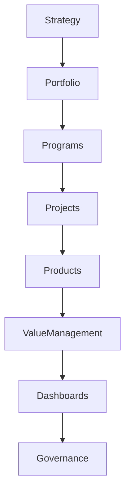

# ARCH-132 — Enterprise Portfolio Architecture

> Référentiel officiel de l'**Architecture de Gestion du Portefeuille d'Entreprise (Enterprise Portfolio Architecture)** de la plateforme **EduWeb Planner**.

---

# Sommaire

1. Vision
2. Objectifs
3. Principes fondamentaux
4. Définition du portefeuille d'entreprise
5. Architecture globale
6. Typologie des portefeuilles
7. Cycle de vie du portefeuille
8. Gouvernance du portefeuille
9. Priorisation des initiatives
10. Gestion des capacités
11. Gestion des dépendances
12. Gestion de la valeur
13. Gestion financière du portefeuille
14. Intelligence artificielle et gestion du portefeuille
15. Tableaux de bord stratégiques
16. API conceptuelle
17. Bonnes pratiques
18. Anti-patterns
19. KPI
20. Règles d'architecture

---

# 1. Vision

Le portefeuille d'entreprise constitue le mécanisme permettant d'aligner l'ensemble des investissements numériques avec la stratégie d'EduWeb Planner.

Cette architecture garantit que les ressources humaines, financières et technologiques sont affectées aux initiatives produisant la plus forte valeur pour :

- les établissements ;
- les ministères ;
- les enseignants ;
- les apprenants ;
- les partenaires ;
- la plateforme elle-même.

---

# 2. Objectifs

Cette architecture vise à :

- aligner les investissements sur la stratégie ;
- optimiser l'utilisation des ressources ;
- arbitrer les priorités ;
- maximiser la valeur créée ;
- maîtriser les risques ;
- piloter l'ensemble des initiatives de transformation.

---

# 3. Principes fondamentaux

Le portefeuille repose sur :

- Strategy First
- Value Driven
- Evidence-Based Decisions
- Risk-Aware Investment
- Continuous Prioritization
- Transparency
- Enterprise Alignment

---

# 4. Définition du portefeuille d'entreprise

Le portefeuille regroupe l'ensemble des :

- programmes ;
- projets ;
- produits ;
- investissements ;
- initiatives ;
- transformations ;

pilotés par l'organisation afin d'atteindre ses objectifs stratégiques.

Le portefeuille ne constitue pas une simple liste de projets : il représente un ensemble cohérent d'investissements gouvernés.

---

# 5. Architecture globale

```text
Vision stratégique

↓

Objectifs

↓

Portefeuille

↓

Programmes

↓

Projets

↓

Produits

↓

Résultats

↓

Création de valeur
```

---

# 6. Typologie des portefeuilles

## Portefeuille stratégique

- transformation numérique ;
- innovation ;
- nouveaux services.

---

## Portefeuille métier

- pédagogie ;
- administration ;
- gouvernance ;
- recherche.

---

## Portefeuille technologique

- infrastructures ;
- cybersécurité ;
- plateformes ;
- intelligence artificielle.

---

## Portefeuille réglementaire

- conformité ;
- protection des données ;
- obligations ministérielles.

---

## Portefeuille d'innovation

- expérimentations ;
- recherche ;
- prototypes ;
- intelligence artificielle.

---

# 7. Cycle de vie du portefeuille

```text
Identification

↓

Évaluation

↓

Priorisation

↓

Validation

↓

Exécution

↓

Suivi

↓

Réévaluation

↓

Clôture
```

Le portefeuille évolue en permanence.

---

# 8. Gouvernance du portefeuille

La gouvernance comprend :

- Conseil stratégique ;
- Direction Générale ;
- Comité Architecture ;
- Comité Investissement ;
- PMO ;
- responsables métiers ;
- responsables techniques.

Les arbitrages sont fondés sur des critères objectifs.

---

# 9. Priorisation des initiatives

Les initiatives sont évaluées selon plusieurs dimensions :

- valeur stratégique ;
- impact utilisateur ;
- coût ;
- complexité ;
- risques ;
- urgence ;
- conformité ;
- dépendances.

Chaque initiative reçoit un score global.

---

# 10. Gestion des capacités

Les capacités disponibles sont suivies pour :

- les équipes ;
- les budgets ;
- les infrastructures ;
- les compétences ;
- les fournisseurs.

Les décisions tiennent compte des capacités réelles de l'organisation.

---

# 11. Gestion des dépendances

Les dépendances sont identifiées entre :

- projets ;
- programmes ;
- produits ;
- plateformes ;
- API ;
- référentiels de données.

Leur suivi limite les risques de blocage.

---

# 12. Gestion de la valeur

Chaque initiative possède des indicateurs de valeur.

Exemples :

- amélioration de la qualité ;
- réduction des coûts ;
- gain de temps ;
- satisfaction utilisateur ;
- couverture fonctionnelle ;
- impact pédagogique.

La création de valeur est mesurée tout au long du cycle de vie.

---

# 13. Gestion financière du portefeuille

Les investissements sont suivis selon :

- budget prévisionnel ;
- budget engagé ;
- dépenses réalisées ;
- retour sur investissement (ROI) ;
- coût total de possession (TCO).

Les arbitrages financiers sont documentés.

---

# 14. Intelligence artificielle et gestion du portefeuille

Les services IA peuvent assister :

- la priorisation ;
- la simulation de scénarios ;
- la prévision budgétaire ;
- l'analyse des risques ;
- la détection des dépendances ;
- les recommandations d'arbitrage.

Les décisions finales demeurent sous responsabilité humaine.

---

# 15. Tableaux de bord stratégiques

Les tableaux de bord présentent notamment :

- l'état du portefeuille ;
- les budgets ;
- les risques ;
- les bénéfices attendus ;
- les bénéfices réalisés ;
- les indicateurs de performance.

Ils alimentent les décisions des instances de gouvernance.

---

# 16. API conceptuelle

```typescript
EnterprisePortfolioArchitecture {

    PortfolioRepository

    InitiativeManagement

    PrioritizationEngine

    CapacityManagement

    DependencyManagement

    ValueManagement

    FinancialManagement

    DashboardServices

    AIPortfolioServices

    Governance

}
```

---

# 17. Bonnes pratiques

✔ Aligner chaque initiative sur un objectif stratégique.

✔ Évaluer systématiquement les risques.

✔ Réviser régulièrement les priorités.

✔ Suivre les bénéfices réellement obtenus.

✔ Documenter les arbitrages.

✔ Maintenir une vision globale du portefeuille.

---

# 18. Anti-patterns

✘ Lancer des projets sans alignement stratégique.

✘ Prioriser uniquement selon l'urgence.

✘ Négliger les dépendances.

✘ Ignorer les capacités disponibles.

✘ Mesurer uniquement les coûts.

✘ Maintenir des projets sans valeur démontrée.

---

# Diagramme Mermaid



---

# KPI

| KPI | Objectif |
|------|----------|
|Initiatives alignées sur la stratégie|100 %|
|Portefeuille réévalué périodiquement|100 %|
|Bénéfices réalisés par rapport aux prévisions|≥ 90 %|
|Respect du budget global|≥ 95 %|
|Projets prioritaires livrés dans les délais|≥ 90 %|
|Taux de satisfaction des parties prenantes|> 90 %|

---

# Règles d'architecture

## RA-ARCH132-001

Toute initiative inscrite au portefeuille est explicitement reliée à un ou plusieurs objectifs stratégiques de l'organisation.

---

## RA-ARCH132-002

Les décisions de priorisation reposent sur des critères documentés intégrant la valeur attendue, les risques, les coûts, les capacités disponibles et les dépendances.

---

## RA-ARCH132-003

Le portefeuille fait l'objet d'une réévaluation périodique afin d'adapter les priorités aux évolutions stratégiques, réglementaires, technologiques et budgétaires.

---

## RA-ARCH132-004

Les bénéfices attendus et les bénéfices réalisés sont mesurés tout au long du cycle de vie des initiatives afin d'assurer une gestion orientée vers la création de valeur.

---

## RA-ARCH132-005

Les capacités d'intelligence artificielle peuvent assister l'analyse, la simulation et la priorisation du portefeuille, sans se substituer aux arbitrages des instances de gouvernance.

---

# Documents liés

- ARCH-115 — Enterprise Architecture Governance
- ARCH-117 — Enterprise Business Capability Architecture
- ARCH-118 — Enterprise Business Process Architecture
- ARCH-119 — Enterprise Decision Architecture
- ARCH-123 — Enterprise Platform Architecture
- ARCH-130 — Enterprise Risk Architecture
- GOV-101 — Enterprise Governance Framework
- PMO-101 — Enterprise Project Management Office
- STRAT-101 — Enterprise Strategic Planning
- FIN-101 — Enterprise Financial Management

---

# Conclusion

L'**Enterprise Portfolio Architecture** constitue le cadre de gouvernance permettant à EduWeb Planner de piloter l'ensemble de ses investissements numériques de manière cohérente, transparente et orientée vers la création de valeur. En intégrant les dimensions stratégiques, financières, opérationnelles, technologiques et de gestion des risques, cette architecture assure une allocation optimale des ressources et une adaptation continue du portefeuille aux priorités de l'organisation. Elle renforce ainsi la capacité d'EduWeb Planner à conduire durablement sa transformation numérique au service de l'éducation et de la gouvernance.

# Fin du document
