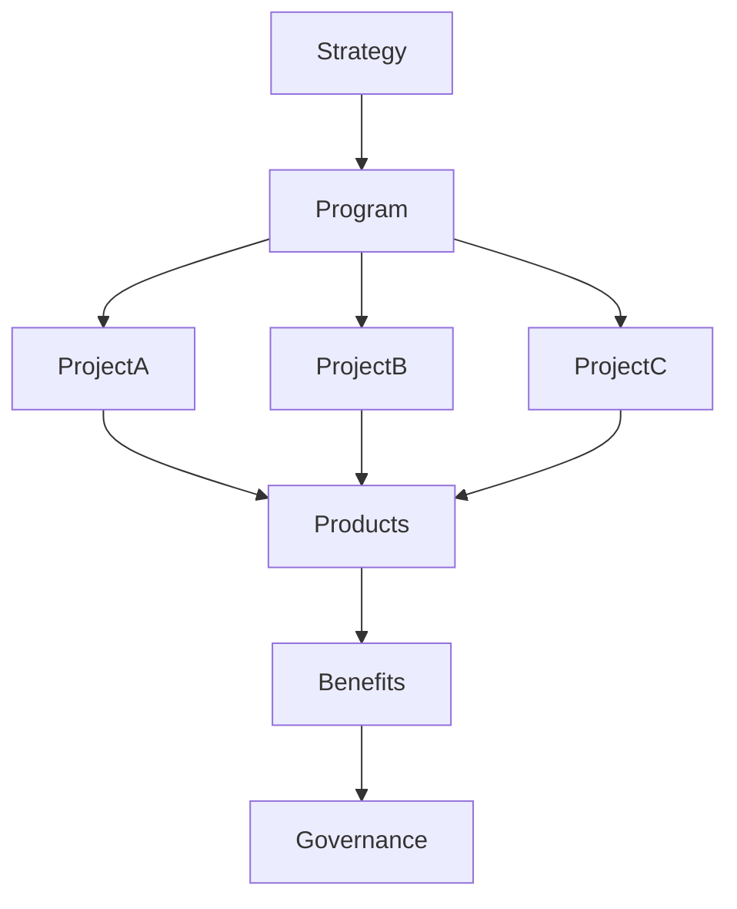

# ARCH-133 — Enterprise Program Architecture

> Référentiel officiel de l'**Architecture de Gestion des Programmes d'Entreprise (Enterprise Program Architecture)** de la plateforme **EduWeb Planner**.

---

# Sommaire

1. Vision
2. Objectifs
3. Principes fondamentaux
4. Définition d'un programme
5. Architecture globale
6. Structure d'un programme
7. Cycle de vie d'un programme
8. Gouvernance des programmes
9. Gestion des bénéfices
10. Gestion des interdépendances
11. Gestion des ressources
12. Gestion des risques du programme
13. Pilotage de la performance
14. Intelligence artificielle et gestion des programmes
15. API conceptuelle
16. Bonnes pratiques
17. Anti-patterns
18. KPI
19. Règles d'architecture
20. Documents liés

---

# 1. Vision

EduWeb Planner considère les **programmes** comme les principaux leviers de transformation permettant de coordonner plusieurs projets concourant à un même objectif stratégique.

Contrairement à un projet, un programme vise principalement la **création durable de valeur** grâce à la coordination d'initiatives interdépendantes.

---

# 2. Objectifs

Cette architecture vise à :

- aligner les programmes sur la stratégie d'entreprise ;
- coordonner plusieurs projets complémentaires ;
- optimiser les ressources communes ;
- maîtriser les interdépendances ;
- piloter la création de valeur ;
- améliorer la gouvernance des transformations.

---

# 3. Principes fondamentaux

Les programmes reposent sur les principes suivants :

- Strategy Driven
- Benefits First
- Integrated Governance
- Continuous Value Delivery
- Adaptive Management
- Enterprise Coordination
- Risk-Aware Execution

---

# 4. Définition d'un programme

Un programme est un **ensemble coordonné de projets, produits, services et activités** gérés de manière intégrée afin d'obtenir des bénéfices impossibles à atteindre par une gestion indépendante.

Exemples dans EduWeb Planner :

- Programme National de Digitalisation des Établissements ;
- Programme IA Éducative ;
- Programme Gouvernance Numérique ;
- Programme Smart Schools.

---

# 5. Architecture globale

```text
Vision stratégique

↓

Programme

↓

Projets

↓

Produits

↓

Services

↓

Transformation

↓

Bénéfices
```

---

# 6. Structure d'un programme

Un programme comprend généralement :

- une vision ;
- une feuille de route ;
- plusieurs projets ;
- plusieurs produits ;
- des ressources mutualisées ;
- des indicateurs stratégiques ;
- une gouvernance dédiée.

---

# 7. Cycle de vie d'un programme

```text
Identification

↓

Étude d'opportunité

↓

Conception

↓

Lancement

↓

Pilotage

↓

Livraison progressive

↓

Évaluation des bénéfices

↓

Clôture
```

Le pilotage est continu et évolutif.

---

# 8. Gouvernance des programmes

Chaque programme dispose :

- d'un sponsor ;
- d'un directeur de programme ;
- d'un comité de pilotage ;
- d'un PMO ;
- de responsables métiers ;
- de responsables techniques.

Les décisions majeures sont validées par les instances de gouvernance.

---

# 9. Gestion des bénéfices

Chaque bénéfice attendu est défini selon :

- sa description ;
- son indicateur ;
- sa valeur cible ;
- son responsable ;
- son échéance.

Les bénéfices sont suivis après la livraison des projets.

---

# 10. Gestion des interdépendances

Les programmes coordonnent les dépendances entre :

- projets ;
- applications ;
- API ;
- données ;
- infrastructures ;
- ressources humaines.

Les impacts sont analysés avant toute décision.

---

# 11. Gestion des ressources

Les ressources comprennent :

- équipes métiers ;
- équipes techniques ;
- budgets ;
- infrastructures ;
- prestataires ;
- partenaires institutionnels.

Leur allocation est optimisée au niveau du programme.

---

# 12. Gestion des risques du programme

Les risques sont évalués à l'échelle globale du programme :

- dépassement budgétaire ;
- retard de projets ;
- indisponibilité de ressources ;
- évolution réglementaire ;
- dépendances critiques ;
- risques technologiques.

Les plans de mitigation sont consolidés.

---

# 13. Pilotage de la performance

Les tableaux de bord présentent notamment :

- avancement global ;
- consommation budgétaire ;
- bénéfices réalisés ;
- risques majeurs ;
- dépendances critiques ;
- qualité des livrables.

Ces indicateurs permettent un pilotage stratégique.

---

# 14. Intelligence artificielle et gestion des programmes

L'IA peut assister :

- la planification ;
- la simulation de scénarios ;
- la prévision des retards ;
- l'analyse des risques ;
- la recommandation d'arbitrages ;
- la génération de rapports exécutifs.

Les arbitrages restent validés par les responsables du programme.

---

# 15. API conceptuelle

```typescript
EnterpriseProgramArchitecture {

    ProgramRepository

    RoadmapManagement

    ProjectCoordination

    BenefitsManagement

    DependencyManagement

    ResourceManagement

    RiskManagement

    DashboardServices

    AIProgramServices

    Governance

}
```

---

# 16. Bonnes pratiques

✔ Définir clairement les bénéfices attendus.

✔ Maintenir une gouvernance active.

✔ Coordonner les projets de manière intégrée.

✔ Réévaluer régulièrement les priorités.

✔ Suivre les bénéfices au-delà de la livraison.

✔ Maintenir une communication permanente avec les parties prenantes.

---

# 17. Anti-patterns

✘ Gérer un programme comme un projet unique.

✘ Multiplier les projets sans coordination.

✘ Oublier les bénéfices métier.

✘ Négliger les interdépendances.

✘ Ignorer les risques globaux.

✘ Clôturer un programme avant la réalisation des bénéfices.

---

# Diagramme Mermaid



---

# KPI

| KPI | Objectif |
|------|----------|
|Programmes alignés sur la stratégie|100 %|
|Bénéfices réalisés|≥ 90 %|
|Projets coordonnés avec succès|≥ 95 %|
|Respect du budget programme|≥ 95 %|
|Risques critiques maîtrisés|100 %|
|Satisfaction des parties prenantes|> 90 %|

---

# Règles d'architecture

## RA-ARCH133-001

Tout programme est explicitement rattaché à un ou plusieurs objectifs stratégiques et fait l'objet d'une gouvernance dédiée.

---

## RA-ARCH133-002

Les bénéfices attendus sont définis, mesurés et suivis tout au long du cycle de vie du programme, y compris après la livraison des projets.

---

## RA-ARCH133-003

Les dépendances entre projets, produits, ressources et infrastructures sont identifiées, documentées et pilotées de manière centralisée.

---

## RA-ARCH133-004

Les risques sont évalués au niveau du programme afin de garantir une vision consolidée des enjeux stratégiques, opérationnels et technologiques.

---

## RA-ARCH133-005

Les capacités d'intelligence artificielle peuvent assister la planification, la prévision et le pilotage des programmes, sans se substituer aux décisions des instances de gouvernance.

---

# Documents liés

- ARCH-115 — Enterprise Architecture Governance
- ARCH-117 — Enterprise Business Capability Architecture
- ARCH-118 — Enterprise Business Process Architecture
- ARCH-119 — Enterprise Decision Architecture
- ARCH-130 — Enterprise Risk Architecture
- ARCH-132 — Enterprise Portfolio Architecture
- PMO-101 — Enterprise Project Management Office
- STRAT-101 — Enterprise Strategic Planning
- FIN-101 — Enterprise Financial Management
- GOV-101 — Enterprise Governance Framework

---

# Conclusion

L'**Enterprise Program Architecture** fournit le cadre permettant à EduWeb Planner de piloter des ensembles cohérents de projets et de produits orientés vers une même ambition stratégique. En mettant l'accent sur la gouvernance, la coordination, la gestion des bénéfices, des risques et des interdépendances, cette architecture favorise une transformation maîtrisée et durable. Complémentaire de l'architecture de portefeuille (**ARCH-132**), elle assure le passage de la stratégie à l'exécution tout en maximisant la valeur créée pour l'ensemble des parties prenantes.

# Fin du document
