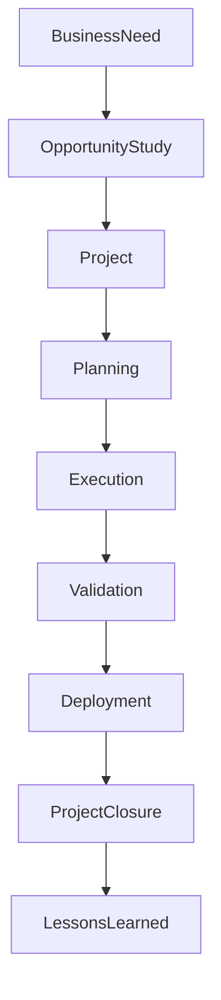

# ARCH-134 — Enterprise Project Architecture

> Référentiel officiel de l'**Architecture de Gestion des Projets d'Entreprise (Enterprise Project Architecture)** de la plateforme **EduWeb Planner**.

---

# Sommaire

1. Vision
2. Objectifs
3. Principes fondamentaux
4. Définition d'un projet
5. Architecture globale
6. Typologie des projets
7. Cycle de vie d'un projet
8. Gouvernance du projet
9. Gestion du périmètre
10. Gestion des délais
11. Gestion des coûts
12. Gestion de la qualité
13. Gestion des ressources
14. Gestion des communications
15. Gestion des parties prenantes
16. Gestion des risques
17. Gestion des changements
18. Pilotage par les indicateurs
19. Intelligence artificielle et gestion de projet
20. API conceptuelle
21. Bonnes pratiques
22. Anti-patterns
23. KPI
24. Règles d'architecture

---

# 1. Vision

Chaque projet mené au sein d'EduWeb Planner constitue un **vecteur de création de valeur** contribuant à la stratégie globale de l'organisation.

L'architecture projet fournit un cadre standardisé permettant de garantir :

- la maîtrise des délais ;
- la maîtrise des coûts ;
- la qualité des livrables ;
- la gestion des risques ;
- la satisfaction des parties prenantes.

---

# 2. Objectifs

Cette architecture vise à :

- standardiser la conduite des projets ;
- améliorer le taux de réussite ;
- optimiser les ressources ;
- réduire les risques ;
- assurer la traçabilité des décisions ;
- garantir la livraison de produits conformes aux besoins.

---

# 3. Principes fondamentaux

Les projets reposent sur les principes suivants :

- Business Value First
- Customer Centric
- Governance by Design
- Adaptive Delivery
- Risk-Based Planning
- Transparency
- Continuous Improvement

---

# 4. Définition d'un projet

Un projet est une **initiative temporaire** visant à produire un résultat unique dans un délai, un budget et un périmètre définis.

Chaque projet est caractérisé par :

- un objectif ;
- un sponsor ;
- une équipe ;
- un calendrier ;
- un budget ;
- des livrables ;
- des critères de succès.

---

# 5. Architecture globale

```text
Besoin

↓

Étude d'opportunité

↓

Projet

↓

Planification

↓

Exécution

↓

Contrôle

↓

Livraison

↓

Clôture
```

---

# 6. Typologie des projets

Les projets peuvent être classés selon leur nature.

## Projets numériques

- nouvelles plateformes ;
- applications mobiles ;
- microservices ;
- API.

---

## Projets métiers

- amélioration des processus ;
- gouvernance ;
- organisation.

---

## Projets pédagogiques

- plateformes éducatives ;
- contenus numériques ;
- intelligence artificielle éducative.

---

## Projets d'infrastructure

- cloud ;
- cybersécurité ;
- réseau ;
- datacenter.

---

## Projets réglementaires

- conformité ;
- archivage ;
- protection des données.

---

# 7. Cycle de vie d'un projet

```text
Initialisation

↓

Planification

↓

Conception

↓

Développement

↓

Validation

↓

Déploiement

↓

Clôture

↓

Retour d'expérience
```

Chaque étape est validée par des jalons décisionnels.

---

# 8. Gouvernance du projet

Chaque projet comprend :

- Sponsor ;
- Chef de projet ;
- Comité de pilotage ;
- Équipe projet ;
- Responsables métiers ;
- Architectes ;
- Experts techniques.

Les responsabilités sont définies dans une matrice RACI.

---

# 9. Gestion du périmètre

Le périmètre précise :

- les objectifs ;
- les fonctionnalités ;
- les exclusions ;
- les contraintes ;
- les livrables.

Toute évolution suit un processus formel de gestion des changements.

---

# 10. Gestion des délais

Le planning comprend :

- jalons ;
- tâches ;
- dépendances ;
- chemin critique ;
- marges.

Les retards sont analysés afin d'identifier leurs causes et leurs impacts.

---

# 11. Gestion des coûts

Le budget comprend :

- ressources humaines ;
- infrastructures ;
- licences ;
- prestations ;
- équipements ;
- imprévus.

Les écarts sont suivis en continu.

---

# 12. Gestion de la qualité

La qualité est assurée par :

- revues ;
- tests ;
- audits ;
- validation métier ;
- validation technique.

Chaque livrable satisfait aux critères d'acceptation définis.

---

# 13. Gestion des ressources

Les ressources concernent :

- équipes ;
- compétences ;
- matériels ;
- logiciels ;
- partenaires.

Leur disponibilité est suivie tout au long du projet.

---

# 14. Gestion des communications

Le plan de communication précise :

- les destinataires ;
- la fréquence ;
- les supports ;
- les responsabilités ;
- les messages clés.

Une communication régulière favorise l'adhésion des parties prenantes.

---

# 15. Gestion des parties prenantes

Les parties prenantes sont identifiées selon :

- leur rôle ;
- leur influence ;
- leurs attentes ;
- leur niveau d'implication.

Des stratégies d'engagement adaptées sont mises en œuvre.

---

# 16. Gestion des risques

Chaque risque est :

- identifié ;
- évalué ;
- priorisé ;
- traité ;
- surveillé.

Les plans de réponse sont intégrés au pilotage du projet.

---

# 17. Gestion des changements

Toute demande de changement comporte :

- une description ;
- une justification ;
- une analyse d'impact ;
- une estimation ;
- une décision.

Les changements approuvés sont intégrés au planning.

---

# 18. Pilotage par les indicateurs

Les tableaux de bord présentent notamment :

- avancement ;
- budget consommé ;
- qualité ;
- risques ;
- charges ;
- délais ;
- satisfaction client.

Ils sont mis à jour régulièrement.

---

# 19. Intelligence artificielle et gestion de projet

L'IA peut assister :

- la planification automatique ;
- l'estimation des charges ;
- la prévision des retards ;
- l'analyse des risques ;
- la rédaction des comptes rendus ;
- la génération de tableaux de bord.

Les décisions de gouvernance demeurent de la responsabilité du chef de projet et du comité de pilotage.

---

# 20. API conceptuelle

```typescript
EnterpriseProjectArchitecture {

    ProjectRepository

    PlanningManagement

    ResourceManagement

    BudgetManagement

    ScopeManagement

    RiskManagement

    ChangeManagement

    DashboardServices

    AIProjectServices

    Governance

}
```

---

# 21. Bonnes pratiques

✔ Définir clairement les objectifs.

✔ Formaliser le périmètre.

✔ Maintenir un planning réaliste.

✔ Communiquer régulièrement avec les parties prenantes.

✔ Gérer les risques de manière proactive.

✔ Réaliser un retour d'expérience en fin de projet.

---

# 22. Anti-patterns

✘ Démarrer un projet sans sponsor identifié.

✘ Modifier le périmètre sans validation.

✘ Négliger les risques.

✘ Sous-estimer les charges.

✘ Communiquer uniquement en cas de problème.

✘ Clôturer un projet sans capitalisation des enseignements.

---

# Diagramme Mermaid



---

# KPI

| KPI | Objectif |
|------|----------|
|Projets livrés dans les délais|≥ 90 %|
|Respect du budget|≥ 95 %|
|Livrables conformes dès la première validation|≥ 95 %|
|Risques critiques maîtrisés|100 %|
|Satisfaction des parties prenantes|> 90 %|
|Retours d'expérience réalisés|100 % des projets clôturés|

---

# Règles d'architecture

## RA-ARCH134-001

Tout projet est officiellement approuvé, dispose d'un sponsor identifié, d'un chef de projet désigné et d'un périmètre validé avant son lancement.

---

## RA-ARCH134-002

Les coûts, les délais, les ressources, les risques et les livrables sont suivis au moyen d'indicateurs régulièrement mis à jour et présentés aux instances de gouvernance.

---

## RA-ARCH134-003

Toute modification du périmètre, du budget ou du calendrier fait l'objet d'une procédure formelle de gestion des changements, incluant une analyse d'impact et une validation.

---

## RA-ARCH134-004

Chaque projet fait l'objet d'un retour d'expérience documenté permettant d'enrichir la base de connaissances et d'améliorer les pratiques de gestion de projet.

---

## RA-ARCH134-005

Les capacités d'intelligence artificielle peuvent assister la planification, l'estimation, le suivi et la production des livrables de pilotage, sans se substituer aux décisions des responsables de projet.

---

# Documents liés

- ARCH-115 — Enterprise Architecture Governance
- ARCH-117 — Enterprise Business Capability Architecture
- ARCH-118 — Enterprise Business Process Architecture
- ARCH-119 — Enterprise Decision Architecture
- ARCH-130 — Enterprise Risk Architecture
- ARCH-132 — Enterprise Portfolio Architecture
- ARCH-133 — Enterprise Program Architecture
- PMO-101 — Enterprise Project Management Office
- AGILE-101 — Agile Delivery Framework
- DEVOPS-101 — DevSecOps Framework

---

# Conclusion

L'**Enterprise Project Architecture** définit le cadre méthodologique permettant à EduWeb Planner de conduire ses projets de manière cohérente, maîtrisée et orientée vers les résultats. En intégrant les meilleures pratiques de gouvernance, de planification, de gestion des ressources, des risques et des changements, elle favorise la réussite des initiatives et leur alignement avec les objectifs stratégiques de l'organisation. Complémentaire des architectures de portefeuille (**ARCH-132**) et de programme (**ARCH-133**), elle constitue le niveau opérationnel de la transformation numérique d'EduWeb Planner.

# Fin du document
