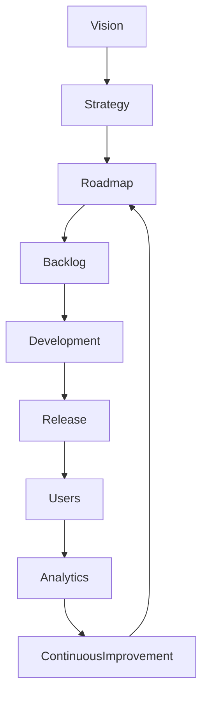

# ARCH-135 — Enterprise Product Architecture

> Référentiel officiel de l'**Architecture de Gestion des Produits Numériques d'Entreprise (Enterprise Product Architecture)** de la plateforme **EduWeb Planner**.

---

# Sommaire

1. Vision
2. Objectifs
3. Principes fondamentaux
4. Définition d'un produit
5. Architecture globale
6. Typologie des produits
7. Cycle de vie du produit
8. Gouvernance produit
9. Gestion de la feuille de route (Roadmap)
10. Gestion des fonctionnalités
11. Gestion de la valeur
12. Expérience utilisateur
13. Gestion des versions
14. Gestion des métriques produit
15. Intelligence artificielle et gestion produit
16. API conceptuelle
17. Bonnes pratiques
18. Anti-patterns
19. KPI
20. Règles d'architecture

---

# 1. Vision

EduWeb Planner adopte une approche **Product-Centric**, dans laquelle chaque produit numérique est considéré comme un actif stratégique évoluant continuellement afin de répondre aux besoins des utilisateurs et de soutenir les objectifs institutionnels.

Contrairement à un projet, un produit possède une **durée de vie continue**, évolue par versions successives et est piloté par la valeur créée.

---

# 2. Objectifs

Cette architecture vise à :

- développer des produits centrés sur les utilisateurs ;
- maximiser la valeur métier ;
- accélérer les cycles d'amélioration ;
- améliorer la qualité des services numériques ;
- favoriser l'innovation continue ;
- garantir la cohérence entre les différents produits de l'écosystème EduWeb.

---

# 3. Principes fondamentaux

Les produits sont gouvernés selon les principes suivants :

- Product First
- Customer Centric
- Continuous Delivery
- Continuous Learning
- Data-Driven Decisions
- Value-Oriented Development
- Long-Term Sustainability

---

# 4. Définition d'un produit

Un produit est une solution numérique délivrant durablement de la valeur à ses utilisateurs.

Un produit comprend notamment :

- une vision ;
- une stratégie ;
- une feuille de route ;
- des fonctionnalités ;
- des utilisateurs ;
- des indicateurs ;
- une équipe dédiée.

Exemples dans EduWeb :

- EduWeb Planner ;
- EduWeb Governance ;
- EduWeb Family ;
- EduWeb Booking ;
- E-School EduWeb.

---

# 5. Architecture globale

```text
Vision Produit

↓

Stratégie Produit

↓

Roadmap

↓

Backlog

↓

Développement

↓

Livraison Continue

↓

Utilisateurs

↓

Mesure de la Valeur

↓

Amélioration Continue
```

---

# 6. Typologie des produits

Les produits peuvent appartenir à plusieurs catégories.

## Produits SaaS

- plateformes web ;
- applications cloud.

---

## Produits mobiles

- Android ;
- iOS ;
- Progressive Web Apps.

---

## Produits IA

- assistants pédagogiques ;
- moteurs de recommandation ;
- génération automatique.

---

## Produits API

- services REST ;
- services GraphQL ;
- services d'intégration.

---

## Produits Data

- référentiels ;
- tableaux de bord ;
- plateformes analytiques.

---

# 7. Cycle de vie du produit

```text
Idéation

↓

Étude de marché

↓

Vision

↓

Roadmap

↓

Conception

↓

Développement

↓

Lancement

↓

Croissance

↓

Optimisation

↓

Évolution

↓

Retrait
```

Chaque étape est pilotée par des indicateurs mesurables.

---

# 8. Gouvernance produit

Chaque produit dispose :

- d'un Product Owner ;
- d'un Product Manager ;
- d'une équipe produit ;
- d'une équipe technique ;
- d'un sponsor métier ;
- d'un comité produit.

Les responsabilités sont clairement définies.

---

# 9. Gestion de la feuille de route (Roadmap)

La roadmap décrit :

- les objectifs ;
- les versions ;
- les fonctionnalités majeures ;
- les dépendances ;
- les priorités ;
- les échéances.

Elle est réévaluée régulièrement.

---

# 10. Gestion des fonctionnalités

Chaque fonctionnalité est caractérisée par :

- un identifiant ;
- une description ;
- une valeur métier ;
- une priorité ;
- des critères d'acceptation ;
- des dépendances.

Les fonctionnalités sont organisées dans un backlog priorisé.

---

# 11. Gestion de la valeur

La valeur d'un produit est évaluée selon :

- la satisfaction utilisateur ;
- l'adoption ;
- les gains métiers ;
- les économies réalisées ;
- la qualité ;
- les performances.

Les décisions sont orientées vers la maximisation de cette valeur.

---

# 12. Expérience utilisateur

L'expérience utilisateur constitue un axe majeur.

Elle repose notamment sur :

- l'accessibilité ;
- l'ergonomie ;
- la simplicité ;
- la rapidité ;
- la cohérence ;
- la personnalisation.

Les retours utilisateurs alimentent les évolutions.

---

# 13. Gestion des versions

Chaque version possède :

- un numéro ;
- une date ;
- un périmètre ;
- des nouveautés ;
- des corrections ;
- des évolutions techniques.

Les déploiements sont pilotés par une stratégie de versionnement.

---

# 14. Gestion des métriques produit

Les principaux indicateurs comprennent :

- utilisateurs actifs ;
- taux d'adoption ;
- satisfaction (CSAT) ;
- Net Promoter Score (NPS) ;
- disponibilité ;
- temps de réponse ;
- fréquence des livraisons.

Ces indicateurs orientent les arbitrages.

---

# 15. Intelligence artificielle et gestion produit

Les capacités d'IA peuvent assister :

- l'analyse des retours utilisateurs ;
- la priorisation du backlog ;
- la prédiction des usages ;
- la personnalisation des fonctionnalités ;
- la génération de spécifications ;
- la détection d'opportunités d'amélioration.

Les décisions de gouvernance restent sous responsabilité humaine.

---

# 16. API conceptuelle

```typescript
EnterpriseProductArchitecture {

    ProductRepository

    RoadmapManagement

    BacklogManagement

    FeatureManagement

    ReleaseManagement

    ValueManagement

    ProductAnalytics

    AIProductServices

    Governance

}
```

---

# 17. Bonnes pratiques

✔ Définir une vision produit claire.

✔ Prioriser selon la valeur métier.

✔ Maintenir une roadmap évolutive.

✔ Impliquer régulièrement les utilisateurs.

✔ Mesurer systématiquement les performances.

✔ Livrer fréquemment des améliorations.

---

# 18. Anti-patterns

✘ Développer des fonctionnalités sans besoin utilisateur.

✘ Confondre roadmap et planning détaillé.

✘ Ignorer les retours utilisateurs.

✘ Multiplier les versions sans gouvernance.

✘ Prioriser uniquement les demandes internes.

✘ Arrêter les mesures après le lancement.

---

# Diagramme Mermaid



---

# KPI

| KPI | Objectif |
|------|----------|
|Disponibilité des produits|≥ 99,9 %|
|Satisfaction utilisateur (CSAT)|> 90 %|
|Net Promoter Score (NPS)|> 50|
|Fréquence des livraisons|Amélioration continue|
|Fonctionnalités livrées conformes|≥ 95 %|
|Temps moyen de mise sur le marché (Time-to-Market)|Réduction continue|

---

# Règles d'architecture

## RA-ARCH135-001

Chaque produit possède une vision, une stratégie, une feuille de route et une gouvernance clairement définies.

---

## RA-ARCH135-002

Les décisions relatives aux fonctionnalités sont priorisées en fonction de la valeur métier, des besoins utilisateurs, des risques et des capacités disponibles.

---

## RA-ARCH135-003

Les performances du produit sont mesurées au moyen d'indicateurs objectifs couvrant l'adoption, la qualité, la disponibilité, la satisfaction et la création de valeur.

---

## RA-ARCH135-004

Les versions du produit sont gérées selon une stratégie documentée garantissant la stabilité, la traçabilité et la compatibilité avec l'écosystème EduWeb.

---

## RA-ARCH135-005

Les capacités d'intelligence artificielle peuvent assister la gestion du produit, notamment pour l'analyse des usages, la priorisation et la personnalisation, sans se substituer aux arbitrages du Product Manager et des instances de gouvernance.

---

# Documents liés

- ARCH-117 — Enterprise Business Capability Architecture
- ARCH-118 — Enterprise Business Process Architecture
- ARCH-123 — Enterprise Platform Architecture
- ARCH-132 — Enterprise Portfolio Architecture
- ARCH-133 — Enterprise Program Architecture
- ARCH-134 — Enterprise Project Architecture
- UX-101 — Enterprise UX Principles
- UX-105 — Design System Architecture
- AGILE-101 — Agile Delivery Framework
- DEVOPS-101 — DevSecOps Framework

---

# Conclusion

L'**Enterprise Product Architecture** fournit le cadre de référence permettant à EduWeb Planner de concevoir, développer, faire évoluer et gouverner ses produits numériques dans une logique de création de valeur continue. En intégrant une approche centrée sur les utilisateurs, une gouvernance produit structurée, des métriques de performance et une amélioration permanente, cette architecture garantit que chaque produit contribue durablement à la stratégie de l'organisation. Associée aux architectures de portefeuille (**ARCH-132**), de programme (**ARCH-133**) et de projet (**ARCH-134**), elle complète la chaîne de pilotage stratégique des initiatives numériques d'EduWeb.

# Fin du document
