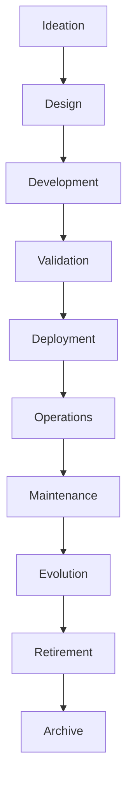

# ARCH-136 — Enterprise Product Lifecycle Architecture

> Référentiel officiel de l'**Architecture de Gestion du Cycle de Vie des Produits (Enterprise Product Lifecycle Architecture)** de la plateforme **EduWeb Planner**.

---

# Sommaire

1. Vision
2. Objectifs
3. Principes fondamentaux
4. Définition du cycle de vie produit
5. Architecture globale
6. Phases du cycle de vie
7. Gouvernance du cycle de vie
8. Gestion des versions
9. Gestion des configurations
10. Gestion des dépendances
11. Gestion de l'obsolescence
12. Gestion des transitions
13. Gestion documentaire
14. Intelligence artificielle et cycle de vie produit
15. API conceptuelle
16. Bonnes pratiques
17. Anti-patterns
18. KPI
19. Règles d'architecture
20. Documents liés

---

# 1. Vision

Le cycle de vie d'un produit numérique constitue un processus continu permettant d'assurer sa pertinence, sa qualité, sa sécurité et son évolution depuis son idéation jusqu'à son retrait.

L'architecture garantit que chaque produit EduWeb évolue selon un cadre maîtrisé, documenté et aligné sur les objectifs stratégiques de l'organisation.

---

# 2. Objectifs

Cette architecture vise à :

- standardiser le cycle de vie des produits ;
- assurer une évolution continue et maîtrisée ;
- garantir la qualité des livraisons ;
- limiter les risques liés aux évolutions ;
- optimiser la maintenance ;
- faciliter le retrait des produits obsolètes.

---

# 3. Principes fondamentaux

Les produits sont gouvernés selon les principes suivants :

- Lifecycle by Design
- Continuous Evolution
- Controlled Change
- Sustainable Maintenance
- Backward Compatibility
- Traceability
- Continuous Value Delivery

---

# 4. Définition du cycle de vie produit

Le cycle de vie d'un produit regroupe l'ensemble des étapes permettant de concevoir, développer, exploiter, maintenir, faire évoluer puis retirer un produit numérique.

Chaque étape possède :

- des objectifs ;
- des livrables ;
- des critères d'entrée ;
- des critères de sortie ;
- des indicateurs.

---

# 5. Architecture globale

```text
Idéation

↓

Conception

↓

Développement

↓

Validation

↓

Déploiement

↓

Exploitation

↓

Maintenance

↓

Évolution

↓

Retrait

↓

Archivage
```

---

# 6. Phases du cycle de vie

## 6.1 Idéation

Identification :

- besoins ;
- opportunités ;
- innovation ;
- attentes utilisateurs.

---

## 6.2 Conception

Définition :

- architecture ;
- UX ;
- fonctionnalités ;
- modèles de données ;
- sécurité.

---

## 6.3 Développement

Production :

- code ;
- tests ;
- documentation ;
- automatisation.

---

## 6.4 Validation

Contrôles :

- qualité ;
- sécurité ;
- conformité ;
- performance.

---

## 6.5 Déploiement

Livraison progressive :

- production ;
- formation ;
- accompagnement ;
- supervision.

---

## 6.6 Exploitation

Suivi quotidien :

- disponibilité ;
- support ;
- supervision ;
- incidents.

---

## 6.7 Maintenance

Maintenance :

- corrective ;
- préventive ;
- adaptative ;
- évolutive.

---

## 6.8 Évolution

Ajout :

- nouvelles fonctionnalités ;
- optimisation ;
- montée de version.

---

## 6.9 Retrait

Planification :

- migration ;
- communication ;
- archivage ;
- désactivation.

---

# 7. Gouvernance du cycle de vie

Chaque produit est piloté par :

- Product Owner ;
- Product Manager ;
- Architecte ;
- Responsable Technique ;
- Responsable Qualité ;
- Responsable Sécurité ;
- Comité Produit.

Les jalons majeurs sont validés collectivement.

---

# 8. Gestion des versions

Chaque version possède :

- numéro de version ;
- date de publication ;
- journal des modifications (changelog) ;
- compatibilité ;
- niveau de support ;
- statut.

Le versionnement suit une politique commune (par exemple : Semantic Versioning).

---

# 9. Gestion des configurations

Les éléments suivants sont gérés comme des configurations :

- code source ;
- paramètres ;
- API ;
- modèles IA ;
- dépendances ;
- documentation.

Chaque modification est historisée.

---

# 10. Gestion des dépendances

Les dépendances concernent :

- bibliothèques ;
- frameworks ;
- microservices ;
- API externes ;
- bases de données ;
- modèles IA.

Une cartographie des dépendances est maintenue afin d'anticiper les impacts des évolutions.

---

# 11. Gestion de l'obsolescence

Les composants obsolètes sont identifiés selon :

- leur niveau de support ;
- les vulnérabilités connues ;
- les recommandations des éditeurs ;
- les contraintes réglementaires.

Des plans de remplacement sont élaborés avant la fin du support.

---

# 12. Gestion des transitions

Les transitions majeures comprennent :

- montée de version ;
- migration de données ;
- changement d'architecture ;
- changement d'infrastructure ;
- remplacement de produit.

Chaque transition est préparée, testée et validée avant sa mise en production.

---

# 13. Gestion documentaire

Chaque phase produit est accompagnée d'une documentation comprenant notamment :

- architecture ;
- spécifications ;
- guides utilisateurs ;
- procédures d'exploitation ;
- guides de maintenance ;
- historiques des versions.

La documentation évolue avec le produit.

---

# 14. Intelligence artificielle et cycle de vie produit

L'IA peut assister :

- la planification des versions ;
- l'analyse des retours utilisateurs ;
- la détection des régressions ;
- l'estimation des impacts ;
- la génération de documentation ;
- la prédiction des besoins de maintenance.

Les décisions de mise en production restent validées par les responsables habilités.

---

# 15. API conceptuelle

```typescript
EnterpriseProductLifecycleArchitecture {

    ProductRepository

    LifecycleManagement

    VersionManagement

    ConfigurationManagement

    DependencyManagement

    MaintenanceManagement

    TransitionManagement

    DocumentationManagement

    AIProductLifecycleServices

    Governance

}
```

---

# 16. Bonnes pratiques

✔ Définir clairement les critères d'entrée et de sortie de chaque phase.

✔ Maintenir une documentation synchronisée avec les évolutions du produit.

✔ Planifier les migrations et les retraits suffisamment tôt.

✔ Automatiser les tests de régression.

✔ Maîtriser les dépendances techniques.

✔ Réévaluer régulièrement la feuille de route produit.

---

# 17. Anti-patterns

✘ Déployer une nouvelle version sans plan de retour arrière.

✘ Modifier une configuration sans traçabilité.

✘ Reporter indéfiniment le remplacement des composants obsolètes.

✘ Négliger la documentation des évolutions.

✘ Introduire des dépendances non maîtrisées.

✘ Retirer un produit sans stratégie de migration.

---

# Diagramme Mermaid



---

# KPI

| KPI | Objectif |
|------|----------|
|Versions livrées selon le planning|≥ 95 %|
|Régressions détectées avant production|≥ 99 %|
|Produits documentés|100 %|
|Composants obsolètes remplacés dans les délais|≥ 95 %|
|Disponibilité pendant les transitions|≥ 99,9 %|
|Temps moyen de résolution des incidents critiques|Réduction continue|

---

# Règles d'architecture

## RA-ARCH136-001

Tout produit suit un cycle de vie documenté comprenant des phases clairement définies, des critères de validation et des responsabilités explicites.

---

## RA-ARCH136-002

Les versions, configurations, dépendances et composants du produit sont identifiés, versionnés et tracés tout au long de leur cycle de vie.

---

## RA-ARCH136-003

Les évolutions, migrations et retraits de produits sont planifiés, évalués et validés afin de garantir la continuité de service et la maîtrise des risques.

---

## RA-ARCH136-004

La documentation technique, fonctionnelle et opérationnelle est maintenue à jour durant tout le cycle de vie du produit et constitue un livrable obligatoire de chaque phase.

---

## RA-ARCH136-005

Les capacités d'intelligence artificielle peuvent assister la planification, la maintenance, l'analyse des impacts et la documentation du cycle de vie produit, sans se substituer aux décisions des responsables de gouvernance.

---

# Documents liés

- ARCH-123 — Enterprise Platform Architecture
- ARCH-127 — Enterprise Content Management Architecture
- ARCH-130 — Enterprise Risk Architecture
- ARCH-134 — Enterprise Project Architecture
- ARCH-135 — Enterprise Product Architecture
- DEVOPS-101 — DevSecOps Framework
- OPS-101 — Enterprise Operations Architecture
- QA-101 — Enterprise Quality Assurance Framework
- CM-101 — Configuration Management Framework
- RELEASE-101 — Enterprise Release Management

---

# Conclusion

L'**Enterprise Product Lifecycle Architecture** fournit le cadre de référence permettant de gérer l'ensemble du cycle de vie des produits numériques d'EduWeb Planner, depuis leur conception jusqu'à leur retrait. En intégrant la gouvernance, le versionnement, la gestion des configurations, la maintenance, les transitions et l'amélioration continue, cette architecture garantit des produits durables, sécurisés, évolutifs et alignés sur les besoins des utilisateurs ainsi que sur les objectifs stratégiques de l'organisation. Elle constitue le prolongement naturel de **ARCH-135 – Enterprise Product Architecture** et s'inscrit pleinement dans la vision d'une plateforme EdTech gouvernée de bout en bout.

# Fin du document
