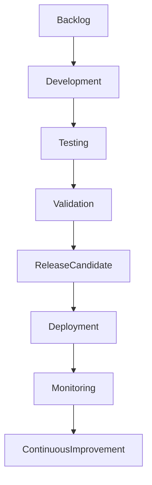

# ARCH-137 — Enterprise Release Management Architecture

> Référentiel officiel de l'**Architecture de Gestion des Livraisons et des Mises en Production (Enterprise Release Management Architecture)** de la plateforme **EduWeb Planner**.

---

# Sommaire

1. Vision
2. Objectifs
3. Principes fondamentaux
4. Définition d'une release
5. Architecture globale
6. Typologie des releases
7. Cycle de vie d'une release
8. Gouvernance des releases
9. Gestion des environnements
10. Validation avant mise en production
11. Déploiement
12. Rollback et reprise
13. Communication des releases
14. Mesure de performance
15. Intelligence artificielle et Release Management
16. API conceptuelle
17. Bonnes pratiques
18. Anti-patterns
19. KPI
20. Règles d'architecture

---

# 1. Vision

EduWeb Planner adopte une stratégie de **Release Management maîtrisée**, garantissant que chaque évolution est livrée de manière :

- sécurisée ;
- reproductible ;
- traçable ;
- automatisée ;
- contrôlée ;
- transparente.

Chaque mise en production constitue une opération gouvernée, minimisant les risques pour les utilisateurs et les services.

---

# 2. Objectifs

Cette architecture vise à :

- standardiser les mises en production ;
- réduire les incidents liés aux déploiements ;
- améliorer la fréquence des livraisons ;
- garantir la qualité des versions ;
- assurer la continuité des services ;
- accélérer la création de valeur.

---

# 3. Principes fondamentaux

Le Release Management repose sur :

- Release by Design
- Automation First
- Progressive Delivery
- Immutable Deployments
- Continuous Validation
- Observability
- Rapid Recovery

---

# 4. Définition d'une release

Une **release** représente un ensemble cohérent d'évolutions fonctionnelles, techniques ou correctives livré dans un environnement donné.

Une release peut comprendre :

- nouvelles fonctionnalités ;
- corrections d'anomalies ;
- améliorations techniques ;
- mises à jour de sécurité ;
- évolutions réglementaires.

---

# 5. Architecture globale

```text
Backlog

↓

Développement

↓

Tests

↓

Validation

↓

Release Candidate

↓

Déploiement

↓

Supervision

↓

Amélioration continue
```

---

# 6. Typologie des releases

## Release majeure

Introduit des évolutions importantes.

Exemple :

Version 5.0

---

## Release mineure

Ajoute des fonctionnalités compatibles.

Exemple :

Version 5.3

---

## Patch

Corrige rapidement une anomalie.

Exemple :

Version 5.3.2

---

## Hotfix

Correction urgente directement en production.

Utilisation exceptionnelle.

---

## Emergency Release

Déploiement d'urgence suite à :

- faille critique ;
- incident majeur ;
- obligation réglementaire.

---

# 7. Cycle de vie d'une release

```text
Planification

↓

Construction

↓

Tests

↓

Validation

↓

Approbation

↓

Déploiement

↓

Monitoring

↓

Clôture
```

Chaque étape comporte des critères d'acceptation.

---

# 8. Gouvernance des releases

Les acteurs principaux sont :

- Release Manager ;
- Product Owner ;
- DevOps ;
- QA ;
- RSSI ;
- Architectes ;
- Exploitation ;
- Comité CAB (Change Advisory Board).

Les mises en production critiques nécessitent une validation formelle.

---

# 9. Gestion des environnements

Les environnements standards sont :

```text
Développement

↓

Intégration

↓

Qualification

↓

Préproduction

↓

Production
```

Chaque environnement est isolé et dispose de données adaptées à son usage.

---

# 10. Validation avant mise en production

Avant toute release, les validations suivantes sont réalisées :

- tests unitaires ;
- tests d'intégration ;
- tests fonctionnels ;
- tests de sécurité ;
- tests de performance ;
- validation métier ;
- contrôle de conformité.

Aucune release ne peut être déployée sans validation complète.

---

# 11. Déploiement

Les stratégies supportées comprennent :

## Blue-Green Deployment

Deux environnements de production alternés.

---

## Canary Release

Déploiement progressif sur un faible pourcentage d'utilisateurs.

---

## Rolling Update

Mise à jour progressive des instances.

---

## Feature Toggle

Activation différée des fonctionnalités.

---

## Progressive Delivery

Livraison incrémentale pilotée par les indicateurs.

---

# 12. Rollback et reprise

Chaque release doit disposer :

- d'un plan de retour arrière ;
- d'une sauvegarde préalable ;
- d'une procédure de restauration ;
- d'un plan de communication.

Les temps de reprise doivent respecter les objectifs de continuité définis par l'organisation.

---

# 13. Communication des releases

Chaque livraison donne lieu à :

- une note de version (Release Notes) ;
- une documentation technique ;
- une documentation utilisateur si nécessaire ;
- une communication aux parties prenantes ;
- une mise à jour du catalogue des versions.

---

# 14. Mesure de performance

Les principaux indicateurs sont :

- fréquence des déploiements ;
- taux de réussite des releases ;
- durée moyenne des déploiements ;
- temps moyen de restauration (MTTR) ;
- incidents post-release ;
- taux de rollback.

Ces métriques alimentent l'amélioration continue.

---

# 15. Intelligence artificielle et Release Management

Les capacités d'IA peuvent assister :

- la planification des releases ;
- l'analyse des impacts ;
- la détection des risques ;
- l'analyse automatique des journaux ;
- la génération des Release Notes ;
- la recommandation de fenêtres de déploiement.

Les validations finales restent sous responsabilité humaine.

---

# 16. API conceptuelle

```typescript
EnterpriseReleaseManagementArchitecture {

    ReleaseRepository

    ReleasePlanning

    EnvironmentManagement

    DeploymentManagement

    ValidationManagement

    RollbackManagement

    ReleaseNotes

    Monitoring

    AIReleaseServices

    Governance

}
```

---

# 17. Bonnes pratiques

✔ Automatiser les déploiements.

✔ Utiliser des pipelines CI/CD.

✔ Prévoir un rollback systématique.

✔ Tester les procédures de reprise.

✔ Communiquer clairement les changements.

✔ Déployer progressivement les évolutions critiques.

---

# 18. Anti-patterns

✘ Déployer directement en production sans validation.

✘ Modifier manuellement les serveurs de production.

✘ Déployer plusieurs changements non maîtrisés simultanément.

✘ Ne pas disposer d'un plan de retour arrière.

✘ Négliger les tests de sécurité.

✘ Publier des releases sans documentation.

---

# Diagramme Mermaid



---

# KPI

| KPI | Objectif |
|------|----------|
|Taux de réussite des releases|≥ 98 %|
|Déploiements automatisés|100 %|
|Temps moyen de déploiement|Réduction continue|
|Temps moyen de restauration (MTTR)|Réduction continue|
|Incidents post-release|< 2 %|
|Rollbacks non planifiés|≈ 0|

---

# Règles d'architecture

## RA-ARCH137-001

Toute release suit un cycle de vie documenté comprenant la planification, les validations, l'approbation, le déploiement, la supervision et la clôture.

---

## RA-ARCH137-002

Aucune mise en production n'est autorisée sans validation des critères de qualité, de sécurité, de conformité et de performance définis par l'organisation.

---

## RA-ARCH137-003

Chaque release dispose d'une stratégie de déploiement adaptée, d'un plan de retour arrière documenté et d'une procédure de reprise testée.

---

## RA-ARCH137-004

Les environnements de développement, d'intégration, de qualification, de préproduction et de production sont isolés, gouvernés et maintenus de manière cohérente.

---

## RA-ARCH137-005

Les capacités d'intelligence artificielle peuvent assister la préparation, l'analyse, la supervision et la documentation des releases, sans se substituer aux validations des responsables de mise en production.

---

# Documents liés

- ARCH-109 — High Availability, Scalability & Resilience Architecture
- ARCH-112 — Enterprise Observability Architecture
- ARCH-113 — Enterprise DevSecOps Architecture
- ARCH-123 — Enterprise Platform Architecture
- ARCH-134 — Enterprise Project Architecture
- ARCH-135 — Enterprise Product Architecture
- ARCH-136 — Enterprise Product Lifecycle Architecture
- DEVOPS-101 — DevSecOps Framework
- OPS-101 — Enterprise Operations Architecture
- CM-101 — Configuration Management Framework

---

# Conclusion

L'**Enterprise Release Management Architecture** fournit le cadre permettant de planifier, valider, déployer, superviser et sécuriser les mises en production d'EduWeb Planner. En s'appuyant sur l'automatisation, les bonnes pratiques DevSecOps, des stratégies de déploiement progressif et une gouvernance rigoureuse, cette architecture réduit les risques opérationnels tout en accélérant la livraison de valeur. Complémentaire des architectures **Produit (ARCH-135)**, **Cycle de vie produit (ARCH-136)** et **DevSecOps (ARCH-113)**, elle garantit des livraisons fiables, traçables et conformes aux exigences de qualité, de sécurité et de continuité de service.

# Fin du document
