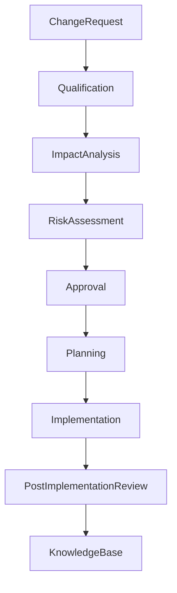

# ARCH-138 — Enterprise Change Management Architecture

> Référentiel officiel de l'**Architecture de Gestion des Changements d'Entreprise (Enterprise Change Management Architecture)** de la plateforme **EduWeb Planner**.

---

# Sommaire

1. Vision
2. Objectifs
3. Principes fondamentaux
4. Définition du changement
5. Architecture globale
6. Typologie des changements
7. Cycle de vie du changement
8. Gouvernance des changements
9. Analyse d'impact
10. Évaluation des risques
11. Validation des changements
12. Mise en œuvre
13. Communication et accompagnement
14. Vérification post-implémentation
15. Intelligence artificielle et gestion des changements
16. API conceptuelle
17. Bonnes pratiques
18. Anti-patterns
19. KPI
20. Règles d'architecture

---

# 1. Vision

EduWeb Planner considère le changement comme un **processus maîtrisé de transformation**, permettant de faire évoluer l'organisation, les processus, les infrastructures, les applications et les services tout en garantissant :

- la continuité des activités ;
- la qualité des services ;
- la sécurité ;
- la conformité ;
- la création de valeur.

Le changement est gouverné afin de limiter les perturbations et d'assurer une adoption rapide.

---

# 2. Objectifs

Cette architecture vise à :

- standardiser les demandes de changement ;
- réduire les risques opérationnels ;
- améliorer la qualité des mises en œuvre ;
- garantir la traçabilité des décisions ;
- favoriser l'adhésion des parties prenantes ;
- soutenir l'amélioration continue.

---

# 3. Principes fondamentaux

Les changements reposent sur les principes suivants :

- Controlled Change
- Risk-Based Decision
- Transparency
- Traceability
- Business Continuity
- Stakeholder Engagement
- Continuous Learning

---

# 4. Définition du changement

Un changement est toute modification susceptible d'affecter :

- un processus ;
- une application ;
- une infrastructure ;
- une donnée ;
- une organisation ;
- une politique ;
- un service.

Chaque changement fait l'objet d'une demande formalisée, d'une analyse et d'une validation avant sa mise en œuvre.

---

# 5. Architecture globale

```text
Demande de changement

↓

Qualification

↓

Analyse d'impact

↓

Évaluation des risques

↓

Validation

↓

Planification

↓

Implémentation

↓

Vérification

↓

Clôture
```

---

# 6. Typologie des changements

## Changement standard

Préapprouvé, répétitif et à faible risque.

Exemples :

- renouvellement de certificats ;
- mises à jour planifiées ;
- création de comptes standards.

---

## Changement normal

Soumis à une analyse complète et à une validation par les instances compétentes.

---

## Changement majeur

Impact important sur les services, les utilisateurs ou l'architecture.

Validation obligatoire par le comité de gouvernance.

---

## Changement d'urgence

Mis en œuvre rapidement afin de :

- corriger un incident critique ;
- répondre à une faille de sécurité ;
- assurer la continuité de service.

Une revue a posteriori est obligatoire.

---

# 7. Cycle de vie du changement

```text
Création

↓

Qualification

↓

Étude

↓

Validation

↓

Planification

↓

Implémentation

↓

Contrôle

↓

Clôture

↓

Capitalisation
```

---

# 8. Gouvernance des changements

Les principaux acteurs sont :

- Demandeur ;
- Change Manager ;
- Product Owner ;
- Responsable métier ;
- Architecte d'entreprise ;
- RSSI ;
- DevOps ;
- CAB (Change Advisory Board).

Les responsabilités sont documentées dans une matrice RACI.

---

# 9. Analyse d'impact

Chaque changement est évalué selon son impact sur :

- les processus métiers ;
- les utilisateurs ;
- les données ;
- les interfaces ;
- les applications ;
- les infrastructures ;
- la sécurité ;
- la conformité.

Les dépendances sont identifiées avant toute décision.

---

# 10. Évaluation des risques

L'analyse prend notamment en compte :

- la probabilité d'échec ;
- l'impact opérationnel ;
- l'impact financier ;
- l'impact réglementaire ;
- les conséquences sur la cybersécurité ;
- les conséquences sur les performances.

Chaque risque est documenté et accompagné de mesures de maîtrise.

---

# 11. Validation des changements

Selon leur criticité, les changements sont validés par :

- le responsable de service ;
- le Product Owner ;
- le comité CAB ;
- le comité d'architecture ;
- la Direction Générale.

Les validations sont historisées.

---

# 12. Mise en œuvre

Chaque changement comprend :

- un plan d'exécution ;
- un calendrier ;
- des responsables ;
- un plan de tests ;
- un plan de retour arrière ;
- un plan de communication.

Les changements sont réalisés selon les procédures approuvées.

---

# 13. Communication et accompagnement

Une communication adaptée est assurée auprès :

- des utilisateurs ;
- des administrateurs ;
- des partenaires ;
- des responsables métiers.

Lorsque nécessaire, des actions de formation et d'accompagnement sont organisées.

---

# 14. Vérification post-implémentation

Après chaque changement, une revue permet de vérifier :

- l'atteinte des objectifs ;
- l'absence d'incidents majeurs ;
- le respect des exigences ;
- les bénéfices obtenus.

Les enseignements sont capitalisés.

---

# 15. Intelligence artificielle et gestion des changements

L'IA peut assister :

- la qualification automatique des demandes ;
- l'analyse des impacts ;
- l'évaluation des risques ;
- la planification ;
- la génération des plans de changement ;
- la rédaction des comptes rendus.

Les décisions d'approbation restent sous responsabilité humaine.

---

# 16. API conceptuelle

```typescript
EnterpriseChangeManagementArchitecture {

    ChangeRepository

    ChangeRequestManagement

    ImpactAnalysis

    RiskAssessment

    ApprovalWorkflow

    ChangePlanning

    ImplementationManagement

    PostImplementationReview

    AIChangeServices

    Governance

}
```

---

# 17. Bonnes pratiques

✔ Formaliser chaque demande de changement.

✔ Réaliser une analyse d'impact systématique.

✔ Prévoir un plan de retour arrière.

✔ Tester avant toute mise en production.

✔ Communiquer avec les parties prenantes.

✔ Capitaliser les retours d'expérience.

---

# 18. Anti-patterns

✘ Modifier directement un système de production.

✘ Approuver un changement sans analyse d'impact.

✘ Négliger les dépendances entre applications.

✘ Déployer sans plan de communication.

✘ Omettre la revue post-implémentation.

✘ Considérer les changements d'urgence comme une pratique normale.

---

# Diagramme Mermaid



---

# KPI

| KPI | Objectif |
|------|----------|
|Demandes de changement documentées|100 %|
|Changements mis en œuvre sans incident majeur|≥ 98 %|
|Changements validés selon la gouvernance|100 %|
|Revues post-implémentation réalisées|100 %|
|Temps moyen de traitement des demandes|Réduction continue|
|Taux de réussite des changements|≥ 95 %|

---

# Règles d'architecture

## RA-ARCH138-001

Toute demande de changement est enregistrée, qualifiée et soumise à un processus formel de gouvernance avant son implémentation.

---

## RA-ARCH138-002

Chaque changement fait l'objet d'une analyse d'impact, d'une évaluation des risques et d'une stratégie de mise en œuvre incluant un plan de retour arrière.

---

## RA-ARCH138-003

Les changements sont validés selon leur niveau de criticité par les autorités compétentes et leur historique est conservé à des fins de traçabilité.

---

## RA-ARCH138-004

Une revue post-implémentation est réalisée après chaque changement significatif afin d'évaluer les résultats obtenus, les incidents éventuels et les enseignements à capitaliser.

---

## RA-ARCH138-005

Les capacités d'intelligence artificielle peuvent assister la qualification, l'analyse, la planification et la documentation des changements, sans se substituer aux décisions des instances de gouvernance.

---

# Documents liés

- ARCH-109 — High Availability, Scalability & Resilience Architecture
- ARCH-113 — Enterprise DevSecOps Architecture
- ARCH-115 — Enterprise Architecture Governance
- ARCH-130 — Enterprise Risk Architecture
- ARCH-131 — Enterprise Audit Architecture
- ARCH-137 — Enterprise Release Management Architecture
- ITSM-101 — Enterprise IT Service Management
- CM-101 — Configuration Management Framework
- OPS-101 — Enterprise Operations Architecture
- DEVOPS-101 — DevSecOps Framework

---

# Conclusion

L'**Enterprise Change Management Architecture** fournit le cadre de référence permettant à EduWeb Planner de conduire les changements de manière maîtrisée, sécurisée et transparente. En intégrant une gouvernance structurée, des analyses d'impact, une évaluation des risques, des procédures de validation et des revues post-implémentation, cette architecture réduit les perturbations opérationnelles tout en favorisant l'amélioration continue. Complémentaire des architectures de **Release Management (ARCH-137)**, de **Gestion des Risques (ARCH-130)** et de **DevSecOps (ARCH-113)**, elle constitue un élément essentiel de la gouvernance opérationnelle de l'écosystème EduWeb.

# Fin du document
