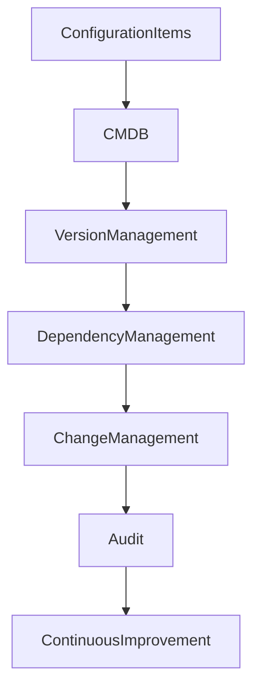

# ARCH-139 — Enterprise Configuration Management Architecture

> Référentiel officiel de l'**Architecture de Gestion des Configurations d'Entreprise (Enterprise Configuration Management Architecture)** de la plateforme **EduWeb Planner**.

---

# Sommaire

1. Vision
2. Objectifs
3. Principes fondamentaux
4. Définition de la gestion des configurations
5. Architecture globale
6. Éléments de configuration (CI)
7. Cycle de vie des éléments de configuration
8. Référentiel de configuration (CMDB)
9. Gestion des versions
10. Gestion des relations et dépendances
11. Contrôle des changements
12. Audit et vérification des configurations
13. Synchronisation avec les autres architectures
14. Intelligence artificielle et gestion des configurations
15. API conceptuelle
16. Bonnes pratiques
17. Anti-patterns
18. KPI
19. Règles d'architecture
20. Documents liés

---

# 1. Vision

EduWeb Planner considère les **configurations** comme des actifs critiques permettant d'assurer la stabilité, la traçabilité et la maîtrise de l'ensemble de son écosystème numérique.

L'architecture garantit que chaque composant technique ou métier est :

- identifié ;
- documenté ;
- versionné ;
- contrôlé ;
- relié aux autres composants ;
- maintenu tout au long de son cycle de vie.

---

# 2. Objectifs

Cette architecture vise à :

- maîtriser les configurations de l'écosystème ;
- réduire les erreurs de déploiement ;
- améliorer la traçabilité ;
- faciliter les audits ;
- sécuriser les changements ;
- soutenir la continuité des services.

---

# 3. Principes fondamentaux

La gestion des configurations repose sur :

- Configuration as Code
- Single Source of Truth
- Traceability
- Controlled Evolution
- Automation First
- Standardization
- Continuous Verification

---

# 4. Définition de la gestion des configurations

La gestion des configurations consiste à identifier, enregistrer, contrôler et maintenir les informations relatives aux composants constituant le système d'information.

Les composants concernés comprennent notamment :

- applications ;
- microservices ;
- API ;
- infrastructures ;
- serveurs ;
- bases de données ;
- modèles IA ;
- équipements réseau ;
- documents techniques.

---

# 5. Architecture globale

```text
Identification

↓

Enregistrement

↓

CMDB

↓

Relations

↓

Versionnement

↓

Contrôle des changements

↓

Audit

↓

Amélioration continue
```

---

# 6. Éléments de configuration (CI)

Chaque **Configuration Item (CI)** possède un identifiant unique.

Exemples :

## Infrastructure

- serveurs ;
- machines virtuelles ;
- clusters Kubernetes ;
- équilibreurs de charge.

---

## Logiciels

- applications ;
- microservices ;
- API ;
- bibliothèques.

---

## Données

- bases de données ;
- référentiels ;
- catalogues.

---

## Sécurité

- certificats ;
- clés ;
- politiques ;
- pare-feu.

---

## Intelligence artificielle

- modèles IA ;
- jeux de données ;
- prompts validés ;
- pipelines d'entraînement.

---

# 7. Cycle de vie des éléments de configuration

```text
Création

↓

Validation

↓

Mise en service

↓

Modification

↓

Maintenance

↓

Retrait

↓

Archivage
```

Chaque étape est historisée.

---

# 8. Référentiel de configuration (CMDB)

La **Configuration Management Database (CMDB)** constitue le référentiel officiel des éléments de configuration.

Chaque enregistrement comprend notamment :

- identifiant ;
- propriétaire ;
- version ;
- statut ;
- environnement ;
- dépendances ;
- historique ;
- niveau de criticité.

La CMDB est synchronisée avec les outils d'exploitation.

---

# 9. Gestion des versions

Chaque configuration possède :

- un numéro de version ;
- une date d'application ;
- un historique des modifications ;
- un responsable ;
- un état (actif, obsolète, retiré).

Les versions sont conservées afin de permettre les comparaisons et les restaurations.

---

# 10. Gestion des relations et dépendances

Les relations entre configurations sont documentées :

- application ↔ base de données ;
- API ↔ microservice ;
- serveur ↔ application ;
- certificat ↔ domaine ;
- modèle IA ↔ jeu de données.

Cette cartographie facilite les analyses d'impact.

---

# 11. Contrôle des changements

Aucune modification d'un élément de configuration ne peut intervenir sans :

- demande de changement ;
- validation ;
- mise à jour de la CMDB ;
- journalisation ;
- vérification post-implémentation.

Le contrôle des changements est intégré à l'architecture **ARCH-138**.

---

# 12. Audit et vérification des configurations

Des audits réguliers permettent de vérifier :

- la cohérence des configurations ;
- la conformité aux standards ;
- la présence des éléments obligatoires ;
- l'absence de dérive (Configuration Drift).

Les écarts sont documentés et corrigés.

---

# 13. Synchronisation avec les autres architectures

La gestion des configurations interagit avec :

- DevSecOps ;
- Release Management ;
- Change Management ;
- Observability ;
- IT Service Management ;
- Enterprise Architecture Repository.

Cette intégration garantit une vision cohérente de l'écosystème.

---

# 14. Intelligence artificielle et gestion des configurations

Les capacités d'IA peuvent assister :

- la découverte automatique des actifs ;
- la détection des incohérences ;
- l'analyse des dépendances ;
- la prédiction des impacts ;
- la détection de dérives ;
- la génération de documentation.

Les validations officielles restent assurées par les responsables habilités.

---

# 15. API conceptuelle

```typescript
EnterpriseConfigurationManagementArchitecture {

    CMDB

    ConfigurationRepository

    VersionManagement

    DependencyManagement

    ChangeIntegration

    AuditServices

    DriftDetection

    AIConfigurationServices

    Governance

}
```

---

# 16. Bonnes pratiques

✔ Maintenir une CMDB unique et fiable.

✔ Identifier chaque élément de configuration.

✔ Documenter toutes les dépendances.

✔ Automatiser la découverte des actifs.

✔ Contrôler les dérives de configuration.

✔ Synchroniser les référentiels techniques.

---

# 17. Anti-patterns

✘ Modifier une configuration directement en production.

✘ Utiliser plusieurs référentiels contradictoires.

✘ Omettre les dépendances.

✘ Ne pas versionner les configurations.

✘ Ignorer les audits de cohérence.

✘ Conserver des éléments obsolètes sans justification.

---

# Diagramme Mermaid



---

# KPI

| KPI | Objectif |
|------|----------|
|Éléments de configuration enregistrés dans la CMDB|100 %|
|Configurations versionnées|100 %|
|Dérives détectées et corrigées|≥ 95 %|
|Configurations auditées|100 %|
|Relations documentées entre CI|≥ 98 %|
|Mises à jour de la CMDB après changement|100 %|

---

# Règles d'architecture

## RA-ARCH139-001

Tout élément de configuration est identifié de manière unique, documenté dans la CMDB et associé à un propriétaire responsable de son cycle de vie.

---

## RA-ARCH139-002

Les relations, dépendances et impacts entre les éléments de configuration sont documentés, maintenus et utilisés lors des analyses de changement et de risque.

---

## RA-ARCH139-003

Toute modification d'un élément de configuration est réalisée conformément au processus de gestion des changements et entraîne une mise à jour immédiate de la CMDB.

---

## RA-ARCH139-004

Les configurations font l'objet de contrôles réguliers afin de détecter les écarts, les dérives et les non-conformités par rapport aux standards de l'organisation.

---

## RA-ARCH139-005

Les capacités d'intelligence artificielle peuvent assister la découverte, l'analyse, la documentation et la surveillance des configurations, sans se substituer aux validations des responsables de gouvernance.

---

# Documents liés

- ARCH-109 — High Availability, Scalability & Resilience Architecture
- ARCH-112 — Enterprise Observability Architecture
- ARCH-113 — Enterprise DevSecOps Architecture
- ARCH-123 — Enterprise Platform Architecture
- ARCH-137 — Enterprise Release Management Architecture
- ARCH-138 — Enterprise Change Management Architecture
- ITSM-101 — Enterprise IT Service Management
- CM-101 — Configuration Management Framework
- OPS-101 — Enterprise Operations Architecture
- SEC-004 — Security Monitoring Standards

---

# Conclusion

L'**Enterprise Configuration Management Architecture** fournit le cadre permettant d'identifier, de contrôler et de gouverner l'ensemble des éléments de configuration d'EduWeb Planner. Grâce à une **CMDB** centralisée, au versionnement, à la gestion des dépendances, au contrôle des changements et à l'automatisation, cette architecture assure une parfaite maîtrise des actifs techniques et métiers. Complémentaire des architectures **Release Management (ARCH-137)**, **Change Management (ARCH-138)** et **DevSecOps (ARCH-113)**, elle constitue un socle indispensable à la stabilité, à la sécurité et à l'évolutivité de l'écosystème EduWeb.

# Fin du document
