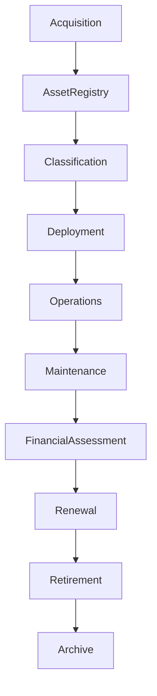

# ARCH-140 — Enterprise Asset Management Architecture

> Référentiel officiel de l'**Architecture de Gestion des Actifs d'Entreprise (Enterprise Asset Management Architecture)** de la plateforme **EduWeb Planner**.

---

# Sommaire

1. Vision
2. Objectifs
3. Principes fondamentaux
4. Définition d'un actif
5. Architecture globale
6. Typologie des actifs
7. Cycle de vie des actifs
8. Registre des actifs
9. Classification et criticité
10. Gestion financière des actifs
11. Maintenance des actifs
12. Sécurité des actifs
13. Gestion des licences
14. Intelligence artificielle et gestion des actifs
15. API conceptuelle
16. Bonnes pratiques
17. Anti-patterns
18. KPI
19. Règles d'architecture
20. Documents liés

---

# 1. Vision

EduWeb Planner considère les **actifs d'entreprise** comme des ressources stratégiques indispensables au fonctionnement, à la sécurité et au développement durable de son écosystème numérique.

L'architecture garantit une gestion unifiée des actifs tout au long de leur cycle de vie afin de :

- maximiser leur valeur ;
- réduire leur coût total de possession (TCO) ;
- assurer leur disponibilité ;
- maîtriser les risques ;
- garantir leur conformité.

---

# 2. Objectifs

Cette architecture vise à :

- inventorier l'ensemble des actifs ;
- optimiser leur utilisation ;
- prolonger leur durée de vie utile ;
- améliorer la planification des investissements ;
- réduire les coûts d'exploitation ;
- renforcer la sécurité et la conformité.

---

# 3. Principes fondamentaux

La gestion des actifs repose sur les principes suivants :

- Asset by Design
- Single Source of Truth
- Lifecycle Management
- Value Optimization
- Risk-Based Management
- Continuous Inventory
- Sustainable Asset Management

---

# 4. Définition d'un actif

Un actif est toute ressource possédée, exploitée ou contrôlée par EduWeb Planner contribuant à la création de valeur.

Chaque actif possède notamment :

- un identifiant unique ;
- un propriétaire ;
- une valeur ;
- un statut ;
- une durée de vie ;
- un niveau de criticité.

---

# 5. Architecture globale

```text
Identification

↓

Enregistrement

↓

Classification

↓

Utilisation

↓

Maintenance

↓

Évaluation

↓

Renouvellement

↓

Retrait

↓

Archivage
```

---

# 6. Typologie des actifs

## Actifs matériels

- serveurs ;
- ordinateurs ;
- équipements réseau ;
- baies de stockage ;
- terminaux mobiles ;
- imprimantes.

---

## Actifs logiciels

- applications ;
- systèmes d'exploitation ;
- bases de données ;
- licences ;
- plateformes SaaS ;
- outils collaboratifs.

---

## Actifs informationnels

- bases de données ;
- référentiels ;
- documents ;
- archives ;
- contenus pédagogiques.

---

## Actifs numériques

- noms de domaine ;
- certificats numériques ;
- API ;
- microservices ;
- modèles IA ;
- jeux de données.

---

## Actifs humains

- compétences ;
- certifications ;
- expertises ;
- savoir-faire organisationnel.

---

## Actifs contractuels

- contrats ;
- abonnements ;
- garanties ;
- conventions de partenariat.

---

# 7. Cycle de vie des actifs

```text
Acquisition

↓

Enregistrement

↓

Déploiement

↓

Exploitation

↓

Maintenance

↓

Évaluation

↓

Remplacement

↓

Retrait

↓

Archivage
```

Le cycle est documenté pour chaque catégorie d'actifs.

---

# 8. Registre des actifs

Le registre central comprend notamment :

- identifiant ;
- catégorie ;
- description ;
- propriétaire ;
- localisation ;
- valeur ;
- date d'acquisition ;
- fournisseur ;
- garantie ;
- état ;
- criticité ;
- historique.

Le registre constitue la référence officielle.

---

# 9. Classification et criticité

Les actifs sont classés selon :

## Niveau de criticité

- Critique ;
- Élevé ;
- Moyen ;
- Faible.

---

## Sensibilité

- Public ;
- Interne ;
- Confidentiel ;
- Très confidentiel.

Cette classification guide les mesures de sécurité.

---

# 10. Gestion financière des actifs

Chaque actif est suivi selon :

- coût d'acquisition ;
- coût de maintenance ;
- coût d'exploitation ;
- amortissement ;
- coût total de possession (TCO) ;
- valeur résiduelle.

Ces informations alimentent les arbitrages budgétaires.

---

# 11. Maintenance des actifs

Les activités de maintenance comprennent :

- maintenance préventive ;
- maintenance corrective ;
- maintenance évolutive ;
- maintenance prédictive.

Les opérations sont planifiées et historisées.

---

# 12. Sécurité des actifs

Chaque actif bénéficie de mesures adaptées :

- contrôle d'accès ;
- chiffrement ;
- sauvegarde ;
- surveillance ;
- journalisation ;
- plan de continuité.

Les actifs critiques font l'objet de contrôles renforcés.

---

# 13. Gestion des licences

Les licences sont suivies afin de garantir :

- leur conformité ;
- leur disponibilité ;
- leur renouvellement ;
- leur optimisation.

Les dépassements de licences sont détectés automatiquement lorsque cela est possible.

---

# 14. Intelligence artificielle et gestion des actifs

L'IA peut assister :

- l'inventaire automatique ;
- la prédiction des pannes ;
- l'optimisation des renouvellements ;
- l'analyse des coûts ;
- la détection d'anomalies ;
- la planification de la maintenance.

Les décisions d'investissement restent sous responsabilité humaine.

---

# 15. API conceptuelle

```typescript
EnterpriseAssetManagementArchitecture {

    AssetRepository

    AssetRegistry

    LifecycleManagement

    FinancialManagement

    MaintenanceManagement

    LicenseManagement

    SecurityManagement

    AIAssetServices

    Governance

}
```

---

# 16. Bonnes pratiques

✔ Maintenir un registre unique des actifs.

✔ Identifier clairement chaque propriétaire.

✔ Évaluer régulièrement la criticité.

✔ Planifier les renouvellements.

✔ Contrôler les licences.

✔ Automatiser l'inventaire lorsque cela est possible.

---

# 17. Anti-patterns

✘ Inventaires incomplets.

✘ Actifs sans propriétaire identifié.

✘ Licences non suivies.

✘ Maintenance uniquement corrective.

✘ Absence d'évaluation financière.

✘ Conserver des actifs obsolètes sans justification.

---

# Diagramme Mermaid



---

# KPI

| KPI | Objectif |
|------|----------|
|Actifs enregistrés dans le registre|100 %|
|Actifs avec propriétaire identifié|100 %|
|Licences conformes|100 %|
|Maintenance préventive réalisée|≥ 95 %|
|Disponibilité des actifs critiques|≥ 99,9 %|
|Réduction annuelle du TCO|Amélioration continue|

---

# Règles d'architecture

## RA-ARCH140-001

Tout actif de l'organisation est identifié de manière unique, enregistré dans un registre officiel et associé à un propriétaire responsable de son cycle de vie.

---

## RA-ARCH140-002

Les actifs sont classés selon leur criticité, leur sensibilité et leur valeur afin de définir les mesures de protection, de maintenance et de gouvernance appropriées.

---

## RA-ARCH140-003

Le cycle de vie des actifs est suivi depuis leur acquisition jusqu'à leur retrait, incluant les opérations de maintenance, les évaluations financières et les renouvellements.

---

## RA-ARCH140-004

Les informations relatives aux actifs, notamment les coûts, les licences, les garanties et les historiques d'intervention, sont maintenues à jour dans le registre officiel.

---

## RA-ARCH140-005

Les capacités d'intelligence artificielle peuvent assister l'inventaire, la maintenance prédictive, l'analyse financière et l'optimisation des actifs, sans se substituer aux décisions des responsables de gouvernance.

---

# Documents liés

- ARCH-109 — High Availability, Scalability & Resilience Architecture
- ARCH-123 — Enterprise Platform Architecture
- ARCH-130 — Enterprise Risk Architecture
- ARCH-137 — Enterprise Release Management Architecture
- ARCH-138 — Enterprise Change Management Architecture
- ARCH-139 — Enterprise Configuration Management Architecture
- ITAM-101 — IT Asset Management Framework
- FIN-101 — Enterprise Financial Management
- OPS-101 — Enterprise Operations Architecture
- SEC-002 — Information Security Classification

---

# Conclusion

L'**Enterprise Asset Management Architecture** fournit le cadre de référence pour inventorier, gouverner, maintenir et valoriser l'ensemble des actifs d'EduWeb Planner. En intégrant une gestion complète du cycle de vie, des aspects financiers, des exigences de sécurité, de maintenance et de conformité, cette architecture optimise l'utilisation des ressources tout en réduisant les risques et les coûts. Complémentaire des architectures de **Configuration Management (ARCH-139)**, **Change Management (ARCH-138)** et **Risk Management (ARCH-130)**, elle constitue un pilier essentiel de la gouvernance opérationnelle et patrimoniale de l'écosystème EduWeb.

# Fin du document
