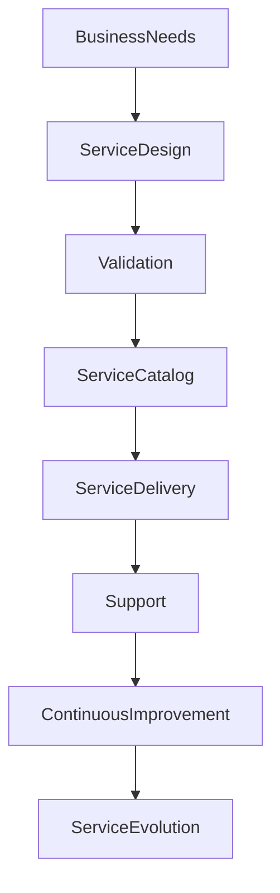

# ARCH-141 — Enterprise Service Management Architecture

> Référentiel officiel de l'**Architecture de Gestion des Services d'Entreprise (Enterprise Service Management Architecture)** de la plateforme **EduWeb Planner**.

---

# Sommaire

1. Vision
2. Objectifs
3. Principes fondamentaux
4. Définition d'un service
5. Architecture globale
6. Typologie des services
7. Cycle de vie des services
8. Catalogue des services
9. Gestion des niveaux de service (SLA)
10. Gestion des demandes de service
11. Gestion des incidents et des problèmes
12. Amélioration continue des services
13. Gouvernance des services
14. Intelligence artificielle et gestion des services
15. API conceptuelle
16. Bonnes pratiques
17. Anti-patterns
18. KPI
19. Règles d'architecture
20. Documents liés

---

# 1. Vision

EduWeb Planner considère les **services** comme l'expression concrète de la valeur apportée aux établissements scolaires, aux administrations, aux enseignants, aux apprenants et aux partenaires.

L'architecture de gestion des services garantit que chaque service est :

- clairement défini ;
- mesurable ;
- gouverné ;
- sécurisé ;
- continuellement amélioré ;
- aligné sur les besoins métiers.

---

# 2. Objectifs

Cette architecture vise à :

- structurer l'ensemble des services de l'organisation ;
- améliorer la qualité de service ;
- optimiser l'expérience utilisateur ;
- garantir le respect des engagements de service ;
- faciliter l'amélioration continue ;
- harmoniser les pratiques ITSM et ESM.

---

# 3. Principes fondamentaux

La gestion des services repose sur les principes suivants :

- Service First
- Value Creation
- Customer-Centric Design
- Continuous Improvement
- Operational Excellence
- Measurable Performance
- Governance by Objectives

---

# 4. Définition d'un service

Un **service** est un ensemble organisé de ressources, de processus, de technologies et de compétences permettant de fournir une valeur mesurable à un utilisateur ou à une organisation.

Chaque service est caractérisé par :

- un identifiant unique ;
- un propriétaire (Service Owner) ;
- une description ;
- des bénéficiaires ;
- un niveau de service attendu ;
- des indicateurs de performance.

---

# 5. Architecture globale

```text
Expression du besoin

↓

Conception du service

↓

Validation

↓

Publication au catalogue

↓

Consommation

↓

Support

↓

Évaluation

↓

Amélioration continue
```

---

# 6. Typologie des services

## Services métiers

Exemples :

- gestion des établissements ;
- gestion pédagogique ;
- gestion administrative ;
- gestion des emplois du temps ;
- gestion des évaluations.

---

## Services numériques

- authentification ;
- messagerie ;
- hébergement ;
- stockage ;
- API.

---

## Services d'assistance

- support utilisateur ;
- assistance technique ;
- formation ;
- accompagnement au changement.

---

## Services d'infrastructure

- réseau ;
- cloud ;
- sauvegarde ;
- supervision ;
- sécurité.

---

## Services d'intelligence artificielle

- assistants IA ;
- recommandation pédagogique ;
- génération documentaire ;
- analyse prédictive ;
- aide à la décision.

---

# 7. Cycle de vie des services

```text
Conception

↓

Développement

↓

Validation

↓

Publication

↓

Exploitation

↓

Évaluation

↓

Optimisation

↓

Retrait
```

Chaque phase est documentée et validée.

---

# 8. Catalogue des services

Le catalogue constitue la référence officielle des services disponibles.

Pour chaque service sont renseignés :

- nom ;
- description ;
- responsable ;
- utilisateurs concernés ;
- SLA ;
- horaires de disponibilité ;
- procédures d'accès ;
- procédures d'escalade ;
- documentation associée.

Le catalogue est maintenu à jour.

---

# 9. Gestion des niveaux de service (SLA)

Chaque service dispose d'engagements mesurables portant notamment sur :

- disponibilité ;
- temps de réponse ;
- temps de résolution ;
- capacité ;
- continuité ;
- qualité.

Les SLA sont suivis par des indicateurs automatisés.

---

# 10. Gestion des demandes de service

Les demandes peuvent concerner :

- création d'un compte ;
- attribution d'un droit ;
- accès à une ressource ;
- installation d'un logiciel ;
- assistance fonctionnelle ;
- accompagnement métier.

Chaque demande suit un workflow standardisé.

---

# 11. Gestion des incidents et des problèmes

La gestion distingue :

## Incident

Interruption ou dégradation d'un service.

Objectif :

> rétablir rapidement le service.

---

## Problème

Cause profonde d'un ou plusieurs incidents.

Objectif :

> éliminer définitivement la cause.

Les processus sont coordonnés avec les architectures de gestion des changements et des configurations.

---

# 12. Amélioration continue des services

L'amélioration continue repose sur :

- l'analyse des KPI ;
- les retours utilisateurs ;
- les audits ;
- les incidents ;
- les innovations technologiques ;
- les recommandations des équipes.

Chaque amélioration est planifiée et évaluée.

---

# 13. Gouvernance des services

Les principaux acteurs sont :

- Service Owner ;
- Service Manager ;
- Product Owner ;
- Responsable Support ;
- Architecte d'entreprise ;
- Direction des opérations ;
- Comité de gouvernance.

Les responsabilités sont définies dans une matrice RACI.

---

# 14. Intelligence artificielle et gestion des services

L'IA peut assister :

- le routage intelligent des demandes ;
- la classification automatique des incidents ;
- la prédiction des dégradations ;
- la recommandation de solutions ;
- la génération de procédures ;
- l'analyse de satisfaction.

Les décisions impactant les engagements contractuels restent sous contrôle humain.

---

# 15. API conceptuelle

```typescript
EnterpriseServiceManagementArchitecture {

    ServiceCatalog

    ServiceRegistry

    ServiceLifecycleManagement

    ServiceRequestManagement

    IncidentManagement

    ProblemManagement

    SLAManagement

    ContinuousImprovement

    AIServiceManagement

    Governance

}
```

---

# 16. Bonnes pratiques

✔ Maintenir un catalogue de services unique.

✔ Définir des SLA réalistes et mesurables.

✔ Nommer un responsable pour chaque service.

✔ Mesurer régulièrement la satisfaction des utilisateurs.

✔ Documenter les procédures de support.

✔ Mettre en œuvre une amélioration continue fondée sur les données.

---

# 17. Anti-patterns

✘ Fournir des services sans propriétaire identifié.

✘ Publier un service sans documentation.

✘ Ne pas mesurer les SLA.

✘ Confondre incidents et problèmes.

✘ Modifier un service sans gouvernance.

✘ Négliger les retours utilisateurs.

---

# Diagramme Mermaid



---

# KPI

| KPI | Objectif |
|------|----------|
|Services documentés dans le catalogue|100 %|
|Respect des SLA|≥ 99 %|
|Temps moyen de résolution des incidents|Réduction continue|
|Satisfaction utilisateur|≥ 95 %|
|Demandes traitées dans les délais|≥ 98 %|
|Services faisant l'objet d'une revue annuelle|100 %|

---

# Règles d'architecture

## RA-ARCH141-001

Tout service est documenté dans un catalogue officiel comprenant son propriétaire, son périmètre, ses bénéficiaires, ses niveaux de service et ses procédures d'exploitation.

---

## RA-ARCH141-002

Chaque service suit un cycle de vie structuré incluant la conception, la validation, la publication, l'exploitation, l'évaluation, l'amélioration continue et, le cas échéant, son retrait.

---

## RA-ARCH141-003

Les engagements de niveau de service (SLA) sont définis, mesurés, suivis et révisés régulièrement afin de garantir la qualité de service attendue.

---

## RA-ARCH141-004

Les processus de gestion des demandes, des incidents, des problèmes et des améliorations sont intégrés aux architectures de gestion des changements, des configurations et des actifs.

---

## RA-ARCH141-005

Les capacités d'intelligence artificielle peuvent assister la gestion des services, le support, la classification des demandes, l'analyse des performances et la recommandation d'améliorations, sans se substituer aux décisions des responsables de gouvernance.

---

# Documents liés

- ARCH-109 — High Availability, Scalability & Resilience Architecture
- ARCH-112 — Enterprise Observability Architecture
- ARCH-123 — Enterprise Platform Architecture
- ARCH-130 — Enterprise Risk Architecture
- ARCH-137 — Enterprise Release Management Architecture
- ARCH-138 — Enterprise Change Management Architecture
- ARCH-139 — Enterprise Configuration Management Architecture
- ARCH-140 — Enterprise Asset Management Architecture
- ITSM-101 — Enterprise IT Service Management
- OPS-101 — Enterprise Operations Architecture

---

# Conclusion

L'**Enterprise Service Management Architecture** constitue le cadre de référence pour concevoir, fournir, exploiter et améliorer les services d'EduWeb Planner. En s'appuyant sur un catalogue de services, des engagements de niveau de service (SLA), des processus structurés de gestion des demandes, des incidents et des problèmes, ainsi que sur une gouvernance orientée valeur, cette architecture garantit une prestation de services fiable, mesurable et centrée sur les utilisateurs. Complémentaire des architectures **Asset Management (ARCH-140)**, **Configuration Management (ARCH-139)** et **Change Management (ARCH-138)**, elle contribue à une gestion intégrée et durable de l'ensemble de l'écosystème EduWeb.

# Fin du document
