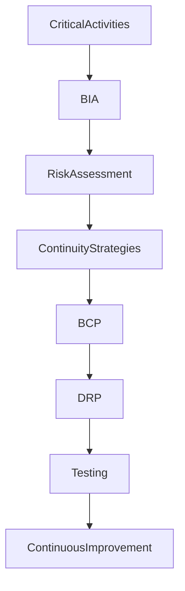

# ARCH-142 — Enterprise Business Continuity Management Architecture

> Référentiel officiel de l'**Architecture de Gestion de la Continuité d'Activité (Enterprise Business Continuity Management Architecture)** de la plateforme **EduWeb Planner**.

---

# Sommaire

1. Vision
2. Objectifs
3. Principes fondamentaux
4. Définition de la continuité d'activité
5. Architecture globale
6. Gouvernance de la continuité
7. Analyse d'impact sur l'activité (BIA)
8. Analyse des risques
9. Stratégies de continuité
10. Plans de continuité d'activité (PCA)
11. Plans de reprise d'activité (PRA)
12. Exercices, tests et simulations
13. Communication de crise
14. Intelligence artificielle et continuité d'activité
15. API conceptuelle
16. Bonnes pratiques
17. Anti-patterns
18. KPI
19. Règles d'architecture
20. Documents liés

---

# 1. Vision

EduWeb Planner doit assurer la continuité de ses missions essentielles quelles que soient les circonstances :

- incident informatique ;
- cyberattaque ;
- catastrophe naturelle ;
- panne électrique ;
- indisponibilité d'un fournisseur ;
- crise sanitaire ;
- erreur humaine ;
- événement exceptionnel.

L'architecture de continuité garantit la résilience de l'ensemble des services numériques et métiers.

---

# 2. Objectifs

Cette architecture vise à :

- assurer la continuité des services essentiels ;
- limiter les interruptions d'activité ;
- protéger les données critiques ;
- organiser les procédures de reprise ;
- réduire les impacts financiers et opérationnels ;
- renforcer la résilience de l'organisation.

---

# 3. Principes fondamentaux

La continuité d'activité repose sur les principes suivants :

- Business First
- Risk-Based Continuity
- Resilience by Design
- Continuous Preparedness
- Tested Recovery
- Redundancy
- Continuous Improvement

---

# 4. Définition de la continuité d'activité

La continuité d'activité regroupe l'ensemble des politiques, procédures, ressources et mécanismes permettant à l'organisation de poursuivre ses activités essentielles malgré une perturbation majeure.

Elle couvre :

- les activités métiers ;
- les infrastructures ;
- les applications ;
- les données ;
- les ressources humaines ;
- les partenaires ;
- les communications.

---

# 5. Architecture globale

```text
Identification des activités critiques

↓

Analyse d'impact (BIA)

↓

Analyse des risques

↓

Définition des stratégies

↓

Élaboration des PCA/PRA

↓

Tests

↓

Exploitation

↓

Amélioration continue
```

---

# 6. Gouvernance de la continuité

La gouvernance implique :

- Direction Générale ;
- Responsable Continuité d'Activité (BCM Manager) ;
- RSSI ;
- Architectes d'entreprise ;
- Responsables métiers ;
- Équipe Infrastructure ;
- Équipe DevSecOps ;
- Cellule de crise.

Les responsabilités sont formalisées dans une matrice RACI.

---

# 7. Analyse d'impact sur l'activité (BIA)

Le **Business Impact Analysis (BIA)** identifie :

- les processus critiques ;
- les dépendances ;
- les impacts d'une interruption ;
- les ressources indispensables ;
- les priorités de reprise.

Les indicateurs clés comprennent :

- **RTO** (Recovery Time Objective) ;
- **RPO** (Recovery Point Objective) ;
- **MTPD** (Maximum Tolerable Period of Disruption).

---

# 8. Analyse des risques

L'analyse porte notamment sur :

- cyberattaques ;
- indisponibilité des infrastructures ;
- défaillance des fournisseurs ;
- erreurs humaines ;
- catastrophes naturelles ;
- pannes énergétiques ;
- pertes de données.

Chaque risque est évalué selon sa probabilité et son impact.

---

# 9. Stratégies de continuité

Les principales stratégies comprennent :

## Redondance

- serveurs ;
- réseaux ;
- bases de données ;
- stockage.

---

## Haute disponibilité

- clustering ;
- load balancing ;
- réplication.

---

## Sauvegardes

- complètes ;
- incrémentales ;
- différentielles ;
- hors site.

---

## Sites de secours

- site chaud (Hot Site) ;
- site tiède (Warm Site) ;
- site froid (Cold Site).

---

## Continuité organisationnelle

- télétravail ;
- délégation des responsabilités ;
- procédures de remplacement.

---

# 10. Plans de continuité d'activité (PCA)

Chaque PCA décrit :

- les activités critiques ;
- les scénarios de crise ;
- les rôles et responsabilités ;
- les procédures d'urgence ;
- les ressources nécessaires ;
- les moyens de communication ;
- les procédures de retour à la normale.

Les PCA sont revus régulièrement.

---

# 11. Plans de reprise d'activité (PRA)

Les PRA précisent :

- les procédures de restauration ;
- l'ordre de reprise des systèmes ;
- les responsabilités ;
- les critères de validation ;
- les délais de reprise ;
- les dépendances techniques.

Ils sont alignés avec les objectifs RTO et RPO.

---

# 12. Exercices, tests et simulations

Les plans sont validés par :

- tests documentaires ;
- exercices sur table ;
- simulations de crise ;
- tests techniques ;
- bascules réelles contrôlées.

Les résultats sont analysés et donnent lieu à des plans d'amélioration.

---

# 13. Communication de crise

La communication de crise prévoit :

- les circuits d'information ;
- les porte-parole ;
- les messages prévalidés ;
- les canaux de communication ;
- les contacts d'urgence ;
- les communications avec les partenaires et les utilisateurs.

La cohérence et la rapidité de diffusion sont essentielles.

---

# 14. Intelligence artificielle et continuité d'activité

L'IA peut assister :

- la détection précoce des incidents ;
- l'analyse prédictive des risques ;
- la priorisation des actions de reprise ;
- la simulation de scénarios de crise ;
- la génération des rapports d'incident ;
- la recommandation d'actions correctives.

Les décisions stratégiques restent sous responsabilité humaine.

---

# 15. API conceptuelle

```typescript
EnterpriseBusinessContinuityArchitecture {

    BusinessImpactAnalysis

    RiskAssessment

    ContinuityStrategyManagement

    BusinessContinuityPlans

    DisasterRecoveryPlans

    CrisisCommunication

    ContinuityTesting

    AIContinuityServices

    Governance

}
```

---

# 16. Bonnes pratiques

✔ Réaliser régulièrement des analyses BIA.

✔ Définir clairement les RTO et RPO.

✔ Tester périodiquement les PCA et PRA.

✔ Maintenir des sauvegardes sécurisées et vérifiées.

✔ Former régulièrement les équipes.

✔ Capitaliser les retours d'expérience après chaque exercice.

---

# 17. Anti-patterns

✘ Ne jamais tester les plans de continuité.

✘ Dépendre d'un fournisseur unique sans solution de secours.

✘ Ne pas documenter les procédures de reprise.

✘ Négliger les communications de crise.

✘ Conserver des sauvegardes non vérifiées.

✘ Considérer la continuité comme un projet ponctuel.

---

# Diagramme Mermaid



---

# KPI

| KPI | Objectif |
|------|----------|
|Processus critiques couverts par un PCA|100 %|
|Systèmes critiques couverts par un PRA|100 %|
|Respect des objectifs RTO|≥ 95 %|
|Respect des objectifs RPO|≥ 95 %|
|Tests de continuité réalisés selon le planning|100 %|
|Temps moyen de reprise réel|Amélioration continue|

---

# Règles d'architecture

## RA-ARCH142-001

Toute activité critique de l'organisation fait l'objet d'une analyse d'impact (BIA) permettant de définir ses priorités de continuité et ses objectifs de reprise.

---

## RA-ARCH142-002

Les plans de continuité d'activité (PCA) et les plans de reprise d'activité (PRA) sont documentés, régulièrement mis à jour, validés et testés.

---

## RA-ARCH142-003

Les stratégies de continuité reposent sur des mécanismes de redondance, de sauvegarde, de haute disponibilité et de reprise adaptés au niveau de criticité des services.

---

## RA-ARCH142-004

Des exercices de simulation, des tests techniques et des revues post-exercice sont réalisés périodiquement afin d'améliorer en permanence la capacité de résilience de l'organisation.

---

## RA-ARCH142-005

Les capacités d'intelligence artificielle peuvent assister la détection des incidents, l'analyse des risques, la simulation des scénarios de crise et la priorisation des actions de reprise, sans se substituer aux décisions des responsables de la continuité d'activité.

---

# Documents liés

- ARCH-109 — High Availability, Scalability & Resilience Architecture
- ARCH-114 — Enterprise Disaster Recovery & Business Continuity Architecture
- ARCH-130 — Enterprise Risk Architecture
- ARCH-131 — Enterprise Audit Architecture
- ARCH-138 — Enterprise Change Management Architecture
- ARCH-139 — Enterprise Configuration Management Architecture
- ARCH-140 — Enterprise Asset Management Architecture
- ARCH-141 — Enterprise Service Management Architecture
- SEC-003 — Enterprise Cybersecurity Architecture
- OPS-101 — Enterprise Operations Architecture

---

# Conclusion

L'**Enterprise Business Continuity Management Architecture** constitue le référentiel stratégique permettant à EduWeb Planner de maintenir ses activités essentielles face aux crises, incidents majeurs et événements exceptionnels. En combinant l'analyse d'impact métier (BIA), l'évaluation des risques, les plans de continuité (PCA), les plans de reprise (PRA), les exercices réguliers et une gouvernance robuste, cette architecture renforce durablement la résilience de l'organisation. Complémentaire des architectures **High Availability (ARCH-109)**, **Disaster Recovery (ARCH-114)**, **Risk Management (ARCH-130)** et **Service Management (ARCH-141)**, elle garantit la continuité des services numériques et métiers au bénéfice de l'ensemble de l'écosystème EduWeb.

# Fin du document
