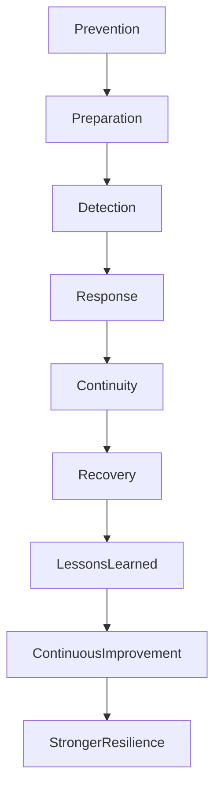

# ARCH-143 — Enterprise Resilience Architecture

> Référentiel officiel de l'**Architecture de Résilience d'Entreprise (Enterprise Resilience Architecture)** de la plateforme **EduWeb Planner**.

---

# Sommaire

1. Vision
2. Objectifs
3. Principes fondamentaux
4. Définition de la résilience d'entreprise
5. Architecture globale
6. Piliers de la résilience
7. Gouvernance de la résilience
8. Résilience opérationnelle
9. Résilience technologique
10. Résilience organisationnelle
11. Résilience des données
12. Résilience de la chaîne de valeur
13. Surveillance et amélioration continue
14. Intelligence artificielle et résilience
15. API conceptuelle
16. Bonnes pratiques
17. Anti-patterns
18. KPI
19. Règles d'architecture
20. Documents liés

---

# 1. Vision

EduWeb Planner adopte une approche globale de la **résilience d'entreprise**, permettant non seulement de résister aux perturbations, mais également de s'adapter rapidement, d'apprendre des événements rencontrés et d'en sortir renforcée.

La résilience est intégrée dès la conception des processus, des applications, des infrastructures et de la gouvernance.

---

# 2. Objectifs

Cette architecture vise à :

- renforcer la capacité d'adaptation de l'organisation ;
- garantir la continuité des services critiques ;
- limiter les impacts des crises ;
- accélérer le retour à un fonctionnement normal ;
- améliorer la robustesse des systèmes ;
- développer une culture permanente de résilience.

---

# 3. Principes fondamentaux

La résilience repose sur les principes suivants :

- Resilience by Design
- Adaptability
- Redundancy
- Continuous Learning
- Proactive Risk Management
- Observability
- Continuous Improvement

---

# 4. Définition de la résilience d'entreprise

La résilience désigne la capacité d'une organisation à :

- anticiper les perturbations ;
- résister aux incidents ;
- absorber les chocs ;
- poursuivre ses activités essentielles ;
- retrouver rapidement un fonctionnement normal ;
- tirer des enseignements afin de devenir plus robuste.

Elle dépasse la simple continuité d'activité en intégrant l'amélioration permanente.

---

# 5. Architecture globale

```text
Prévention

↓

Préparation

↓

Détection

↓

Réponse

↓

Maintien des activités

↓

Reprise

↓

Analyse

↓

Amélioration

↓

Résilience renforcée
```

---

# 6. Piliers de la résilience

## Résilience stratégique

Capacité à maintenir les objectifs de long terme malgré les crises.

---

## Résilience opérationnelle

Capacité des processus métiers à continuer de fonctionner.

---

## Résilience numérique

Capacité des systèmes d'information à rester disponibles.

---

## Résilience humaine

Compétences, organisation, leadership, culture.

---

## Résilience financière

Capacité à absorber les impacts économiques.

---

## Résilience réglementaire

Maintien permanent de la conformité.

---

# 7. Gouvernance de la résilience

La gouvernance implique :

- Direction Générale ;
- Comité Exécutif ;
- Architecte d'Entreprise ;
- Responsable BCM ;
- RSSI ;
- Responsable Qualité ;
- Responsable Risques ;
- Responsable Exploitation.

Les orientations sont validées dans un comité de résilience.

---

# 8. Résilience opérationnelle

Les mécanismes comprennent :

- standardisation des processus ;
- automatisation ;
- plans de secours ;
- polyvalence des équipes ;
- délégation des responsabilités ;
- surveillance continue.

Chaque processus critique dispose d'un scénario de continuité.

---

# 9. Résilience technologique

Les mesures incluent :

- haute disponibilité ;
- infrastructures redondantes ;
- cloud hybride ;
- sauvegardes automatisées ;
- reprise après sinistre ;
- supervision temps réel ;
- cybersécurité intégrée.

Les architectures distribuées sont privilégiées.

---

# 10. Résilience organisationnelle

L'organisation développe :

- une gouvernance agile ;
- des cellules de crise ;
- des plans de succession ;
- une gestion des compétences ;
- une culture d'amélioration continue.

Les responsabilités sont clairement définies.

---

# 11. Résilience des données

Les données critiques bénéficient de :

- réplication ;
- sauvegardes multiples ;
- chiffrement ;
- contrôles d'intégrité ;
- archivage sécurisé ;
- restauration testée.

La protection des données est alignée sur les exigences réglementaires.

---

# 12. Résilience de la chaîne de valeur

La résilience couvre également :

- les fournisseurs ;
- les partenaires ;
- les prestataires cloud ;
- les opérateurs réseau ;
- les établissements scolaires utilisateurs.

Les dépendances critiques sont identifiées et surveillées.

---

# 13. Surveillance et amélioration continue

La résilience est évaluée grâce à :

- audits ;
- exercices ;
- simulations ;
- indicateurs de performance ;
- retours d'expérience (RETEX) ;
- analyses post-incident.

Les plans d'amélioration sont suivis jusqu'à leur réalisation.

---

# 14. Intelligence artificielle et résilience

L'IA peut assister :

- la détection précoce des anomalies ;
- la prédiction des risques ;
- la simulation de scénarios de crise ;
- l'analyse des impacts ;
- la recommandation de mesures correctives ;
- l'optimisation des stratégies de reprise.

Les décisions stratégiques demeurent de la responsabilité des instances de gouvernance.

---

# 15. API conceptuelle

```typescript
EnterpriseResilienceArchitecture {

    ResilienceRepository

    OperationalResilience

    TechnologyResilience

    OrganizationalResilience

    DataResilience

    SupplyChainResilience

    ContinuousMonitoring

    ContinuousImprovement

    AIResilienceServices

    Governance

}
```

---

# 16. Bonnes pratiques

✔ Concevoir les systèmes selon une logique de résilience dès l'origine.

✔ Réaliser des exercices réguliers de simulation.

✔ Diversifier les fournisseurs critiques.

✔ Former les équipes aux procédures de crise.

✔ Mesurer régulièrement la maturité de la résilience.

✔ Capitaliser systématiquement les retours d'expérience.

---

# 17. Anti-patterns

✘ Considérer la résilience comme une responsabilité exclusivement informatique.

✘ Ne jamais tester les scénarios de crise.

✘ Dépendre d'une infrastructure unique.

✘ Ignorer les risques liés aux partenaires.

✘ Sous-estimer le facteur humain.

✘ Ne pas exploiter les enseignements des incidents passés.

---

# Diagramme Mermaid



---

# KPI

| KPI | Objectif |
|------|----------|
|Services critiques résilients|100 %|
|Exercices de résilience réalisés|100 % du planning|
|Temps moyen de retour à la normale|Amélioration continue|
|Scénarios de crise testés|≥ 95 %|
|Recommandations RETEX mises en œuvre|≥ 90 %|
|Indice global de maturité de résilience|Progression annuelle|

---

# Règles d'architecture

## RA-ARCH143-001

La résilience est intégrée dès la conception des processus, des applications, des infrastructures et des organisations afin de limiter les impacts des perturbations.

---

## RA-ARCH143-002

Les activités critiques, les dépendances et les scénarios de crise sont identifiés, documentés et régulièrement réévalués afin d'adapter les stratégies de résilience.

---

## RA-ARCH143-003

Les dispositifs de résilience font l'objet d'exercices, de simulations et de tests périodiques dont les résultats alimentent les plans d'amélioration continue.

---

## RA-ARCH143-004

La gouvernance de la résilience coordonne les dimensions opérationnelles, technologiques, humaines, financières et réglementaires afin d'assurer une réponse cohérente aux crises.

---

## RA-ARCH143-005

Les capacités d'intelligence artificielle peuvent assister la détection des anomalies, la simulation des scénarios, l'analyse prédictive et l'amélioration des stratégies de résilience, sans se substituer aux décisions des responsables de gouvernance.

---

# Documents liés

- ARCH-109 — High Availability, Scalability & Resilience Architecture
- ARCH-114 — Enterprise Disaster Recovery & Business Continuity Architecture
- ARCH-130 — Enterprise Risk Architecture
- ARCH-131 — Enterprise Audit Architecture
- ARCH-142 — Enterprise Business Continuity Management Architecture
- ARCH-141 — Enterprise Service Management Architecture
- ARCH-140 — Enterprise Asset Management Architecture
- SEC-003 — Enterprise Cybersecurity Architecture
- OPS-101 — Enterprise Operations Architecture
- GOV-101 — Enterprise Governance Framework

---

# Conclusion

L'**Enterprise Resilience Architecture** établit le cadre stratégique permettant à EduWeb Planner d'anticiper, d'absorber, de surmonter et de transformer les perturbations en opportunités d'amélioration. En articulant la résilience opérationnelle, technologique, organisationnelle, humaine, financière et informationnelle autour d'une gouvernance unifiée, cette architecture dépasse la seule continuité d'activité pour instaurer une capacité permanente d'adaptation. Complémentaire des architectures **Business Continuity Management (ARCH-142)**, **Risk Management (ARCH-130)**, **Service Management (ARCH-141)** et **High Availability (ARCH-109)**, elle constitue l'un des fondements majeurs de la robustesse et de la pérennité de l'écosystème EduWeb.

# Fin du document
