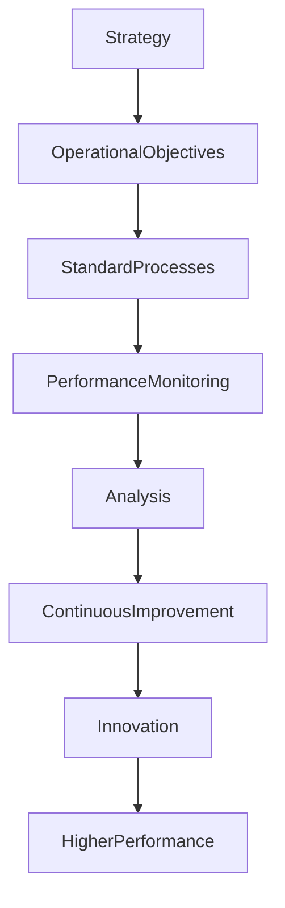

# ARCH-144 — Enterprise Operational Excellence Architecture

> Référentiel officiel de l'**Architecture de l'Excellence Opérationnelle (Enterprise Operational Excellence Architecture)** de la plateforme **EduWeb Planner**.

---

# Sommaire

1. Vision
2. Objectifs
3. Principes fondamentaux
4. Définition de l'excellence opérationnelle
5. Architecture globale
6. Piliers de l'excellence opérationnelle
7. Gouvernance
8. Standardisation des processus
9. Gestion de la performance
10. Culture de l'amélioration continue
11. Optimisation des ressources
12. Innovation opérationnelle
13. Mesure de la maturité opérationnelle
14. Intelligence artificielle et excellence opérationnelle
15. API conceptuelle
16. Bonnes pratiques
17. Anti-patterns
18. KPI
19. Règles d'architecture
20. Documents liés

---

# 1. Vision

EduWeb Planner adopte une démarche d'**Excellence Opérationnelle** visant à offrir des services fiables, performants et durables tout en optimisant continuellement les ressources, les processus et les pratiques de management.

L'objectif est de développer une organisation capable de produire davantage de valeur avec une qualité constante, des délais maîtrisés et une amélioration continue.

---

# 2. Objectifs

Cette architecture vise à :

- améliorer durablement les performances opérationnelles ;
- réduire les gaspillages ;
- accroître la qualité des services ;
- renforcer la satisfaction des utilisateurs ;
- optimiser les ressources ;
- développer une culture de l'amélioration continue.

---

# 3. Principes fondamentaux

L'excellence opérationnelle repose sur les principes suivants :

- Customer Value First
- Continuous Improvement
- Process Excellence
- Evidence-Based Decision Making
- Operational Transparency
- Standardization
- Sustainable Performance

---

# 4. Définition de l'excellence opérationnelle

L'excellence opérationnelle désigne la capacité d'une organisation à atteindre durablement ses objectifs grâce à :

- des processus maîtrisés ;
- une gouvernance efficace ;
- des ressources optimisées ;
- une amélioration permanente ;
- une culture collaborative ;
- une orientation forte vers la création de valeur.

---

# 5. Architecture globale

```text
Vision stratégique

↓

Objectifs opérationnels

↓

Processus standardisés

↓

Pilotage de la performance

↓

Mesure

↓

Analyse

↓

Amélioration

↓

Innovation

↓

Nouvelle performance
```

---

# 6. Piliers de l'excellence opérationnelle

## Gouvernance

Pilotage cohérent des activités.

---

## Processus

Optimisation continue des workflows.

---

## Ressources humaines

Développement des compétences.

---

## Technologies

Automatisation et transformation numérique.

---

## Qualité

Amélioration permanente des résultats.

---

## Innovation

Recherche continue de meilleures pratiques.

---

# 7. Gouvernance

Les principaux acteurs sont :

- Direction Générale ;
- Comité de Pilotage ;
- Architecte d'Entreprise ;
- Responsable Qualité ;
- Responsable Performance ;
- Responsables Métiers ;
- Responsables Techniques.

Les décisions sont guidées par des indicateurs fiables.

---

# 8. Standardisation des processus

Les processus sont :

- documentés ;
- cartographiés ;
- normalisés ;
- versionnés ;
- régulièrement révisés.

Les écarts sont analysés afin d'identifier les opportunités d'amélioration.

---

# 9. Gestion de la performance

La performance est suivie selon plusieurs dimensions :

- efficacité ;
- efficience ;
- qualité ;
- disponibilité ;
- conformité ;
- satisfaction utilisateur ;
- maîtrise des coûts.

Les tableaux de bord sont mis à jour automatiquement lorsque cela est possible.

---

# 10. Culture de l'amélioration continue

L'amélioration continue repose notamment sur :

- le cycle PDCA (Plan-Do-Check-Act) ;
- les retours d'expérience (RETEX) ;
- les audits ;
- les indicateurs ;
- les suggestions des collaborateurs ;
- les innovations technologiques.

Chaque amélioration est documentée.

---

# 11. Optimisation des ressources

L'organisation recherche en permanence :

- une meilleure allocation des ressources ;
- la réduction des tâches à faible valeur ajoutée ;
- l'automatisation des activités répétitives ;
- l'optimisation des coûts ;
- l'amélioration de la productivité.

---

# 12. Innovation opérationnelle

L'innovation est encouragée à travers :

- l'expérimentation contrôlée ;
- les prototypes ;
- les laboratoires d'innovation ;
- les retours des utilisateurs ;
- les technologies émergentes ;
- l'intelligence artificielle.

Les innovations sont évaluées avant leur généralisation.

---

# 13. Mesure de la maturité opérationnelle

La maturité est évaluée selon plusieurs niveaux :

| Niveau | Description |
|---------|-------------|
| 1 | Initial |
| 2 | Répétable |
| 3 | Standardisé |
| 4 | Piloté |
| 5 | Optimisé |

Les évaluations permettent d'orienter les plans de progrès.

---

# 14. Intelligence artificielle et excellence opérationnelle

L'IA peut assister :

- l'analyse des performances ;
- la détection des inefficacités ;
- la prévision des charges ;
- la recommandation d'améliorations ;
- la génération automatique de tableaux de bord ;
- l'analyse des retours utilisateurs.

Les décisions stratégiques demeurent de la responsabilité des dirigeants.

---

# 15. API conceptuelle

```typescript
EnterpriseOperationalExcellenceArchitecture {

    ProcessRepository

    PerformanceManagement

    KPIManagement

    ContinuousImprovement

    InnovationManagement

    ResourceOptimization

    MaturityAssessment

    AIOperationalExcellenceServices

    Governance

}
```

---

# 16. Bonnes pratiques

✔ Standardiser les processus critiques.

✔ Mesurer régulièrement la performance.

✔ Encourager les retours d'expérience.

✔ Développer les compétences des équipes.

✔ Automatiser les activités répétitives.

✔ Réévaluer périodiquement les objectifs opérationnels.

---

# 17. Anti-patterns

✘ Mesurer sans exploiter les résultats.

✘ Multiplier les indicateurs sans finalité.

✘ Négliger les retours des utilisateurs.

✘ Standardiser des processus inefficaces.

✘ Confondre vitesse et qualité.

✘ Limiter l'amélioration continue aux seuls audits.

---

# Diagramme Mermaid



---

# KPI

| KPI | Objectif |
|------|----------|
|Processus documentés et standardisés|100 %|
|Objectifs opérationnels atteints|≥ 95 %|
|Améliorations mises en œuvre|Progression continue|
|Temps moyen d'exécution des processus|Réduction continue|
|Satisfaction des utilisateurs|≥ 95 %|
|Indice de maturité opérationnelle|Progression annuelle|

---

# Règles d'architecture

## RA-ARCH144-001

Les processus critiques de l'organisation sont documentés, standardisés, mesurés et régulièrement améliorés afin de garantir une performance durable.

---

## RA-ARCH144-002

La performance opérationnelle est pilotée au moyen d'indicateurs fiables couvrant les dimensions de qualité, de coûts, de délais, de conformité et de satisfaction des utilisateurs.

---

## RA-ARCH144-003

Toute initiative d'amélioration est évaluée, documentée, priorisée et intégrée dans une démarche structurée d'amélioration continue.

---

## RA-ARCH144-004

Les ressources humaines, technologiques, financières et organisationnelles sont optimisées dans une logique permanente de création de valeur et de réduction des gaspillages.

---

## RA-ARCH144-005

Les capacités d'intelligence artificielle peuvent assister l'analyse des performances, l'identification des axes d'amélioration, l'optimisation des ressources et la production des tableaux de bord, sans se substituer aux décisions des responsables de gouvernance.

---

# Documents liés

- ARCH-115 — Enterprise Architecture Governance
- ARCH-130 — Enterprise Risk Architecture
- ARCH-131 — Enterprise Audit Architecture
- ARCH-141 — Enterprise Service Management Architecture
- ARCH-142 — Enterprise Business Continuity Management Architecture
- ARCH-143 — Enterprise Resilience Architecture
- QA-101 — Enterprise Quality Assurance Framework
- OPS-101 — Enterprise Operations Architecture
- BPM-101 — Business Process Management Framework
- GOV-101 — Enterprise Governance Framework

---

# Conclusion

L'**Enterprise Operational Excellence Architecture** constitue le cadre de référence permettant à EduWeb Planner d'atteindre un haut niveau de performance durable grâce à la standardisation des processus, à la maîtrise des ressources, à une gouvernance orientée résultats et à une culture d'amélioration continue. En intégrant les meilleures pratiques de management, d'innovation et de pilotage par les données, cette architecture favorise une organisation agile, efficiente et centrée sur la création de valeur. Complémentaire des architectures **Service Management (ARCH-141)**, **Business Continuity Management (ARCH-142)**, **Enterprise Resilience (ARCH-143)** et **Governance (ARCH-115)**, elle représente l'un des piliers majeurs de la transformation et de la performance globale de l'écosystème EduWeb.

# Fin du document
