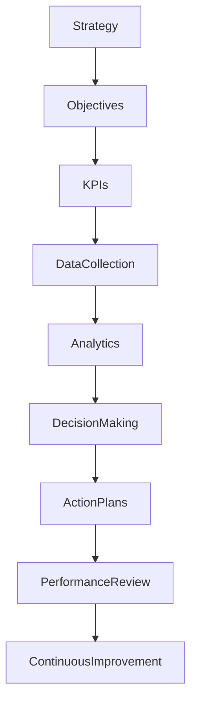

# ARCH-145 — Enterprise Performance Management Architecture

> Référentiel officiel de l'**Architecture de Pilotage de la Performance d'Entreprise (Enterprise Performance Management Architecture)** de la plateforme **EduWeb Planner**.

---

# Sommaire

1. Vision
2. Objectifs
3. Principes fondamentaux
4. Définition du pilotage de la performance
5. Architecture globale
6. Cadre stratégique de la performance
7. Gouvernance de la performance
8. Indicateurs de performance (KPI)
9. Tableaux de bord décisionnels
10. Pilotage par objectifs (OKR)
11. Évaluation de la performance organisationnelle
12. Amélioration continue
13. Intelligence artificielle et pilotage de la performance
14. API conceptuelle
15. Bonnes pratiques
16. Anti-patterns
17. KPI de l'architecture
18. Règles d'architecture
19. Documents liés
20. Conclusion

---

# 1. Vision

EduWeb Planner adopte une approche intégrée du **pilotage de la performance**, permettant d'aligner les objectifs stratégiques, les activités opérationnelles et les résultats obtenus.

Chaque décision doit être guidée par des données fiables, mesurables et actualisées afin de favoriser une amélioration continue de la performance globale.

---

# 2. Objectifs

Cette architecture vise à :

- aligner les performances opérationnelles sur la stratégie ;
- mesurer objectivement les résultats ;
- faciliter la prise de décision ;
- identifier rapidement les écarts ;
- renforcer la culture de responsabilité ;
- soutenir l'amélioration continue.

---

# 3. Principes fondamentaux

Le pilotage de la performance repose sur les principes suivants :

- Strategy Alignment
- Evidence-Based Management
- Continuous Measurement
- Transparency
- Accountability
- Continuous Learning
- Value Creation

---

# 4. Définition du pilotage de la performance

Le pilotage de la performance regroupe l'ensemble des méthodes, processus, indicateurs et outils permettant de mesurer, d'analyser et d'améliorer les performances de l'organisation.

Il couvre notamment :

- les performances stratégiques ;
- les performances métiers ;
- les performances opérationnelles ;
- les performances financières ;
- les performances numériques ;
- les performances pédagogiques.

---

# 5. Architecture globale

```text
Vision stratégique

↓

Objectifs

↓

Indicateurs (KPI)

↓

Collecte des données

↓

Analyse

↓

Décision

↓

Actions correctives

↓

Évaluation

↓

Amélioration continue
```

---

# 6. Cadre stratégique de la performance

Le pilotage repose sur plusieurs niveaux :

## Niveau stratégique

- vision ;
- missions ;
- orientations.

---

## Niveau tactique

- programmes ;
- projets ;
- produits ;
- directions.

---

## Niveau opérationnel

- équipes ;
- processus ;
- activités ;
- services.

Chaque niveau dispose de ses propres indicateurs.

---

# 7. Gouvernance de la performance

Les principaux acteurs sont :

- Direction Générale ;
- Comité de Pilotage ;
- Architecte d'Entreprise ;
- Responsable Qualité ;
- Responsable Performance ;
- Contrôle de Gestion ;
- Responsables métiers ;
- Data Office.

La gouvernance garantit la cohérence des indicateurs et des analyses.

---

# 8. Indicateurs de performance (KPI)

Les KPI sont classés selon plusieurs catégories.

## Stratégiques

- croissance ;
- couverture nationale ;
- innovation.

---

## Financiers

- recettes ;
- coûts ;
- rentabilité ;
- ROI ;
- TCO.

---

## Opérationnels

- disponibilité ;
- délais ;
- qualité ;
- productivité.

---

## Techniques

- disponibilité des plateformes ;
- temps de réponse ;
- incidents ;
- sécurité.

---

## Utilisateurs

- satisfaction ;
- engagement ;
- fidélisation.

Chaque KPI possède :

- une définition ;
- une méthode de calcul ;
- une fréquence de mesure ;
- un responsable ;
- une cible.

---

# 9. Tableaux de bord décisionnels

Les tableaux de bord permettent :

- le suivi en temps réel ;
- l'analyse historique ;
- les comparaisons ;
- les alertes automatiques ;
- les simulations.

Ils sont adaptés aux différents niveaux de gouvernance.

---

# 10. Pilotage par objectifs (OKR)

L'architecture supporte une approche **Objectives & Key Results (OKR)**.

Chaque objectif comprend :

- une formulation claire ;
- des résultats clés mesurables ;
- un responsable ;
- une échéance.

Les OKR sont révisés périodiquement.

---

# 11. Évaluation de la performance organisationnelle

Les évaluations prennent en compte :

- les résultats obtenus ;
- les écarts par rapport aux objectifs ;
- les risques ;
- les facteurs explicatifs ;
- les opportunités d'amélioration.

Les conclusions alimentent les décisions stratégiques.

---

# 12. Amélioration continue

Le pilotage de la performance s'inscrit dans une démarche permanente :

```text
Mesurer

↓

Analyser

↓

Décider

↓

Agir

↓

Mesurer à nouveau
```

Les retours d'expérience enrichissent les référentiels.

---

# 13. Intelligence artificielle et pilotage de la performance

L'IA peut assister :

- l'analyse prédictive des KPI ;
- la détection des anomalies ;
- la prévision des tendances ;
- la génération automatique de tableaux de bord ;
- la recommandation d'actions correctives ;
- la simulation de scénarios décisionnels.

Les arbitrages stratégiques restent sous la responsabilité des instances de gouvernance.

---

# 14. API conceptuelle

```typescript
EnterprisePerformanceManagementArchitecture {

    StrategyManagement

    KPIRepository

    ObjectiveManagement

    DashboardManagement

    DataAnalytics

    PerformanceAssessment

    ContinuousImprovement

    AIPerformanceServices

    Governance

}
```

---

# 15. Bonnes pratiques

✔ Définir des KPI limités mais pertinents.

✔ Aligner les indicateurs sur les objectifs stratégiques.

✔ Mettre à jour régulièrement les tableaux de bord.

✔ Automatiser la collecte des données.

✔ Réaliser des revues périodiques de performance.

✔ Associer chaque indicateur à un responsable identifié.

---

# 16. Anti-patterns

✘ Multiplier les KPI sans valeur décisionnelle.

✘ Utiliser des données non fiables.

✘ Modifier les indicateurs sans gouvernance.

✘ Mesurer uniquement les résultats financiers.

✘ Ne pas exploiter les analyses produites.

✘ Confondre volume d'activité et performance.

---

# Diagramme Mermaid



---

# 17. KPI de l'architecture

| KPI | Objectif |
|------|----------|
|Objectifs stratégiques couverts par des KPI|100 %|
|KPI mis à jour selon la fréquence prévue|≥ 98 %|
|Décisions appuyées sur des tableaux de bord|≥ 95 %|
|Revues de performance réalisées|100 %|
|Actions correctives clôturées dans les délais|≥ 90 %|
|Amélioration annuelle des indicateurs clés|Progression continue|

---

# Règles d'architecture

## RA-ARCH145-001

Tout objectif stratégique, tactique ou opérationnel est associé à des indicateurs de performance clairement définis, mesurables et régulièrement réévalués.

---

## RA-ARCH145-002

Les indicateurs de performance sont documentés, gouvernés et alimentés par des données fiables, traçables et actualisées provenant de sources maîtrisées.

---

## RA-ARCH145-003

Les tableaux de bord décisionnels sont adaptés aux différents niveaux de gouvernance et permettent le suivi en temps réel des performances, des écarts et des tendances.

---

## RA-ARCH145-004

Les résultats des évaluations de performance alimentent les processus d'amélioration continue, de gestion des risques, de planification stratégique et de prise de décision.

---

## RA-ARCH145-005

Les capacités d'intelligence artificielle peuvent assister l'analyse prédictive, la détection des anomalies, la simulation de scénarios et la recommandation d'actions d'amélioration, sans se substituer aux décisions des responsables de gouvernance.

---

# Documents liés

- ARCH-115 — Enterprise Architecture Governance
- ARCH-117 — Enterprise Business Capability Architecture
- ARCH-118 — Enterprise Business Process Architecture
- ARCH-119 — Enterprise Decision Architecture
- ARCH-132 — Enterprise Portfolio Architecture
- ARCH-133 — Enterprise Program Architecture
- ARCH-134 — Enterprise Project Architecture
- ARCH-141 — Enterprise Service Management Architecture
- ARCH-144 — Enterprise Operational Excellence Architecture
- BI-101 — Enterprise Business Intelligence Framework

---

# Conclusion

L'**Enterprise Performance Management Architecture** constitue le cadre de référence permettant à EduWeb Planner de mesurer, analyser et améliorer durablement ses performances à tous les niveaux de l'organisation. En alignant les objectifs stratégiques avec des indicateurs fiables, des tableaux de bord décisionnels et des mécanismes d'amélioration continue, cette architecture renforce la qualité de la gouvernance et la capacité d'adaptation de l'organisation. Complémentaire des architectures **Operational Excellence (ARCH-144)**, **Decision Architecture (ARCH-119)**, **Governance (ARCH-115)** et **Business Capability (ARCH-117)**, elle fournit les fondements d'un pilotage stratégique orienté résultats, données et création de valeur.

# Fin du document
