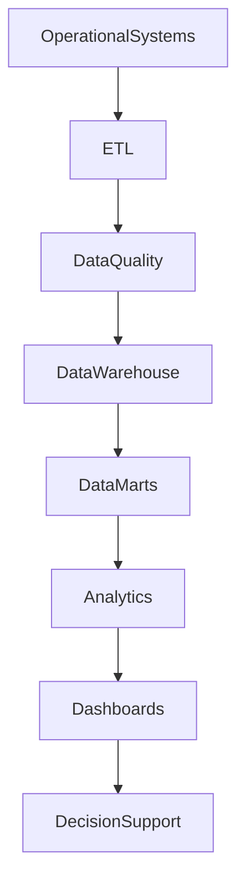

# ARCH-146 — Enterprise Business Intelligence Architecture

> Référentiel officiel de l'**Architecture décisionnelle et Business Intelligence (Enterprise Business Intelligence Architecture)** de la plateforme **EduWeb Planner**.

---

# Sommaire

1. Vision
2. Objectifs
3. Principes fondamentaux
4. Définition de la Business Intelligence
5. Architecture globale
6. Sources de données
7. Intégration et qualité des données
8. Entrepôt de données (Data Warehouse)
9. Data Marts
10. Analyses décisionnelles
11. Visualisation et tableaux de bord
12. Gouvernance de la Business Intelligence
13. Intelligence artificielle et BI
14. API conceptuelle
15. Bonnes pratiques
16. Anti-patterns
17. KPI
18. Règles d'architecture
19. Documents liés
20. Conclusion

---

# 1. Vision

EduWeb Planner place la **Business Intelligence (BI)** au cœur de sa gouvernance afin de transformer les données en informations fiables, puis en connaissances exploitables pour soutenir la décision stratégique, tactique et opérationnelle.

La BI constitue l'un des principaux leviers de pilotage de l'ensemble de l'écosystème EduWeb.

---

# 2. Objectifs

Cette architecture vise à :

- centraliser les données décisionnelles ;
- produire une information fiable ;
- accélérer la prise de décision ;
- améliorer le pilotage des performances ;
- renforcer la transparence ;
- favoriser une culture orientée données (Data Driven Organization).

---

# 3. Principes fondamentaux

La Business Intelligence repose sur les principes suivants :

- Single Version of Truth
- Data Quality First
- Decision by Evidence
- Self-Service Analytics
- Secure Data Access
- Near Real-Time Intelligence
- Continuous Improvement

---

# 4. Définition de la Business Intelligence

La Business Intelligence désigne l'ensemble des méthodes, technologies et processus permettant de :

- collecter ;
- intégrer ;
- consolider ;
- analyser ;
- visualiser ;
- diffuser les données décisionnelles.

Elle transforme les données brutes en informations utiles à la gouvernance.

---

# 5. Architecture globale

```text
Sources de données

↓

Collecte

↓

ETL / ELT

↓

Contrôle qualité

↓

Data Warehouse

↓

Data Marts

↓

Analyse

↓

Visualisation

↓

Décision
```

---

# 6. Sources de données

Les principales sources comprennent :

## Applications EduWeb

- Planner
- Governance
- Family
- Booking
- Learning
- Finance

---

## Applications partenaires

- ERP
- CRM
- LMS
- RH
- Comptabilité

---

## Données externes

- Ministères
- Open Data
- Statistiques nationales
- Organismes internationaux
- Données météorologiques
- Données démographiques

---

## IoT et supervision

- journaux systèmes ;
- métriques ;
- événements ;
- télémétrie.

---

# 7. Intégration et qualité des données

Les traitements comprennent :

- extraction ;
- transformation ;
- chargement (ETL/ELT) ;
- nettoyage ;
- normalisation ;
- enrichissement ;
- déduplication ;
- validation.

Les contrôles de qualité sont automatisés.

---

# 8. Entrepôt de données (Data Warehouse)

Le Data Warehouse constitue la référence décisionnelle.

Il centralise :

- données historiques ;
- données consolidées ;
- données normalisées ;
- indicateurs calculés.

Les modèles dimensionnels (étoile ou flocon) sont privilégiés selon les besoins analytiques.

---

# 9. Data Marts

Des Data Marts spécialisés sont construits pour :

## Gouvernance

- indicateurs institutionnels ;
- conformité.

---

## Finance

- budgets ;
- dépenses ;
- recettes.

---

## Pédagogie

- résultats scolaires ;
- fréquentation ;
- progression.

---

## Ressources humaines

- effectifs ;
- compétences ;
- formations.

---

## Commercial

- abonnements ;
- ventes ;
- fidélisation.

---

# 10. Analyses décisionnelles

Les analyses couvrent :

- analyses descriptives ;
- analyses diagnostiques ;
- analyses prédictives ;
- analyses prescriptives ;
- simulations ;
- analyses multidimensionnelles (OLAP).

Les utilisateurs peuvent réaliser des analyses interactives.

---

# 11. Visualisation et tableaux de bord

Les tableaux de bord proposent :

- indicateurs temps réel ;
- graphiques dynamiques ;
- cartes ;
- analyses géographiques ;
- alertes ;
- comparaisons temporelles ;
- analyses multicritères.

Chaque profil dispose d'une vue adaptée à ses responsabilités.

---

# 12. Gouvernance de la Business Intelligence

La gouvernance mobilise :

- Chief Data Officer ;
- Architecte Data ;
- Data Engineers ;
- Data Analysts ;
- Data Scientists ;
- Responsables Métiers ;
- Comité Data.

Les responsabilités sont définies dans une matrice RACI.

---

# 13. Intelligence artificielle et BI

L'IA peut assister :

- la détection automatique de tendances ;
- l'explication des variations ;
- les prévisions ;
- la génération automatique de rapports ;
- les requêtes en langage naturel ;
- les recommandations stratégiques.

L'IA générative facilite également la création de tableaux de bord et la synthèse des résultats.

---

# 14. API conceptuelle

```typescript
EnterpriseBusinessIntelligenceArchitecture {

    DataSources

    ETLServices

    DataWarehouse

    DataMartManagement

    AnalyticsEngine

    DashboardManagement

    ReportingServices

    AIAnalytics

    Governance

}
```

---

# 15. Bonnes pratiques

✔ Maintenir une source unique de vérité.

✔ Contrôler systématiquement la qualité des données.

✔ Automatiser les flux ETL.

✔ Documenter les indicateurs.

✔ Sécuriser les accès aux données.

✔ Réviser régulièrement les tableaux de bord.

---

# 16. Anti-patterns

✘ Produire plusieurs versions contradictoires d'un même indicateur.

✘ Construire des tableaux de bord sans gouvernance.

✘ Utiliser des données non validées.

✘ Mélanger données opérationnelles et décisionnelles sans contrôle.

✘ Accorder des accès excessifs aux données sensibles.

✘ Négliger la documentation des KPI.

---

# Diagramme Mermaid



---

# KPI

| KPI | Objectif |
|------|----------|
|Qualité des données|≥ 99 %|
|Actualisation des indicateurs|Temps réel ou selon SLA|
|Rapports générés automatiquement|≥ 95 %|
|Disponibilité du Data Warehouse|≥ 99,9 %|
|Temps moyen de génération des tableaux de bord|< 5 secondes|
|Utilisateurs actifs de la BI|Progression continue|

---

# Règles d'architecture

## RA-ARCH146-001

Les données décisionnelles proviennent exclusivement de sources identifiées, gouvernées et validées afin de garantir une information fiable et cohérente.

---

## RA-ARCH146-002

Le Data Warehouse constitue la source officielle des analyses décisionnelles, tandis que les Data Marts répondent aux besoins spécifiques des domaines métiers.

---

## RA-ARCH146-003

Les traitements ETL/ELT intègrent systématiquement des contrôles de qualité, de traçabilité, de sécurité et de conformité des données.

---

## RA-ARCH146-004

Les tableaux de bord et rapports décisionnels sont adaptés aux différents niveaux de gouvernance et permettent le suivi des objectifs stratégiques, tactiques et opérationnels.

---

## RA-ARCH146-005

Les capacités d'intelligence artificielle peuvent assister l'analyse, la prévision, la génération de rapports et l'exploration des données, sans se substituer aux décisions des responsables de gouvernance.

---

# Documents liés

- ARCH-111 — Enterprise Data Architecture
- ARCH-119 — Enterprise Decision Architecture
- ARCH-120 — Enterprise Knowledge Architecture
- ARCH-121 — Enterprise Information Architecture
- ARCH-145 — Enterprise Performance Management Architecture
- DATA-101 — Enterprise Data Governance Framework
- BI-101 — Enterprise Business Intelligence Framework
- AI-101 — Enterprise Artificial Intelligence Architecture
- GOV-101 — Enterprise Governance Framework
- SEC-003 — Enterprise Cybersecurity Architecture

---

# Conclusion

L'**Enterprise Business Intelligence Architecture** constitue le socle décisionnel de l'écosystème EduWeb Planner. En structurant l'ensemble de la chaîne de valeur des données — depuis leur collecte jusqu'à leur visualisation — elle permet de transformer les données en informations stratégiques puis en connaissances exploitables. Grâce à une gouvernance rigoureuse, à des entrepôts de données centralisés, à des analyses avancées et à l'apport de l'intelligence artificielle, cette architecture favorise une organisation pleinement **Data Driven**, capable de prendre des décisions rapides, objectives et fondées sur des informations fiables. Elle complète naturellement les architectures **Enterprise Data (ARCH-111)**, **Performance Management (ARCH-145)** et **Decision Architecture (ARCH-119)**.

# Fin du document
