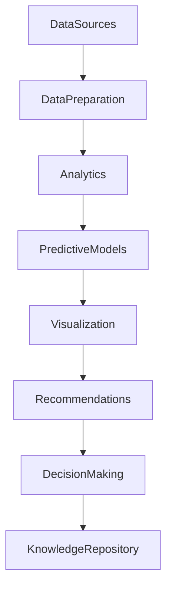

# ARCH-147 — Enterprise Analytics Architecture

> Référentiel officiel de l'**Architecture Analytique d'Entreprise (Enterprise Analytics Architecture)** de la plateforme **EduWeb Planner**.

---

# Sommaire

1. Vision
2. Objectifs
3. Principes fondamentaux
4. Définition de l'Enterprise Analytics
5. Architecture globale
6. Typologie des analyses
7. Gouvernance analytique
8. Cycle de vie analytique
9. Plateforme analytique
10. Modèles analytiques
11. Industrialisation des analyses
12. Diffusion des résultats
13. Intelligence artificielle et Enterprise Analytics
14. API conceptuelle
15. Bonnes pratiques
16. Anti-patterns
17. KPI
18. Règles d'architecture
19. Documents liés
20. Conclusion

---

# 1. Vision

EduWeb Planner place l'**Enterprise Analytics** au cœur de son architecture décisionnelle afin de transformer les données, les informations et les connaissances en **actions stratégiques mesurables**.

L'objectif est de permettre une prise de décision rapide, objective, prédictive et continuellement améliorée.

---

# 2. Objectifs

Cette architecture vise à :

- démocratiser l'analyse des données ;
- industrialiser les traitements analytiques ;
- améliorer la qualité des décisions ;
- renforcer les capacités de prévision ;
- accélérer l'innovation ;
- soutenir l'ensemble des métiers.

---

# 3. Principes fondamentaux

L'Enterprise Analytics repose sur :

- Data Driven Organization
- Explainable Analytics
- Trusted Analytics
- Reusable Analytics
- Automation First
- Self-Service Analytics
- Continuous Learning

---

# 4. Définition de l'Enterprise Analytics

L'Enterprise Analytics regroupe l'ensemble des méthodes permettant d'exploiter les données de l'organisation afin de produire :

- des analyses ;
- des indicateurs ;
- des prévisions ;
- des simulations ;
- des recommandations ;
- des scénarios d'aide à la décision.

Elle complète la Business Intelligence en apportant des capacités analytiques avancées.

---

# 5. Architecture globale

```text
Sources de données

↓

Préparation

↓

Analyse

↓

Modélisation

↓

Visualisation

↓

Recommandation

↓

Décision

↓

Capitalisation
```

---

# 6. Typologie des analyses

## Analyse descriptive

Répond à la question :

> Que s'est-il passé ?

Exemples :

- nombre d'élèves ;
- taux d'inscription ;
- fréquentation.

---

## Analyse diagnostique

Répond à la question :

> Pourquoi cela s'est-il produit ?

Exemples :

- baisse d'abonnements ;
- hausse des incidents ;
- variation des performances.

---

## Analyse prédictive

Répond à la question :

> Que risque-t-il de se produire ?

Exemples :

- prévision des effectifs ;
- estimation des recettes ;
- anticipation des abandons scolaires.

---

## Analyse prescriptive

Répond à la question :

> Quelle est la meilleure décision ?

Exemples :

- optimisation des ressources ;
- planification des emplois du temps ;
- priorisation des investissements.

---

## Analyse cognitive

Mobilise :

- IA générative ;
- Machine Learning ;
- NLP ;
- moteurs de raisonnement.

---

# 7. Gouvernance analytique

Les principaux acteurs sont :

- Chief Data Officer ;
- Chief Analytics Officer ;
- Data Scientists ;
- Data Analysts ;
- Business Analysts ;
- Architectes Data ;
- Architectes IA ;
- Responsables métiers.

Les modèles analytiques sont validés avant leur mise en production.

---

# 8. Cycle de vie analytique

```text
Identification du besoin

↓

Collecte

↓

Préparation

↓

Analyse

↓

Validation

↓

Industrialisation

↓

Déploiement

↓

Suivi

↓

Amélioration
```

Chaque étape est documentée.

---

# 9. Plateforme analytique

La plateforme comprend notamment :

## Data Lake

Stockage massif.

---

## Data Warehouse

Données consolidées.

---

## Moteurs analytiques

- SQL ;
- OLAP ;
- Spark ;
- moteurs statistiques.

---

## Plateforme IA

- Machine Learning ;
- Deep Learning ;
- modèles génératifs.

---

## Outils décisionnels

- tableaux de bord ;
- reporting ;
- alertes.

---

# 10. Modèles analytiques

Les modèles peuvent porter sur :

- la réussite scolaire ;
- les performances pédagogiques ;
- les finances ;
- les abonnements ;
- les risques ;
- les ressources humaines ;
- la cybersécurité ;
- les infrastructures.

Chaque modèle est :

- documenté ;
- versionné ;
- validé ;
- supervisé.

---

# 11. Industrialisation des analyses

Les traitements analytiques sont :

- automatisés ;
- planifiés ;
- supervisés ;
- versionnés ;
- journalisés.

Les pipelines analytiques sont reproductibles.

---

# 12. Diffusion des résultats

Les résultats peuvent être diffusés sous forme de :

- tableaux de bord ;
- rapports ;
- alertes ;
- API ;
- widgets ;
- assistants IA ;
- notifications.

Les droits d'accès sont gouvernés selon les profils utilisateurs.

---

# 13. Intelligence artificielle et Enterprise Analytics

L'IA renforce les capacités analytiques grâce à :

- la génération automatique d'hypothèses ;
- l'explication des résultats ;
- l'analyse conversationnelle ;
- les prévisions ;
- les simulations ;
- les recommandations personnalisées.

Les modèles analytiques restent supervisés afin de garantir leur qualité et leur explicabilité.

---

# 14. API conceptuelle

```typescript
EnterpriseAnalyticsArchitecture {

    DataPreparation

    AnalyticsRepository

    PredictiveAnalytics

    PrescriptiveAnalytics

    CognitiveAnalytics

    VisualizationServices

    AnalyticsAPI

    AIAnalyticsPlatform

    Governance

}
```

---

# 15. Bonnes pratiques

✔ Documenter les modèles analytiques.

✔ Vérifier systématiquement la qualité des données.

✔ Réaliser des validations statistiques.

✔ Mettre en place des tableaux de bord explicatifs.

✔ Contrôler les biais analytiques.

✔ Réviser régulièrement les modèles.

---

# 16. Anti-patterns

✘ Confondre BI et Analytics.

✘ Utiliser des modèles non validés.

✘ Ignorer la qualité des données.

✘ Déployer des analyses sans gouvernance.

✘ Produire des recommandations non explicables.

✘ Conserver des modèles obsolètes.

---

# Diagramme Mermaid



---

# KPI

| KPI | Objectif |
|------|----------|
|Modèles analytiques documentés|100 %|
|Analyses automatisées|≥ 95 %|
|Temps moyen de production d'une analyse|Réduction continue|
|Précision moyenne des modèles prédictifs|≥ 90 %|
|Rapports analytiques produits dans les délais|≥ 98 %|
|Utilisation des analyses dans les décisions|Progression continue|

---

# Règles d'architecture

## RA-ARCH147-001

Toute analyse stratégique ou opérationnelle repose sur des données gouvernées, validées et traçables, conformément aux politiques de gouvernance des données de l'organisation.

---

## RA-ARCH147-002

Les modèles analytiques sont documentés, versionnés, validés, supervisés et régulièrement réévalués afin de garantir leur pertinence, leur précision et leur explicabilité.

---

## RA-ARCH147-003

Les traitements analytiques sont industrialisés sous forme de pipelines automatisés, reproductibles, sécurisés et supervisés.

---

## RA-ARCH147-004

Les résultats analytiques sont diffusés au travers de tableaux de bord, d'API, de rapports ou d'assistants intelligents adaptés aux différents niveaux de gouvernance.

---

## RA-ARCH147-005

Les capacités d'intelligence artificielle peuvent assister la préparation des données, la modélisation, l'analyse prédictive, la génération de recommandations et l'analyse conversationnelle, sans se substituer aux décisions des responsables de gouvernance.

---

# Documents liés

- ARCH-111 — Enterprise Data Architecture
- ARCH-119 — Enterprise Decision Architecture
- ARCH-120 — Enterprise Knowledge Architecture
- ARCH-121 — Enterprise Information Architecture
- ARCH-145 — Enterprise Performance Management Architecture
- ARCH-146 — Enterprise Business Intelligence Architecture
- AI-101 — Enterprise Artificial Intelligence Architecture
- DATA-101 — Enterprise Data Governance Framework
- BI-101 — Enterprise Business Intelligence Framework
- ML-101 — Enterprise Machine Learning Framework

---

# Conclusion

L'**Enterprise Analytics Architecture** constitue le niveau d'exploitation avancée des données au sein d'EduWeb Planner. Complémentaire de la **Business Intelligence (ARCH-146)**, elle permet d'aller au-delà de l'observation des performances pour expliquer les phénomènes, anticiper les évolutions et recommander les meilleures décisions. En intégrant des capacités de modélisation, d'analyse prédictive, d'analyse prescriptive et d'intelligence artificielle, cette architecture renforce la capacité de l'organisation à piloter ses activités de manière proactive, mesurable et durable. Elle représente un pilier majeur de la transformation d'EduWeb en une véritable **Enterprise Intelligence Organization**.

# Fin du document
