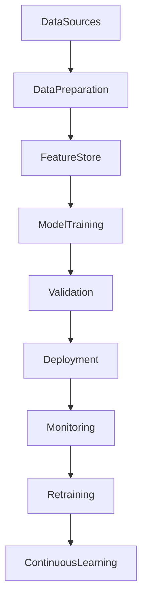

# ARCH-148 — Enterprise Artificial Intelligence Architecture

> Référentiel officiel de l'**Architecture d'Intelligence Artificielle d'Entreprise (Enterprise Artificial Intelligence Architecture)** de la plateforme **EduWeb Planner**.

---

# Sommaire

1. Vision
2. Objectifs
3. Principes fondamentaux
4. Définition de l'IA d'entreprise
5. Architecture globale
6. Domaines d'application
7. Gouvernance de l'IA
8. Cycle de vie des modèles IA
9. Plateforme IA d'entreprise
10. IA générative
11. IA prédictive et prescriptive
12. IA responsable et éthique
13. MLOps et AIOps
14. API conceptuelle
15. Bonnes pratiques
16. Anti-patterns
17. KPI
18. Règles d'architecture
19. Documents liés
20. Conclusion

---

# 1. Vision

EduWeb Planner adopte une architecture **AI-First**, dans laquelle l'intelligence artificielle devient un accélérateur transversal de création de valeur, d'automatisation, d'aide à la décision, de personnalisation des services et d'innovation.

L'IA est intégrée de manière responsable dans l'ensemble des processus métiers tout en conservant l'humain au centre de la décision.

---

# 2. Objectifs

Cette architecture vise à :

- industrialiser les usages de l'IA ;
- améliorer la qualité des décisions ;
- automatiser les tâches répétitives ;
- personnaliser les services numériques ;
- renforcer les capacités prédictives ;
- garantir une IA éthique, explicable et sécurisée.

---

# 3. Principes fondamentaux

L'architecture IA repose sur :

- AI by Design
- Human-in-the-Loop
- Responsible AI
- Explainable AI
- Secure AI
- Reusable AI
- Continuous Learning

---

# 4. Définition de l'IA d'entreprise

L'Intelligence Artificielle d'Entreprise regroupe l'ensemble des technologies permettant à EduWeb Planner :

- d'apprendre à partir des données ;
- de raisonner ;
- de prédire ;
- de générer du contenu ;
- d'assister les utilisateurs ;
- d'automatiser certaines décisions.

L'IA complète les capacités humaines sans s'y substituer.

---

# 5. Architecture globale

```text
Sources de données

↓

Préparation

↓

Feature Store

↓

Entraînement

↓

Validation

↓

Déploiement

↓

Supervision

↓

Réentraînement

↓

Amélioration continue
```

---

# 6. Domaines d'application

L'IA intervient notamment dans :

## Gouvernance

- aide à la décision ;
- prévisions stratégiques ;
- détection des risques.

---

## Éducation

- personnalisation des apprentissages ;
- tutorat intelligent ;
- génération de contenus pédagogiques ;
- recommandations.

---

## Administration

- traitement documentaire ;
- assistants conversationnels ;
- analyse réglementaire.

---

## Finance

- prévisions budgétaires ;
- détection de fraude ;
- optimisation financière.

---

## Cybersécurité

- détection d'intrusion ;
- analyse comportementale ;
- réponse automatisée.

---

## Exploitation

- supervision ;
- maintenance prédictive ;
- optimisation des ressources.

---

# 7. Gouvernance de l'IA

La gouvernance implique :

- Comité IA ;
- Chief AI Officer ;
- Architecte IA ;
- RSSI ;
- Data Scientists ;
- Data Engineers ;
- Juristes ;
- Responsables Métiers ;
- Comité d'Éthique.

Les responsabilités sont documentées selon une matrice RACI.

---

# 8. Cycle de vie des modèles IA

```text
Identification du besoin

↓

Collecte des données

↓

Préparation

↓

Entraînement

↓

Validation

↓

Déploiement

↓

Monitoring

↓

Réentraînement

↓

Retrait
```

Chaque modèle dispose :

- d'une documentation ;
- d'un historique ;
- d'un propriétaire ;
- d'indicateurs de performance.

---

# 9. Plateforme IA d'entreprise

La plateforme comprend :

## Data Lake

Stockage massif.

---

## Feature Store

Référentiel des variables d'apprentissage.

---

## MLOps Platform

Industrialisation des modèles.

---

## LLM Platform

Gestion des modèles génératifs.

---

## Model Registry

Catalogue des modèles.

---

## Vector Database

Gestion des représentations vectorielles.

---

## Inference Services

Services temps réel.

---

## Monitoring

Surveillance continue des performances.

---

# 10. IA générative

Les capacités génératives comprennent :

- génération de documents ;
- génération de rapports ;
- assistants conversationnels ;
- génération de code ;
- synthèses automatiques ;
- création pédagogique ;
- traduction ;
- recherche documentaire.

Les usages sont encadrés par des politiques de gouvernance.

---

# 11. IA prédictive et prescriptive

Les modèles permettent notamment :

- prévisions d'effectifs ;
- estimation des inscriptions ;
- anticipation des abandons ;
- prévision budgétaire ;
- recommandations pédagogiques ;
- optimisation des emplois du temps ;
- allocation des ressources.

---

# 12. IA responsable et éthique

Les principes appliqués sont :

- transparence ;
- explicabilité ;
- équité ;
- absence de discrimination ;
- protection des données ;
- supervision humaine ;
- responsabilité.

Chaque modèle est soumis à une évaluation éthique.

---

# 13. MLOps et AIOps

Les pratiques comprennent :

## MLOps

- versionnement ;
- automatisation ;
- validation ;
- déploiement continu ;
- surveillance des modèles.

---

## AIOps

- supervision intelligente ;
- détection automatique d'anomalies ;
- analyse des journaux ;
- recommandations opérationnelles ;
- automatisation des opérations.

---

# 14. API conceptuelle

```typescript
EnterpriseAIArchitecture {

    AIRepository

    FeatureStore

    ModelRegistry

    MLPlatform

    LLMPlatform

    AIInference

    MLOps

    AIOps

    ResponsibleAI

    Governance

}
```

---

# 15. Bonnes pratiques

✔ Documenter chaque modèle IA.

✔ Contrôler la qualité des données.

✔ Mettre en œuvre une supervision humaine.

✔ Surveiller la dérive des modèles.

✔ Réentraîner régulièrement les modèles.

✔ Évaluer les impacts éthiques avant chaque mise en production.

---

# 16. Anti-patterns

✘ Déployer un modèle sans validation.

✘ Utiliser des données biaisées.

✘ Ignorer les dérives des modèles.

✘ Automatiser des décisions sensibles sans contrôle humain.

✘ Ne pas documenter les modèles.

✘ Négliger la cybersécurité des plateformes IA.

---

# Diagramme Mermaid



---

# KPI

| KPI | Objectif |
|------|----------|
|Modèles IA documentés|100 %|
|Précision moyenne des modèles|≥ 90 %|
|Modèles supervisés en continu|100 %|
|Dérives détectées automatiquement|≥ 95 %|
|Réentraînements réalisés selon le planning|100 %|
|Évaluations éthiques réalisées|100 %|

---

# Règles d'architecture

## RA-ARCH148-001

Tout modèle d'intelligence artificielle est documenté, versionné, validé, supervisé et associé à un propriétaire responsable de son cycle de vie.

---

## RA-ARCH148-002

Les modèles IA sont entraînés exclusivement à partir de données gouvernées, de qualité contrôlée et conformes aux exigences réglementaires et éthiques.

---

## RA-ARCH148-003

Les décisions présentant un impact significatif sur les personnes, les établissements ou les partenaires demeurent placées sous supervision humaine, conformément au principe du **Human-in-the-Loop**.

---

## RA-ARCH148-004

Les plateformes MLOps, AIOps et LLMOps assurent l'industrialisation, le déploiement, le monitoring, le réentraînement et la gouvernance de l'ensemble des modèles IA.

---

## RA-ARCH148-005

Les capacités d'intelligence artificielle sont développées et exploitées conformément aux principes d'une IA responsable, explicable, sécurisée, transparente et continuellement évaluée.

---

# Documents liés

- ARCH-107 — Enterprise AI & Multi-Agent Architecture
- ARCH-111 — Enterprise Data Architecture
- ARCH-120 — Enterprise Knowledge Architecture
- ARCH-146 — Enterprise Business Intelligence Architecture
- ARCH-147 — Enterprise Analytics Architecture
- SEC-003 — Enterprise Cybersecurity Architecture
- DATA-101 — Enterprise Data Governance Framework
- ML-101 — Enterprise Machine Learning Framework
- GENAI-101 — Enterprise Generative AI Framework
- MLOPS-101 — Enterprise MLOps Framework

---

# Conclusion

L'**Enterprise Artificial Intelligence Architecture** constitue le cadre stratégique permettant d'intégrer, de gouverner et d'industrialiser l'intelligence artificielle au sein de l'ensemble de l'écosystème EduWeb Planner. En couvrant les dimensions de gouvernance, de qualité des données, de MLOps, de LLMOps, d'IA générative, d'IA prédictive et d'IA responsable, cette architecture fournit les fondations d'une organisation **AI-First** où l'intelligence artificielle agit comme un levier d'innovation, de performance et d'aide à la décision. Complémentaire des architectures **Enterprise Analytics (ARCH-147)**, **Business Intelligence (ARCH-146)**, **Enterprise Data (ARCH-111)** et **Enterprise AI & Multi-Agent (ARCH-107)**, elle prépare EduWeb Planner à une évolution durable vers une plateforme intelligente, explicable et digne de confiance.

# Fin du document
