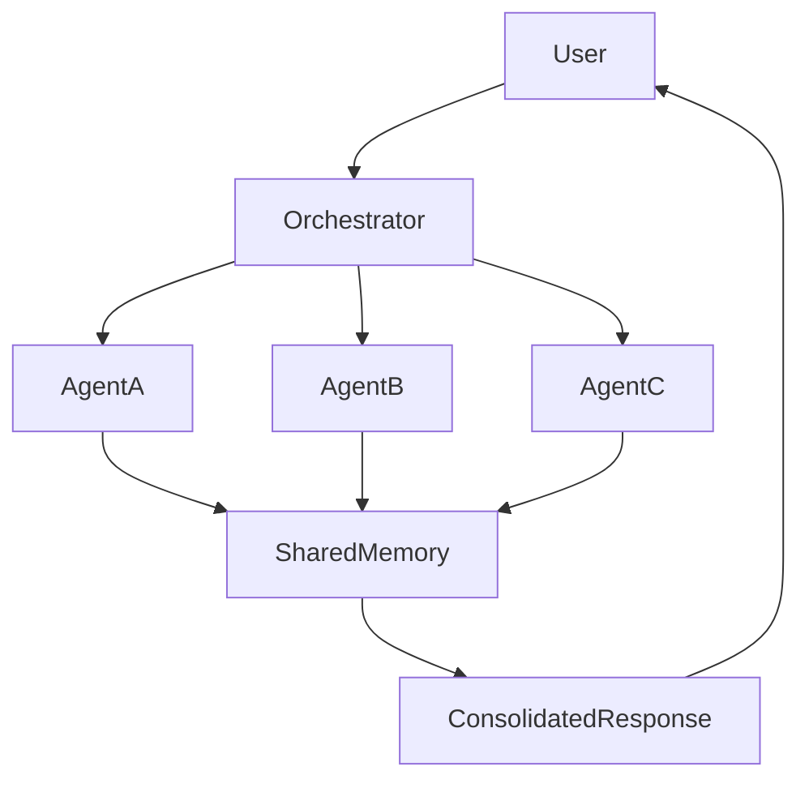

# ARCH-149 — Enterprise Multi-Agent Systems Architecture

> Référentiel officiel de l'**Architecture des Systèmes Multi-Agents d'Entreprise (Enterprise Multi-Agent Systems Architecture)** de la plateforme **EduWeb Planner**.

---

# Sommaire

1. Vision
2. Objectifs
3. Principes fondamentaux
4. Définition des systèmes multi-agents
5. Architecture globale
6. Typologie des agents
7. Organisation et orchestration
8. Communication inter-agents
9. Collaboration homme–IA
10. Gouvernance des agents
11. Sécurité et supervision
12. Intelligence collective
13. IA générative et agents autonomes
14. API conceptuelle
15. Bonnes pratiques
16. Anti-patterns
17. KPI
18. Règles d'architecture
19. Documents liés
20. Conclusion

---

# 1. Vision

EduWeb Planner adopte une architecture **Multi-Agent AI** afin de répartir les responsabilités entre plusieurs agents intelligents spécialisés collaborant sous une gouvernance centralisée.

Cette approche améliore :

- la modularité ;
- la scalabilité ;
- la spécialisation ;
- la robustesse ;
- la qualité des décisions.

---

# 2. Objectifs

Cette architecture vise à :

- distribuer les tâches complexes ;
- favoriser la coopération entre agents ;
- améliorer l'automatisation ;
- accélérer les traitements ;
- renforcer la résilience ;
- faciliter l'évolution des capacités IA.

---

# 3. Principes fondamentaux

Les systèmes multi-agents reposent sur :

- Specialization
- Collaboration
- Coordination
- Explainability
- Human Supervision
- Trustworthy AI
- Distributed Intelligence

---

# 4. Définition des systèmes multi-agents

Un système multi-agents est constitué d'un ensemble d'agents autonomes capables de :

- percevoir leur environnement ;
- raisonner ;
- communiquer ;
- coopérer ;
- négocier ;
- exécuter des tâches ;
- apprendre.

Chaque agent possède une responsabilité clairement définie.

---

# 5. Architecture globale

```text
Utilisateur

↓

Orchestrateur IA

↓

Catalogue des Agents

↓

Agents spécialisés

↓

Outils

↓

Sources de données

↓

Résultats consolidés
```

---

# 6. Typologie des agents

## Agents conversationnels

- assistants utilisateurs ;
- support ;
- FAQ.

---

## Agents décisionnels

- recommandations ;
- analyses ;
- simulations.

---

## Agents analytiques

- statistiques ;
- BI ;
- prévisions.

---

## Agents documentaires

- recherche ;
- synthèse ;
- indexation.

---

## Agents pédagogiques

- tutorat ;
- évaluation ;
- génération d'exercices.

---

## Agents administratifs

- rédaction ;
- validation ;
- suivi réglementaire.

---

## Agents techniques

- supervision ;
- monitoring ;
- cybersécurité ;
- exploitation.

---

# 7. Organisation et orchestration

Les agents sont coordonnés par un **Orchestrateur Central** chargé de :

- sélectionner les agents compétents ;
- répartir les tâches ;
- gérer les priorités ;
- agréger les résultats ;
- assurer la cohérence globale.

Les workflows peuvent être séquentiels, parallèles ou hybrides.

---

# 8. Communication inter-agents

Les échanges reposent sur :

- API sécurisées ;
- messages structurés ;
- événements ;
- files de messages ;
- mémoire partagée ;
- bases vectorielles.

Chaque échange est journalisé.

---

# 9. Collaboration homme–IA

L'utilisateur peut :

- solliciter un agent ;
- demander une expertise combinée ;
- intervenir dans les décisions ;
- corriger les propositions ;
- valider les actions sensibles.

Le principe du **Human-in-the-Loop** est appliqué aux processus critiques.

---

# 10. Gouvernance des agents

Chaque agent possède :

- un identifiant unique ;
- un propriétaire ;
- un domaine de compétence ;
- un niveau d'autorisation ;
- un historique des versions ;
- des métriques de performance.

Les agents sont régulièrement évalués.

---

# 11. Sécurité et supervision

Les mécanismes comprennent :

- authentification ;
- autorisation ;
- traçabilité ;
- journalisation ;
- audit ;
- surveillance continue ;
- contrôle des comportements anormaux.

Les actions critiques nécessitent une validation appropriée.

---

# 12. Intelligence collective

Les agents peuvent :

- partager leurs connaissances ;
- confronter leurs analyses ;
- voter sur des recommandations ;
- fusionner leurs résultats ;
- apprendre de leurs interactions.

L'intelligence collective améliore la qualité des décisions complexes.

---

# 13. IA générative et agents autonomes

Les agents peuvent exploiter :

- des modèles génératifs ;
- des moteurs de raisonnement ;
- des bases vectorielles ;
- des moteurs de recherche ;
- des outils métiers ;
- des API externes.

Les capacités autonomes restent encadrées par des règles de gouvernance et de sécurité.

---

# 14. API conceptuelle

```typescript
EnterpriseMultiAgentArchitecture {

    AgentRegistry

    AgentOrchestrator

    AgentCommunication

    AgentMemory

    VectorDatabase

    ToolConnector

    WorkflowEngine

    AIModelRegistry

    Governance

}
```

---

# 15. Bonnes pratiques

✔ Définir une responsabilité unique par agent.

✔ Documenter les capacités et limites de chaque agent.

✔ Journaliser toutes les interactions inter-agents.

✔ Mettre en œuvre des mécanismes d'orchestration robustes.

✔ Prévoir une supervision humaine pour les décisions critiques.

✔ Évaluer régulièrement les performances des agents.

---

# 16. Anti-patterns

✘ Concevoir un agent omnipotent réalisant toutes les tâches.

✘ Permettre des communications non sécurisées entre agents.

✘ Déployer des agents sans gouvernance.

✘ Ignorer la traçabilité des décisions.

✘ Accorder des privilèges excessifs aux agents.

✘ Négliger la supervision humaine dans les cas sensibles.

---

# Diagramme Mermaid



---

# KPI

| KPI | Objectif |
|------|----------|
|Agents documentés|100 %|
|Agents supervisés|100 %|
|Temps moyen d'orchestration|< 2 secondes|
|Taux de réussite des workflows multi-agents|≥ 98 %|
|Interactions inter-agents journalisées|100 %|
|Décisions critiques validées par un humain|100 %|

---

# Règles d'architecture

## RA-ARCH149-001

Chaque agent dispose d'une mission clairement définie, d'un propriétaire identifié, d'un périmètre fonctionnel limité et d'un cycle de vie gouverné.

---

## RA-ARCH149-002

Les interactions entre agents utilisent exclusivement des mécanismes sécurisés, traçables, documentés et conformes aux politiques d'architecture de l'entreprise.

---

## RA-ARCH149-003

L'orchestrateur central coordonne les workflows multi-agents, répartit les tâches, consolide les résultats et applique les politiques de gouvernance, de sécurité et de priorisation.

---

## RA-ARCH149-004

Les décisions ayant un impact réglementaire, financier, pédagogique, administratif ou stratégique demeurent soumises au principe du **Human-in-the-Loop**.

---

## RA-ARCH149-005

Les capacités des agents, leurs performances, leurs versions, leurs droits d'accès et leurs interactions sont continuellement supervisés, audités et améliorés afin de garantir une intelligence collective fiable et responsable.

---

# Documents liés

- ARCH-107 — Enterprise AI & Multi-Agent Architecture
- ARCH-111 — Enterprise Data Architecture
- ARCH-120 — Enterprise Knowledge Architecture
- ARCH-147 — Enterprise Analytics Architecture
- ARCH-148 — Enterprise Artificial Intelligence Architecture
- ARCH-150 — Enterprise Autonomous Systems Architecture
- AI-101 — Enterprise Artificial Intelligence Framework
- GENAI-101 — Enterprise Generative AI Framework
- MLOPS-101 — Enterprise MLOps Framework
- SEC-003 — Enterprise Cybersecurity Architecture

---

# Conclusion

L'**Enterprise Multi-Agent Systems Architecture** fournit le cadre de référence permettant à EduWeb Planner de déployer des systèmes d'intelligence distribuée composés d'agents spécialisés collaborant sous une gouvernance unifiée. En favorisant la spécialisation, l'orchestration, la communication sécurisée et la supervision humaine, cette architecture améliore la performance, la résilience et l'évolutivité des services intelligents. Complémentaire des architectures **Enterprise Artificial Intelligence (ARCH-148)**, **Enterprise AI & Multi-Agent (ARCH-107)**, **Enterprise Analytics (ARCH-147)** et **Enterprise Data (ARCH-111)**, elle prépare l'écosystème EduWeb à l'émergence d'une organisation reposant sur une intelligence collective, distribuée et responsable.

# Fin du document
