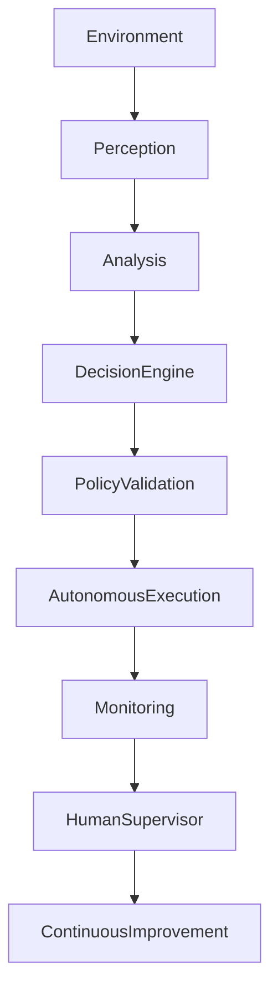

# ARCH-150 — Enterprise Autonomous Systems Architecture

> Référentiel officiel de l'**Architecture des Systèmes Autonomes d'Entreprise (Enterprise Autonomous Systems Architecture)** de la plateforme **EduWeb Planner**.

---

# Sommaire

1. Vision
2. Objectifs
3. Principes fondamentaux
4. Définition des systèmes autonomes
5. Architecture globale
6. Niveaux d'autonomie
7. Domaines d'application
8. Gouvernance des systèmes autonomes
9. Cycle de vie des systèmes autonomes
10. Prise de décision autonome
11. Supervision humaine
12. Sécurité et résilience
13. Intelligence artificielle et autonomie
14. API conceptuelle
15. Bonnes pratiques
16. Anti-patterns
17. KPI
18. Règles d'architecture
19. Documents liés
20. Conclusion

---

# 1. Vision

EduWeb Planner adopte une architecture de **Systèmes Autonomes d'Entreprise** permettant à certains processus d'être exécutés automatiquement avec un minimum d'intervention humaine, tout en garantissant la transparence, la sécurité, la conformité réglementaire et la maîtrise des risques.

L'autonomie constitue un moyen d'améliorer la réactivité, la disponibilité et la qualité des services, sans supprimer le rôle de supervision humaine.

---

# 2. Objectifs

Cette architecture vise à :

- automatiser les processus répétitifs ;
- améliorer les temps de réponse ;
- réduire les erreurs opérationnelles ;
- renforcer la continuité de service ;
- optimiser les ressources ;
- maintenir une gouvernance responsable de l'autonomie.

---

# 3. Principes fondamentaux

Les systèmes autonomes reposent sur les principes suivants :

- Human Oversight
- Safe Autonomy
- Adaptive Intelligence
- Explainability
- Continuous Monitoring
- Accountability
- Resilience by Design

---

# 4. Définition des systèmes autonomes

Un système autonome est un système capable de :

- percevoir son environnement ;
- analyser les situations ;
- prendre certaines décisions ;
- exécuter des actions ;
- apprendre de ses résultats ;
- adapter son comportement dans un cadre défini.

L'autonomie est toujours limitée par des politiques de gouvernance, de sécurité et de conformité.

---

# 5. Architecture globale

```text
Sources d'information

↓

Perception

↓

Analyse

↓

Moteur de décision

↓

Validation des politiques

↓

Exécution

↓

Supervision

↓

Apprentissage

↓

Amélioration continue
```

---

# 6. Niveaux d'autonomie

L'architecture distingue plusieurs niveaux.

| Niveau | Description |
|---------|-------------|
| 0 | Exécution entièrement manuelle |
| 1 | Assistance intelligente |
| 2 | Automatisation supervisée |
| 3 | Décision autonome sous contraintes |
| 4 | Autonomie avancée avec validation contextuelle |
| 5 | Autonomie complète dans un domaine autorisé |

Chaque processus est classé selon son niveau d'autonomie autorisé.

---

# 7. Domaines d'application

Les systèmes autonomes interviennent notamment dans :

## Administration

- traitement des dossiers ;
- génération documentaire ;
- archivage.

---

## Éducation

- personnalisation des parcours ;
- recommandations pédagogiques ;
- planification.

---

## Exploitation

- supervision des plateformes ;
- maintenance prédictive ;
- allocation dynamique des ressources.

---

## Cybersécurité

- détection d'anomalies ;
- confinement automatique ;
- réponses aux incidents de faible criticité.

---

## Gouvernance

- surveillance des indicateurs ;
- alertes ;
- préparation de rapports.

---

# 8. Gouvernance des systèmes autonomes

La gouvernance implique :

- Direction Générale ;
- Comité IA ;
- Architecte d'Entreprise ;
- Architecte IA ;
- RSSI ;
- Responsable Conformité ;
- Responsables Métiers ;
- Comité d'Éthique.

Chaque système autonome possède :

- un propriétaire ;
- un périmètre d'action ;
- des règles de fonctionnement ;
- des seuils d'intervention ;
- des mécanismes d'arrêt d'urgence.

---

# 9. Cycle de vie des systèmes autonomes

```text
Conception

↓

Simulation

↓

Validation

↓

Déploiement

↓

Surveillance

↓

Évaluation

↓

Optimisation

↓

Retrait
```

Chaque évolution suit un processus de validation formel.

---

# 10. Prise de décision autonome

Le moteur décisionnel applique :

- les politiques métiers ;
- les règles réglementaires ;
- les contraintes techniques ;
- les niveaux de risque ;
- les priorités stratégiques.

Les décisions sont :

- explicables ;
- journalisées ;
- auditables.

---

# 11. Supervision humaine

Le principe du **Human-on-the-Loop** est appliqué.

Les opérateurs peuvent :

- suspendre un système ;
- corriger une décision ;
- modifier les paramètres ;
- reprendre le contrôle ;
- analyser les journaux d'activité.

Les décisions critiques nécessitent une validation humaine préalable (**Human-in-the-Loop**).

---

# 12. Sécurité et résilience

Les systèmes autonomes intègrent :

- authentification forte ;
- contrôle d'accès ;
- journalisation complète ;
- surveillance comportementale ;
- détection de dérive ;
- reprise après incident ;
- plans de continuité.

La résilience est testée régulièrement.

---

# 13. Intelligence artificielle et autonomie

L'IA permet :

- l'apprentissage adaptatif ;
- la planification dynamique ;
- l'optimisation des décisions ;
- l'analyse prédictive ;
- la génération de recommandations ;
- l'amélioration continue des performances.

Les modèles sont supervisés afin d'éviter les dérives et les biais.

---

# 14. API conceptuelle

```typescript
EnterpriseAutonomousSystemsArchitecture {

    AutonomousEngine

    DecisionEngine

    PolicyRepository

    WorkflowAutomation

    MonitoringPlatform

    AuditTrail

    SafetyController

    AIOptimization

    Governance

}
```

---

# 15. Bonnes pratiques

✔ Définir précisément le périmètre d'autonomie.

✔ Documenter les règles décisionnelles.

✔ Mettre en œuvre des mécanismes d'arrêt d'urgence.

✔ Contrôler régulièrement les performances.

✔ Maintenir une supervision humaine adaptée au niveau de risque.

✔ Tester périodiquement les scénarios de défaillance.

---

# 16. Anti-patterns

✘ Accorder une autonomie illimitée à un système.

✘ Déployer un système autonome sans politique de gouvernance.

✘ Ignorer les journaux d'audit.

✘ Supprimer toute intervention humaine.

✘ Négliger les mécanismes de repli.

✘ Ne pas surveiller les dérives comportementales.

---

# Diagramme Mermaid



---

# KPI

| KPI | Objectif |
|------|----------|
|Processus autonomes documentés|100 %|
|Décisions autonomes auditables|100 %|
|Temps moyen de réaction|Réduction continue|
|Interventions humaines sur incidents critiques|100 %|
|Disponibilité des systèmes autonomes|≥ 99,9 %|
|Détection des dérives comportementales|≥ 95 %|

---

# Règles d'architecture

## RA-ARCH150-001

Tout système autonome possède un périmètre fonctionnel clairement défini, un propriétaire identifié, des règles d'exploitation documentées et un niveau d'autonomie explicitement autorisé.

---

## RA-ARCH150-002

Les décisions autonomes sont prises conformément aux politiques métiers, aux exigences réglementaires et aux règles de sécurité, puis journalisées de manière exhaustive afin de garantir leur traçabilité.

---

## RA-ARCH150-003

Les systèmes autonomes disposent de mécanismes de supervision, d'arrêt d'urgence, de reprise manuelle et de surveillance continue permettant de limiter les risques opérationnels.

---

## RA-ARCH150-004

Les processus présentant des impacts juridiques, financiers, pédagogiques, administratifs ou éthiques significatifs demeurent soumis au principe du **Human-in-the-Loop** ou du **Human-on-the-Loop**, selon leur niveau de criticité.

---

## RA-ARCH150-005

Les capacités d'intelligence artificielle utilisées par les systèmes autonomes sont continuellement évaluées, réentraînées, supervisées et auditées afin de garantir leur fiabilité, leur sécurité, leur explicabilité et leur conformité.

---

# Documents liés

- ARCH-107 — Enterprise AI & Multi-Agent Architecture
- ARCH-143 — Enterprise Resilience Architecture
- ARCH-148 — Enterprise Artificial Intelligence Architecture
- ARCH-149 — Enterprise Multi-Agent Systems Architecture
- ARCH-151 — Enterprise Intelligent Automation Architecture
- ARCH-152 — Enterprise Robotic Process Automation Architecture
- SEC-003 — Enterprise Cybersecurity Architecture
- MLOPS-101 — Enterprise MLOps Framework
- GENAI-101 — Enterprise Generative AI Framework
- GOV-101 — Enterprise Governance Framework

---

# Conclusion

L'**Enterprise Autonomous Systems Architecture** établit le cadre de référence permettant à EduWeb Planner de concevoir, déployer et gouverner des systèmes capables d'exécuter des processus de manière autonome tout en restant maîtrisés, transparents et conformes aux exigences de l'organisation. En combinant intelligence artificielle, gouvernance, supervision humaine, sécurité et résilience, cette architecture favorise une automatisation avancée sans compromettre la responsabilité ni la confiance. Elle complète les architectures **Enterprise Artificial Intelligence (ARCH-148)**, **Enterprise Multi-Agent Systems (ARCH-149)** et prépare naturellement l'évolution vers l'**Enterprise Intelligent Automation Architecture (ARCH-151)**.

# Fin du document
