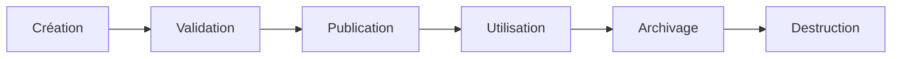

# DATA-101 — Enterprise Data Governance Framework

> Référentiel officiel de gouvernance des données d'entreprise pour **EduWeb Planner**.

## 1. Vision
Mettre en place une gouvernance garantissant des données fiables, sécurisées, traçables, conformes et créatrices de valeur.

## 2. Objectifs
- Définir les rôles et responsabilités.
- Assurer la qualité des données.
- Garantir la conformité.
- Favoriser le partage sécurisé.
- Soutenir BI, Analytics et IA.

## 3. Principes
- Data as a Strategic Asset
- Single Source of Truth
- Data Quality by Design
- Security by Design
- Privacy by Design
- Stewardship
- Continuous Improvement

## 4. Gouvernance

| Rôle | Responsabilité |
|------|----------------|
| Data Owner | Responsable métier |
| Data Steward | Qualité des données |
| Data Custodian | Exploitation technique |
| Chief Data Officer | Gouvernance globale |
| Comité Data | Décisions stratégiques |

## 5. Processus



## 6. API conceptuelle

```typescript
interface EnterpriseDataGovernance {
  owners: DataOwner[];
  stewards: DataSteward[];
  catalog: DataCatalog;
  quality: DataQualityService;
  metadata: MetadataRepository;
}
```

## 7. Bonnes pratiques
- Désigner un Data Owner.
- Cataloguer les jeux de données.
- Automatiser les contrôles qualité.
- Maintenir les métadonnées.

## 8. KPI

| KPI | Objectif |
|------|----------|
| Jeux de données catalogués | ≥95 % |
| Score qualité | ≥98 % |
| Données avec propriétaire | 100 % |

## 9. Règles
- RA-DATA101-001 : Toute donnée possède un propriétaire.
- RA-DATA101-002 : Toute donnée critique est cataloguée.
- RA-DATA101-003 : Toute donnée suit un cycle de vie documenté.
- RA-DATA101-004 : Toute donnée est classifiée.
- RA-DATA101-005 : Les contrôles qualité sont automatisés lorsque possible.

## Conclusion

Ce document constitue le socle de la gouvernance des données d'EduWeb Planner.

# Fin du document
