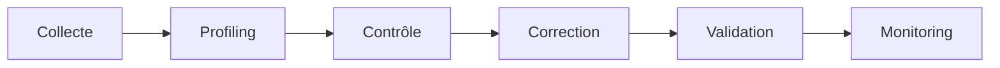

# DATA-102 — Enterprise Data Quality Framework

> Référentiel officiel de gestion de la qualité des données d'entreprise pour **EduWeb Planner**.

## Sommaire
1. Vision
2. Objectifs
3. Dimensions de la qualité
4. Gouvernance
5. Processus
6. Contrôles
7. Indicateurs
8. API conceptuelle
9. Bonnes pratiques
10. Anti-patterns
11. Règles d'architecture
12. Documents liés

## 1. Vision

Garantir des données exactes, complètes, cohérentes, disponibles, traçables et exploitables afin de soutenir les décisions, les services numériques et les capacités d'IA.

## 2. Objectifs

- Améliorer la fiabilité des données.
- Détecter les anomalies le plus tôt possible.
- Standardiser les contrôles qualité.
- Mettre en place des tableaux de bord de qualité.

## 3. Dimensions de la qualité

| Dimension | Description |
|-----------|-------------|
| Exactitude | Les données reflètent la réalité. |
| Complétude | Les informations requises sont présentes. |
| Cohérence | Aucune contradiction entre sources. |
| Validité | Respect des règles métier. |
| Actualité | Données à jour. |
| Unicité | Pas de doublons. |
| Traçabilité | Origine identifiable. |

## 4. Gouvernance

- Chief Data Officer
- Data Owner
- Data Steward
- Data Custodian
- Comité Data Quality

## 5. Processus



## 6. Contrôles

- Profilage des données
- Validation métier
- Détection des doublons
- Contrôle de référence
- Mesure de complétude
- Surveillance continue

## 7. KPI

| KPI | Cible |
|------|-------|
| Exactitude | ≥ 99 % |
| Complétude | ≥ 98 % |
| Cohérence | ≥ 99 % |
| Données sans doublons | ≥ 99,5 % |
| Temps de correction | < 48 h |

## 8. API conceptuelle

```typescript
interface EnterpriseDataQualityFramework {
  profile(): void;
  validate(): void;
  monitor(): void;
  score(): number;
  remediate(): void;
}
```

## 9. Bonnes pratiques

- Définir des règles de qualité par domaine.
- Automatiser les contrôles.
- Publier des scorecards.
- Affecter chaque anomalie à un responsable.

## 10. Anti-patterns

- Corriger les données sans traiter la cause.
- Mesurer uniquement la complétude.
- Ignorer les doublons.
- Ne pas historiser les corrections.

## 11. Règles d'architecture

- RA-DATA102-001 : Toute donnée critique est soumise à des contrôles qualité.
- RA-DATA102-002 : Les règles métier sont versionnées.
- RA-DATA102-003 : Les anomalies sont tracées jusqu'à leur résolution.
- RA-DATA102-004 : Les indicateurs sont publiés régulièrement.
- RA-DATA102-005 : Les contrôles sont automatisés lorsque possible.

## 12. Documents liés

- DATA-101 — Enterprise Data Governance Framework
- DATA-103 — Enterprise Master Data Management
- ARCH-111 — Enterprise Data Architecture
- ARCH-146 — Enterprise Business Intelligence Architecture

# Fin du document
