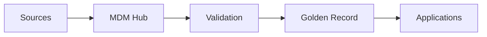

# DATA-103 — Enterprise Master Data Management (MDM)

> Référentiel officiel de gestion des données de référence d'entreprise pour **EduWeb Planner**.

## Sommaire
1. Vision
2. Objectifs
3. Données maîtres
4. Architecture MDM
5. Gouvernance
6. Cycle de vie
7. Synchronisation
8. API conceptuelle
9. KPI
10. Bonnes pratiques
11. Anti-patterns
12. Règles d'architecture

## 1. Vision
Disposer d'une source unique et fiable des données maîtres utilisées par l'ensemble des applications EduWeb.

## 2. Objectifs
- Éliminer les doublons.
- Garantir l'unicité des référentiels.
- Synchroniser les applications.
- Améliorer la qualité des données.

## 3. Données maîtres
- Établissements
- Élèves
- Enseignants
- Personnel
- Parents
- Matières
- Classes
- Régions
- Structures administratives

## 4. Architecture



## 5. Gouvernance
|Rôle|Mission|
|---|---|
|Data Owner|Validation métier|
|Data Steward|Qualité|
|MDM Administrator|Administration|
|Chief Data Officer|Pilotage|

## 6. Cycle de vie
Création → Validation → Publication → Synchronisation → Archivage → Retrait.

## 7. Synchronisation
Les mises à jour sont propagées via API, événements ou traitements planifiés avec contrôle de cohérence.

## 8. API conceptuelle

```typescript
interface EnterpriseMDM {
 createMasterRecord(): void;
 mergeDuplicates(): void;
 publishGoldenRecord(): void;
 synchronize(): void;
 archive(): void;
}
```

## 9. KPI
|KPI|Objectif|
|---|---:|
|Golden Records|100 %|
|Doublons détectés|≥99 %|
|Synchronisations réussies|≥99,9 %|
|Temps de propagation|<5 min|

## 10. Bonnes pratiques
- Définir un Golden Record.
- Versionner les référentiels.
- Auditer les fusions.
- Automatiser la détection des doublons.

## 11. Anti-patterns
- Plusieurs sources de vérité.
- Fusion manuelle sans traçabilité.
- Référentiels non synchronisés.
- Absence d'identifiant unique.

## 12. Règles d'architecture
- RA-DATA103-001 : Chaque entité maître possède un identifiant unique.
- RA-DATA103-002 : Le Golden Record fait autorité.
- RA-DATA103-003 : Toute fusion est journalisée.
- RA-DATA103-004 : Les référentiels sont synchronisés selon les SLA.
- RA-DATA103-005 : Les applications consomment les données maîtres via des interfaces gouvernées.

# Fin du document
