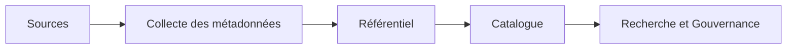

# DATA-104 — Enterprise Metadata Management

> Référentiel officiel de gestion des métadonnées d'entreprise pour **EduWeb Planner**.

## Sommaire
1. Vision
2. Objectifs
3. Types de métadonnées
4. Architecture
5. Gouvernance
6. Cycle de vie
7. Catalogue
8. API conceptuelle
9. KPI
10. Bonnes pratiques
11. Anti-patterns
12. Règles d'architecture

## 1. Vision

Faire des métadonnées un actif stratégique permettant de comprendre, gouverner, rechercher et exploiter efficacement les données de l'organisation.

## 2. Objectifs

- Décrire tous les actifs de données.
- Faciliter la découverte des données.
- Améliorer la traçabilité.
- Soutenir la gouvernance et la conformité.

## 3. Types de métadonnées

| Type | Exemples |
|------|----------|
| Métier | Définition, propriétaire, domaine |
| Technique | Tables, colonnes, API |
| Opérationnelle | Date de mise à jour, fréquence |
| Qualité | Score, anomalies |
| Sécurité | Classification, droits d'accès |

## 4. Architecture



## 5. Gouvernance

- Chief Data Officer
- Data Owner
- Data Steward
- Metadata Administrator

## 6. Cycle de vie

Création → Validation → Publication → Mise à jour → Archivage → Suppression.

## 7. Catalogue

Le catalogue central référence :
- jeux de données ;
- modèles ;
- API ;
- rapports ;
- pipelines ;
- glossaire métier.

## 8. API conceptuelle

```typescript
interface EnterpriseMetadataRepository {
  register(): void;
  classify(): void;
  search(): void;
  update(): void;
  archive(): void;
}
```

## 9. KPI

| KPI | Objectif |
|------|----------|
| Jeux de données documentés | ≥ 95 % |
| Métadonnées complètes | ≥ 98 % |
| Temps moyen de recherche | < 5 s |
| Mises à jour conformes | ≥ 99 % |

## 10. Bonnes pratiques

- Maintenir un glossaire métier.
- Automatiser la collecte des métadonnées.
- Relier les métadonnées au Data Catalog.
- Versionner les descriptions.

## 11. Anti-patterns

- Métadonnées obsolètes.
- Documentation dispersée.
- Glossaire incohérent.
- Absence de propriétaire.

## 12. Règles d'architecture

- RA-DATA104-001 : Tout actif de données possède des métadonnées.
- RA-DATA104-002 : Les métadonnées sont versionnées.
- RA-DATA104-003 : Les propriétaires sont identifiés.
- RA-DATA104-004 : Les métadonnées sont consultables via un catalogue.
- RA-DATA104-005 : Les mises à jour sont tracées.

# Fin du document
