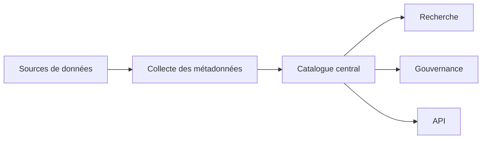

# DATA-106 — Enterprise Data Catalog

> Référentiel officiel du catalogue de données d'entreprise pour **EduWeb Planner**.

## Sommaire
1. Vision
2. Objectifs
3. Définition
4. Architecture
5. Composants
6. Gouvernance
7. Cycle de vie
8. Recherche et découverte
9. API conceptuelle
10. KPI
11. Bonnes pratiques
12. Anti-patterns
13. Règles d'architecture

## 1. Vision

Mettre à disposition un catalogue central permettant à tous les acteurs autorisés de découvrir, comprendre, évaluer et exploiter les actifs de données de manière fiable et sécurisée.

## 2. Objectifs

- Centraliser l'inventaire des données.
- Faciliter la découverte des jeux de données.
- Documenter les actifs informationnels.
- Améliorer la gouvernance et la réutilisation.

## 3. Définition

Le Data Catalog constitue le référentiel décrivant les jeux de données, leurs métadonnées, leurs propriétaires, leur qualité, leur classification et leurs usages.

## 4. Architecture



## 5. Composants

- Inventaire des jeux de données
- Glossaire métier
- Métadonnées
- Classification
- Data Lineage
- Scores de qualité
- Gestion des propriétaires
- Documentation technique

## 6. Gouvernance

Rôles principaux :

- Chief Data Officer
- Data Owner
- Data Steward
- Metadata Administrator
- Utilisateurs autorisés

## 7. Cycle de vie

Découverte → Enregistrement → Validation → Publication → Mise à jour → Archivage.

## 8. Recherche et découverte

Le catalogue permet :

- la recherche par mots-clés ;
- la recherche par domaine métier ;
- la recherche par propriétaire ;
- la recherche par classification ;
- la recherche par qualité.

## 9. API conceptuelle

```typescript
interface EnterpriseDataCatalog {
  registerDataset(): void;
  search(): void;
  classify(): void;
  updateMetadata(): void;
  archiveDataset(): void;
}
```

## 10. KPI

| KPI | Objectif |
|------|----------|
| Jeux de données catalogués | ≥ 95 % |
| Métadonnées complètes | ≥ 98 % |
| Temps moyen de recherche | < 3 s |
| Jeux de données avec propriétaire identifié | 100 % |

## 11. Bonnes pratiques

- Cataloguer tout nouvel actif de données.
- Automatiser l'alimentation du catalogue.
- Maintenir un glossaire métier.
- Publier les scores de qualité.

## 12. Anti-patterns

- Catalogue incomplet.
- Métadonnées obsolètes.
- Jeux de données sans propriétaire.
- Documentation non versionnée.

## 13. Règles d'architecture

- RA-DATA106-001 : Tout jeu de données est enregistré dans le catalogue.
- RA-DATA106-002 : Les métadonnées sont maintenues à jour.
- RA-DATA106-003 : Chaque actif possède un propriétaire identifié.
- RA-DATA106-004 : Les accès au catalogue respectent les politiques de sécurité.
- RA-DATA106-005 : Le catalogue est synchronisé avec les référentiels de métadonnées.

# Fin du document
