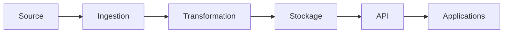

# DATA-107 — Enterprise Data Lineage

> Référentiel officiel de traçabilité des données d'entreprise pour **EduWeb Planner**.

## Sommaire
1. Vision
2. Objectifs
3. Définition
4. Architecture
5. Niveaux de traçabilité
6. Gouvernance
7. Cycle de vie
8. Cas d'usage
9. API conceptuelle
10. KPI
11. Bonnes pratiques
12. Anti-patterns
13. Règles d'architecture

## 1. Vision

Assurer une traçabilité complète des données, depuis leur création jusqu'à leur consommation, afin de renforcer la confiance, la conformité réglementaire et la capacité d'audit.

## 2. Objectifs

- Identifier l'origine des données.
- Suivre toutes les transformations.
- Faciliter les analyses d'impact.
- Renforcer la gouvernance.
- Accélérer les audits.

## 3. Définition

Le **Data Lineage** décrit le parcours d'une donnée à travers les systèmes, les traitements, les interfaces et les utilisateurs, en conservant l'historique des transformations.

## 4. Architecture



## 5. Niveaux de traçabilité

| Niveau | Description |
|---------|-------------|
| Métier | Origine fonctionnelle |
| Technique | Tables, fichiers, API |
| Processus | Pipelines ETL/ELT |
| Sécurité | Accès et modifications |
| Audit | Journal des événements |

## 6. Gouvernance

- Chief Data Officer
- Data Owner
- Data Steward
- Architecte Data
- Équipe Audit

## 7. Cycle de vie

Création → Capture → Transformation → Publication → Consommation → Archivage.

## 8. Cas d'usage

- Analyse d'impact.
- Conformité réglementaire.
- Résolution d'incidents.
- Contrôle qualité.
- Audit interne.

## 9. API conceptuelle

```typescript
interface EnterpriseDataLineage {
  capture(): void;
  trace(): void;
  visualize(): void;
  analyzeImpact(): void;
  exportHistory(): void;
}
```

## 10. KPI

| KPI | Objectif |
|------|----------|
| Jeux de données tracés | 100 % |
| Pipelines documentés | ≥ 95 % |
| Temps d'analyse d'impact | < 10 min |
| Événements journalisés | 100 % |

## 11. Bonnes pratiques

- Automatiser la capture du lineage.
- Visualiser les dépendances.
- Conserver l'historique complet.
- Intégrer le lineage au Data Catalog.

## 12. Anti-patterns

- Traçabilité partielle.
- Documentation manuelle uniquement.
- Journaux incomplets.
- Absence d'analyse d'impact.

## 13. Règles d'architecture

- RA-DATA107-001 : Toute transformation est traçable.
- RA-DATA107-002 : Les métadonnées de lineage sont historisées.
- RA-DATA107-003 : Les analyses d'impact utilisent le référentiel officiel.
- RA-DATA107-004 : Les événements sont horodatés.
- RA-DATA107-005 : Les visualisations sont accessibles aux rôles autorisés.

# Fin du document
