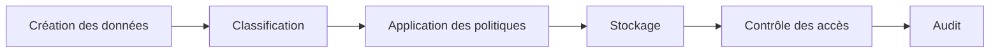

# DATA-110 — Enterprise Data Classification

> Référentiel officiel de classification des données d'entreprise pour **EduWeb Planner**.

## Sommaire

1. Vision
2. Objectifs
3. Principes
4. Niveaux de classification
5. Architecture
6. Gouvernance
7. Processus de classification
8. Mesures de protection
9. API conceptuelle
10. KPI
11. Bonnes pratiques
12. Anti-patterns
13. Règles d'architecture

---

## 1. Vision

Mettre en place une classification uniforme des données afin d'adapter les mesures de sécurité, les règles d'accès, les politiques de conservation et les obligations réglementaires à la sensibilité de chaque information.

---

## 2. Objectifs

- Identifier la sensibilité des données.
- Adapter les contrôles de sécurité.
- Faciliter la conformité réglementaire.
- Réduire les risques liés aux fuites d'information.
- Harmoniser les pratiques dans l'ensemble de l'écosystème EduWeb.

---

## 3. Principes

- Classification dès la création.
- Réévaluation périodique.
- Traçabilité des changements.
- Responsabilité du Data Owner.
- Application automatique des politiques de sécurité.

---

## 4. Niveaux de classification

| Niveau | Description | Exemples |
|--------|-------------|----------|
| Public | Diffusable sans restriction | Documentation publique |
| Interne | Réservé aux collaborateurs | Procédures internes |
| Confidentiel | Accès limité aux personnes autorisées | Dossiers administratifs |
| Très sensible | Protection maximale | Données personnelles, financières, médicales, secrets stratégiques |

---

## 5. Architecture



---

## 6. Gouvernance

- Chief Data Officer
- Data Owner
- Data Steward
- RSSI
- Responsable Conformité
- Administrateurs des systèmes

---

## 7. Processus de classification

1. Identification des données.
2. Analyse de la sensibilité.
3. Attribution du niveau de classification.
4. Validation par le Data Owner.
5. Application automatique des règles de sécurité.
6. Révision périodique.

---

## 8. Mesures de protection

Selon le niveau de classification :

- chiffrement ;
- contrôle d'accès ;
- authentification forte ;
- journalisation ;
- surveillance ;
- archivage sécurisé.

---

## 9. API conceptuelle

```typescript
interface EnterpriseDataClassification {
    classify(): void;
    reclassify(): void;
    applyPolicies(): void;
    audit(): void;
    generateReport(): void;
}
```

---

## 10. KPI

| KPI | Objectif |
|------|----------|
| Données classifiées | 100 % |
| Données reclassifiées dans les délais | ≥ 98 % |
| Incidents liés à une mauvaise classification | 0 |
| Contrôles de sécurité appliqués | 100 % |

---

## 11. Bonnes pratiques

- Classifier automatiquement lorsque cela est possible.
- Documenter les critères de classification.
- Réviser régulièrement les classifications.
- Sensibiliser les utilisateurs.
- Intégrer la classification au Data Catalog et au Data Lineage.

---

## 12. Anti-patterns

- Données non classifiées.
- Classification incohérente entre systèmes.
- Révision jamais effectuée.
- Absence de propriétaire.
- Politiques de sécurité indépendantes de la classification.

---

## 13. Règles d'architecture

- RA-DATA110-001 : Toute donnée possède un niveau de classification.
- RA-DATA110-002 : Les politiques de sécurité dépendent du niveau de classification.
- RA-DATA110-003 : Toute modification de classification est historisée.
- RA-DATA110-004 : Les classifications sont revues périodiquement.
- RA-DATA110-005 : Les référentiels de classification sont gouvernés de manière centralisée.

---

# Fin du document
