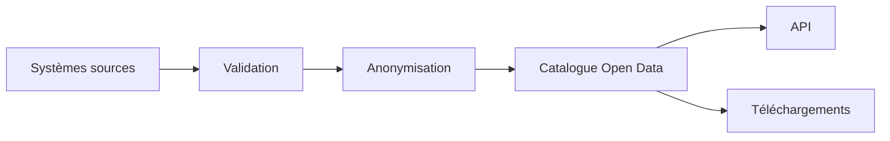

# DATA-111 — Enterprise Open Data

> Référentiel officiel de publication et de gouvernance des données ouvertes pour **EduWeb Planner**.

## Sommaire

1. Vision
2. Objectifs
3. Principes
4. Catégories de données ouvertes
5. Architecture
6. Gouvernance
7. Processus de publication
8. Standards et formats
9. API conceptuelle
10. KPI
11. Bonnes pratiques
12. Anti-patterns
13. Règles d'architecture

---

## 1. Vision

Favoriser la transparence, l'innovation et la réutilisation des informations publiques en publiant des données ouvertes de qualité, sécurisées, documentées et conformes aux exigences légales.

---

## 2. Objectifs

- Promouvoir la transparence institutionnelle.
- Encourager la réutilisation des données.
- Soutenir la recherche et l'innovation.
- Faciliter l'interopérabilité entre organisations.
- Valoriser le patrimoine informationnel.

---

## 3. Principes

- Ouverture par défaut lorsque la réglementation le permet.
- Respect de la confidentialité et des données personnelles.
- Qualité et documentation des jeux de données.
- Formats ouverts et interopérables.
- Mise à jour régulière.

---

## 4. Catégories de données ouvertes

| Catégorie | Exemples |
|-----------|----------|
| Statistiques | Effectifs scolaires, résultats agrégés |
| Géographiques | Cartographie des établissements |
| Administratives | Référentiels publics |
| Budgétaires | Dépenses publiques agrégées |
| Recherche | Jeux de données anonymisés |

---

## 5. Architecture



---

## 6. Gouvernance

- Chief Data Officer
- Responsable Open Data
- Data Owner
- Data Steward
- RSSI
- Responsable Conformité

---

## 7. Processus de publication

1. Sélection des données.
2. Vérification juridique.
3. Contrôle qualité.
4. Anonymisation si nécessaire.
5. Publication.
6. Mise à jour.
7. Archivage.

---

## 8. Standards et formats

Formats recommandés :

- CSV
- JSON
- XML
- GeoJSON
- RDF
- API REST

Les jeux de données sont accompagnés de métadonnées conformes au catalogue d'entreprise.

---

## 9. API conceptuelle

```typescript
interface EnterpriseOpenData {
    publishDataset(): void;
    anonymize(): void;
    updateDataset(): void;
    exposeAPI(): void;
    archiveDataset(): void;
}
```

---

## 10. KPI

| KPI | Objectif |
|------|----------|
| Jeux de données publiés | Croissance continue |
| Jeux documentés | 100 % |
| Disponibilité des API | ≥ 99,9 % |
| Mises à jour réalisées dans les délais | ≥ 98 % |

---

## 11. Bonnes pratiques

- Documenter systématiquement les jeux de données.
- Utiliser des licences ouvertes adaptées.
- Automatiser les mises à jour.
- Publier des API documentées.
- Maintenir un catalogue Open Data.

---

## 12. Anti-patterns

- Publication de données sensibles.
- Jeux de données non documentés.
- Formats propriétaires.
- Métadonnées absentes.
- Données obsolètes.

---

## 13. Règles d'architecture

- RA-DATA111-001 : Toute publication respecte les règles de confidentialité.
- RA-DATA111-002 : Les données ouvertes sont documentées.
- RA-DATA111-003 : Les jeux publiés utilisent des formats ouverts.
- RA-DATA111-004 : Les API Open Data sont versionnées.
- RA-DATA111-005 : Les publications sont réévaluées périodiquement.

---

# Fin du document
