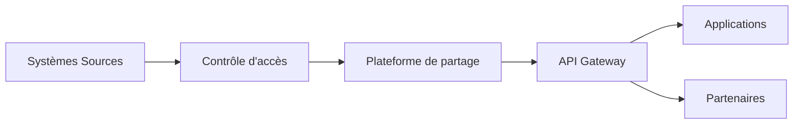

# DATA-112 — Enterprise Data Sharing

> Référentiel officiel du partage des données d'entreprise pour **EduWeb Planner**.

## Sommaire

1. Vision
2. Objectifs
3. Principes
4. Modèles de partage
5. Architecture
6. Gouvernance
7. Contrôle des accès
8. Processus de partage
9. API conceptuelle
10. KPI
11. Bonnes pratiques
12. Anti-patterns
13. Règles d'architecture

---

## 1. Vision

Permettre un partage sécurisé, gouverné et interopérable des données entre les applications, les directions, les partenaires institutionnels et les services numériques d'EduWeb tout en garantissant la confidentialité, l'intégrité et la traçabilité.

---

## 2. Objectifs

- Faciliter la circulation des données autorisées.
- Éviter les duplications inutiles.
- Garantir la cohérence des informations.
- Renforcer la collaboration.
- Respecter les exigences réglementaires.

---

## 3. Principes

- Partage fondé sur le besoin d'en connaître.
- Sécurité dès la conception (Security by Design).
- Traçabilité de tous les échanges.
- Standardisation des formats.
- Gouvernance centralisée.

---

## 4. Modèles de partage

| Modèle | Description |
|--------|-------------|
| Interne | Entre applications EduWeb |
| Institutionnel | Avec les ministères et établissements |
| Partenaires | Avec des organismes autorisés |
| Public | Données ouvertes validées |
| API | Échanges automatisés |

---

## 5. Architecture



---

## 6. Gouvernance

- Chief Data Officer
- Data Owner
- Data Steward
- RSSI
- Responsable Interopérabilité
- Responsable Conformité

---

## 7. Contrôle des accès

Les mécanismes comprennent :

- authentification forte ;
- autorisation basée sur les rôles ;
- chiffrement des échanges ;
- journalisation ;
- surveillance continue.

---

## 8. Processus de partage

1. Demande d'accès.
2. Validation du Data Owner.
3. Attribution des droits.
4. Publication des interfaces.
5. Consommation des données.
6. Audit périodique.

---

## 9. API conceptuelle

```typescript
interface EnterpriseDataSharing {
    authorizeAccess(): void;
    publishDataset(): void;
    shareViaAPI(): void;
    revokeAccess(): void;
    auditSharing(): void;
}
```

---

## 10. KPI

| KPI | Objectif |
|------|----------|
| Partages autorisés documentés | 100 % |
| Disponibilité des services de partage | ≥ 99,9 % |
| Échanges chiffrés | 100 % |
| Incidents liés au partage | 0 critique |

---

## 11. Bonnes pratiques

- Utiliser des API normalisées.
- Appliquer le principe du moindre privilège.
- Chiffrer systématiquement les échanges.
- Versionner les interfaces.
- Auditer régulièrement les accès.

---

## 12. Anti-patterns

- Échanges par fichiers non sécurisés.
- Comptes partagés.
- Absence de journalisation.
- Duplication incontrôlée des données.
- Partage sans validation métier.

---

## 13. Règles d'architecture

- RA-DATA112-001 : Tout partage est autorisé par un Data Owner.
- RA-DATA112-002 : Les échanges utilisent des protocoles sécurisés.
- RA-DATA112-003 : Chaque accès est journalisé.
- RA-DATA112-004 : Les API sont versionnées et documentées.
- RA-DATA112-005 : Les droits d'accès sont réévalués périodiquement.

---

# Fin du document
