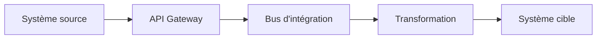

# DATA-113 — Enterprise Data Exchange

> Référentiel officiel des échanges de données d'entreprise pour **EduWeb Planner**.

## Sommaire

1. Vision
2. Objectifs
3. Principes
4. Types d'échanges
5. Architecture
6. Gouvernance
7. Protocoles et formats
8. Sécurité des échanges
9. API conceptuelle
10. KPI
11. Bonnes pratiques
12. Anti-patterns
13. Règles d'architecture

---

## 1. Vision

Garantir des échanges de données fiables, sécurisés, normalisés et traçables entre les applications EduWeb, les établissements scolaires, les partenaires institutionnels et les plateformes externes.

---

## 2. Objectifs

- Standardiser les échanges de données.
- Garantir l'interopérabilité entre systèmes.
- Réduire les erreurs de transmission.
- Sécuriser les flux.
- Faciliter l'intégration des nouveaux services.

---

## 3. Principes

- Interopérabilité.
- Normalisation.
- Sécurité by Design.
- Traçabilité.
- Haute disponibilité.
- Automatisation.

---

## 4. Types d'échanges

| Type | Exemple |
|------|----------|
| Synchrone | API REST |
| Asynchrone | Files de messages |
| Batch | Import/Export planifié |
| Temps réel | Événements (Event Streaming) |
| Hybride | API + Messaging |

---

## 5. Architecture



---

## 6. Gouvernance

- Chief Data Officer
- Architecte d'Intégration
- Data Owner
- Data Steward
- RSSI
- Responsable Interopérabilité

---

## 7. Protocoles et formats

Protocoles recommandés :

- HTTPS
- REST
- GraphQL
- gRPC
- AMQP
- MQTT
- Kafka

Formats :

- JSON
- XML
- CSV
- Avro
- Parquet

---

## 8. Sécurité des échanges

Les échanges doivent intégrer :

- authentification forte ;
- chiffrement TLS ;
- signature numérique si nécessaire ;
- journalisation complète ;
- contrôle d'intégrité ;
- supervision en continu.

---

## 9. API conceptuelle

```typescript
interface EnterpriseDataExchange {
    publish(): void;
    subscribe(): void;
    transform(): void;
    validate(): void;
    audit(): void;
}
```

---

## 10. KPI

| KPI | Objectif |
|------|----------|
| Disponibilité des échanges | ≥ 99,9 % |
| Échanges réussis | ≥ 99,8 % |
| Temps moyen de traitement | < 2 s |
| Échanges sécurisés | 100 % |

---

## 11. Bonnes pratiques

- Utiliser des API documentées.
- Versionner les interfaces.
- Superviser les flux.
- Mettre en œuvre des mécanismes de reprise.
- Tester régulièrement les intégrations.

---

## 12. Anti-patterns

- Interfaces propriétaires non documentées.
- Échanges non chiffrés.
- Absence de supervision.
- Couplage fort entre applications.
- Gestion manuelle des erreurs.

---

## 13. Règles d'architecture

- RA-DATA113-001 : Tous les échanges utilisent des protocoles sécurisés.
- RA-DATA113-002 : Les interfaces sont documentées et versionnées.
- RA-DATA113-003 : Les flux critiques sont supervisés en permanence.
- RA-DATA113-004 : Les erreurs d'échange sont journalisées.
- RA-DATA113-005 : Les formats de données respectent les standards d'entreprise.

---

# Fin du document
