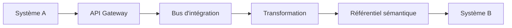

# DATA-114 — Enterprise Data Interoperability

> Référentiel officiel d'interopérabilité des données pour **EduWeb Planner**.

## Sommaire

1. Vision
2. Objectifs
3. Principes
4. Niveaux d'interopérabilité
5. Architecture de référence
6. Gouvernance
7. Standards et protocoles
8. Mise en œuvre
9. API conceptuelle
10. KPI
11. Bonnes pratiques
12. Anti-patterns
13. Règles d'architecture

---

## 1. Vision

Permettre aux applications, plateformes et partenaires d'échanger des données de manière transparente, cohérente et sécurisée, indépendamment de leurs technologies ou fournisseurs.

---

## 2. Objectifs

- Garantir la compatibilité entre systèmes.
- Réduire les coûts d'intégration.
- Faciliter les échanges interinstitutionnels.
- Améliorer la qualité des données échangées.
- Assurer une gouvernance commune.

---

## 3. Principes

- Standards ouverts.
- Couplage faible.
- Sécurité dès la conception.
- Réutilisation des services.
- Gouvernance centralisée.
- Évolutivité.

---

## 4. Niveaux d'interopérabilité

| Niveau | Description |
|---------|-------------|
| Technique | Connectivité, protocoles, réseaux |
| Syntaxique | Formats de données (JSON, XML, CSV…) |
| Sémantique | Compréhension commune des informations |
| Organisationnelle | Processus et responsabilités partagés |
| Juridique | Respect des lois et accords de partage |

---

## 5. Architecture de référence



---

## 6. Gouvernance

Les principaux acteurs sont :

- Chief Data Officer
- Architecte d'Entreprise
- Architecte Data
- Responsable Interopérabilité
- Data Owner
- RSSI
- Équipe Intégration

---

## 7. Standards et protocoles

### Protocoles

- HTTPS
- REST
- GraphQL
- gRPC
- AMQP
- MQTT
- Kafka

### Formats

- JSON
- XML
- CSV
- Avro
- Parquet
- RDF
- JSON-LD

---

## 8. Mise en œuvre

Le processus d'interopérabilité comprend :

1. Identification des besoins.
2. Définition du modèle d'échange.
3. Alignement sémantique.
4. Développement des interfaces.
5. Validation.
6. Tests d'intégration.
7. Supervision continue.

---

## 9. API conceptuelle

```typescript
interface EnterpriseInteroperability {
    validateStandard(): void;
    transformData(): void;
    exchange(): void;
    monitor(): void;
    audit(): void;
}
```

---

## 10. KPI

| KPI | Objectif |
|------|----------|
| Interfaces conformes aux standards | 100 % |
| Disponibilité des échanges | ≥ 99,9 % |
| Taux d'erreurs d'intégration | < 0,5 % |
| Temps moyen d'intégration | En amélioration continue |

---

## 11. Bonnes pratiques

- Utiliser des standards ouverts.
- Centraliser les modèles d'échange.
- Versionner les interfaces.
- Automatiser les tests de compatibilité.
- Documenter les contrats d'échange.

---

## 12. Anti-patterns

- Interfaces propriétaires non documentées.
- Multiplication des formats.
- Couplage fort entre applications.
- Absence de gouvernance.
- Modèles de données divergents.

---

## 13. Règles d'architecture

- RA-DATA114-001 : Les échanges utilisent des standards ouverts.
- RA-DATA114-002 : Les modèles de données sont alignés sur le référentiel sémantique.
- RA-DATA114-003 : Les interfaces sont versionnées.
- RA-DATA114-004 : Les échanges sont sécurisés et journalisés.
- RA-DATA114-005 : Les évolutions sont validées par la gouvernance Data.

---

# Fin du document
