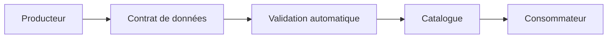

# DATA-115 — Enterprise Data Contracts

> Référentiel officiel des contrats de données pour **EduWeb Planner**.

## Sommaire

1. Vision
2. Objectifs
3. Définition
4. Principes
5. Architecture
6. Cycle de vie
7. Gouvernance
8. Contenu d'un contrat de données
9. API conceptuelle
10. KPI
11. Bonnes pratiques
12. Anti-patterns
13. Règles d'architecture

---

## 1. Vision

Garantir que chaque échange de données entre producteurs et consommateurs repose sur un contrat explicite, versionné, testable et gouverné afin d'assurer la stabilité et l'interopérabilité de l'écosystème EduWeb.

---

## 2. Objectifs

- Formaliser les engagements entre producteurs et consommateurs.
- Réduire les ruptures lors des évolutions.
- Standardiser les schémas de données.
- Renforcer la qualité et la confiance.

---

## 3. Définition

Un **Data Contract** décrit de manière formelle la structure, les règles de validation, les contraintes, les responsabilités et les conditions d'utilisation d'un jeu de données ou d'une API.

---

## 4. Principes

- Contrat explicite.
- Versionnement obligatoire.
- Validation automatique.
- Compatibilité ascendante lorsque possible.
- Documentation centralisée.

---

## 5. Architecture



---

## 6. Cycle de vie

1. Conception.
2. Validation métier.
3. Publication.
4. Utilisation.
5. Évolution versionnée.
6. Dépréciation.
7. Retrait.

---

## 7. Gouvernance

- Chief Data Officer
- Data Owner
- Data Steward
- Architecte Data
- Architecte API
- Équipe Qualité

---

## 8. Contenu d'un contrat de données

- Identifiant unique.
- Producteur.
- Consommateurs autorisés.
- Schéma de données.
- Contraintes de validation.
- Règles métier.
- SLA.
- Politique de sécurité.
- Politique de versionnement.
- Historique des modifications.

---

## 9. API conceptuelle

```typescript
interface EnterpriseDataContract {
    publish(): void;
    validateSchema(): void;
    validatePayload(): boolean;
    version(): void;
    deprecate(): void;
}
```

---

## 10. KPI

| KPI | Objectif |
|------|----------|
| Jeux de données couverts par un contrat | 100 % |
| Contrats versionnés | 100 % |
| Ruptures de compatibilité | 0 critique |
| Validations automatiques réussies | ≥ 99 % |

---

## 11. Bonnes pratiques

- Définir les contrats avant le développement.
- Utiliser des schémas normalisés.
- Automatiser les tests de conformité.
- Documenter les changements de version.
- Publier les contrats dans le Data Catalog.

---

## 12. Anti-patterns

- Échanges sans contrat.
- Modification du schéma sans notification.
- Documentation incomplète.
- Contrats non versionnés.
- Validation uniquement manuelle.

---

## 13. Règles d'architecture

- RA-DATA115-001 : Tout échange de données est régi par un contrat.
- RA-DATA115-002 : Les contrats sont versionnés et publiés.
- RA-DATA115-003 : Les schémas sont validés automatiquement.
- RA-DATA115-004 : Les consommateurs sont informés des évolutions.
- RA-DATA115-005 : Les contrats sont référencés dans le catalogue de données.

---

# Fin du document
