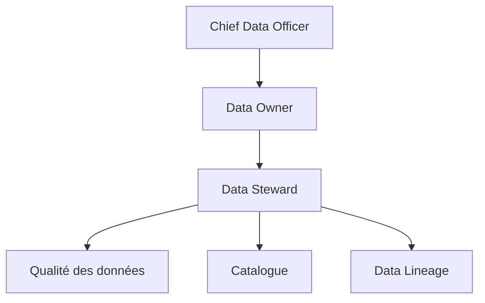

# DATA-116 — Enterprise Data Stewardship

> Référentiel officiel de gestion des responsabilités de **Data Stewardship** pour **EduWeb Planner**.

## Sommaire

1. Vision
2. Objectifs
3. Définition
4. Principes
5. Organisation
6. Rôles et responsabilités
7. Processus
8. Indicateurs
9. API conceptuelle
10. Bonnes pratiques
11. Anti-patterns
12. Règles d'architecture

---

## 1. Vision

Garantir que chaque domaine de données est administré par des responsables clairement identifiés, assurant sa qualité, sa cohérence, sa conformité et sa valeur métier.

## 2. Objectifs

- Attribuer des responsabilités explicites.
- Améliorer la qualité des données.
- Renforcer la gouvernance.
- Faciliter les audits et la conformité.
- Favoriser l'amélioration continue.

## 3. Définition

Le **Data Stewardship** regroupe les activités de supervision opérationnelle des données afin d'assurer leur qualité, leur documentation, leur sécurité et leur conformité tout au long de leur cycle de vie.

## 4. Principes

- Responsabilité clairement définie.
- Collaboration métier–IT.
- Amélioration continue.
- Décisions fondées sur des indicateurs.
- Traçabilité des actions.

## 5. Organisation



## 6. Rôles et responsabilités

| Rôle | Responsabilités |
|------|-----------------|
| Chief Data Officer | Politique de gouvernance |
| Data Owner | Décisions métier |
| Data Steward | Gestion opérationnelle des données |
| RSSI | Protection des données |
| Architecte Data | Cohérence technique |

## 7. Processus

1. Identifier les domaines de données.
2. Nommer les Data Stewards.
3. Définir les règles de qualité.
4. Contrôler les indicateurs.
5. Corriger les anomalies.
6. Produire les rapports de gouvernance.

## 8. Indicateurs

| KPI | Objectif |
|------|----------|
| Domaines avec Data Steward désigné | 100 % |
| Anomalies résolues dans les délais | ≥ 95 % |
| Jeux de données documentés | ≥ 98 % |
| Revues de gouvernance réalisées | 100 % |

## 9. API conceptuelle

```typescript
interface EnterpriseDataStewardship {
    assignSteward(): void;
    validateQuality(): void;
    reviewPolicies(): void;
    resolveIssue(): void;
    publishMetrics(): void;
}
```

## 10. Bonnes pratiques

- Désigner un Data Steward par domaine.
- Définir des objectifs mesurables.
- Organiser des revues périodiques.
- Centraliser les décisions dans le catalogue.

## 11. Anti-patterns

- Responsabilités ambiguës.
- Gouvernance uniquement technique.
- Absence de suivi des anomalies.
- Documentation non maintenue.

## 12. Règles d'architecture

- RA-DATA116-001 : Chaque domaine possède un Data Steward.
- RA-DATA116-002 : Les responsabilités sont documentées.
- RA-DATA116-003 : Les indicateurs sont suivis régulièrement.
- RA-DATA116-004 : Les anomalies sont tracées jusqu'à leur résolution.
- RA-DATA116-005 : Les Data Stewards participent aux comités de gouvernance.

---

# Fin du document
