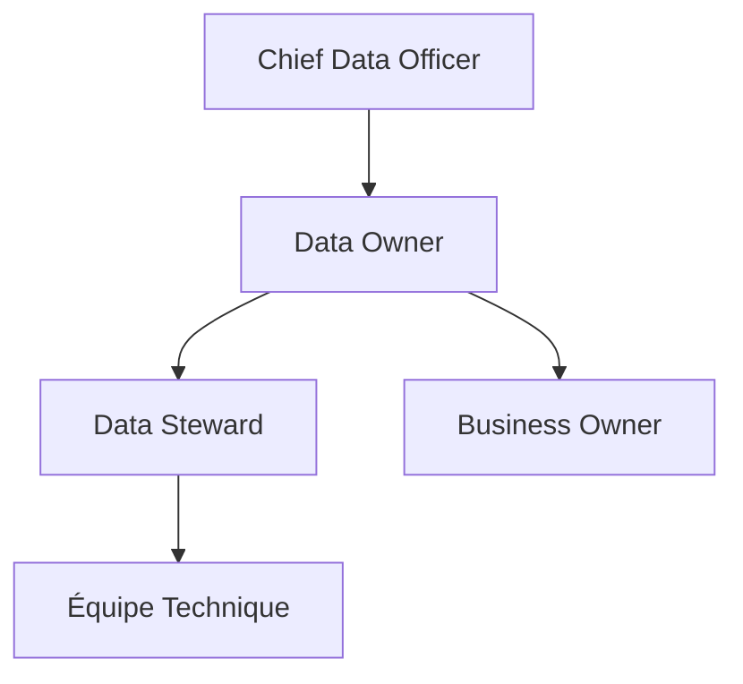

# DATA-117 — Enterprise Data Ownership

> Référentiel officiel de gestion de la propriété des données pour **EduWeb Planner**.

## Sommaire

1. Vision
2. Objectifs
3. Définition
4. Principes directeurs
5. Modèle organisationnel
6. Rôles et responsabilités
7. Processus de gestion
8. Matrice RACI
9. API conceptuelle
10. KPI
11. Bonnes pratiques
12. Anti-patterns
13. Règles d'architecture

---

## 1. Vision

Attribuer à chaque domaine de données un propriétaire clairement identifié afin de garantir la responsabilité, la qualité, la conformité, la sécurité et la création de valeur tout au long du cycle de vie des données.

---

## 2. Objectifs

- Définir la responsabilité métier de chaque domaine de données.
- Clarifier les décisions relatives aux données.
- Renforcer la gouvernance.
- Accélérer les arbitrages.
- Soutenir la conformité réglementaire.

---

## 3. Définition

Le **Data Owner** est l'autorité métier responsable d'un domaine de données. Il valide les règles métier, les usages, les niveaux de qualité, les accès et les politiques de conservation.

---

## 4. Principes directeurs

- Une donnée possède un propriétaire unique.
- La responsabilité est portée par le métier.
- Les décisions sont documentées.
- Les délégations sont formalisées.
- Les responsabilités sont auditables.

---

## 5. Modèle organisationnel



---

## 6. Rôles et responsabilités

| Rôle | Responsabilités principales |
|------|-----------------------------|
| Chief Data Officer | Politique de gouvernance des données |
| Data Owner | Décisions métier et validation |
| Data Steward | Gestion opérationnelle et qualité |
| RSSI | Sécurité et protection |
| Architecte Data | Cohérence des modèles |

---

## 7. Processus de gestion

1. Identifier le domaine de données.
2. Désigner officiellement le Data Owner.
3. Définir les responsabilités.
4. Publier les informations dans le Data Catalog.
5. Réaliser les revues périodiques.
6. Mettre à jour les désignations si nécessaire.

---

## 8. Matrice RACI

| Activité | CDO | Data Owner | Data Steward | RSSI |
|----------|:---:|:----------:|:------------:|:----:|
| Définition des règles métier | A | R | C | I |
| Validation des accès | C | A | R | C |
| Suivi qualité | I | A | R | C |
| Gestion des incidents | C | A | R | R |
| Audit | A | C | C | R |

Légende : **R** = Responsable, **A** = Autorité, **C** = Consulté, **I** = Informé.

---

## 9. API conceptuelle

```typescript
interface EnterpriseDataOwnership {
    assignOwner(): void;
    transferOwnership(): void;
    validatePolicy(): void;
    approveAccess(): void;
    auditOwnership(): void;
}
```

---

## 10. KPI

| KPI | Objectif |
|------|----------|
| Domaines avec Data Owner identifié | 100 % |
| Décisions documentées | 100 % |
| Revues annuelles réalisées | ≥ 95 % |
| Incidents liés à une responsabilité ambiguë | 0 |

---

## 11. Bonnes pratiques

- Désigner un propriétaire métier unique.
- Publier les responsabilités.
- Mettre à jour les nominations.
- Organiser des revues de gouvernance.
- Documenter les délégations.

---

## 12. Anti-patterns

- Plusieurs propriétaires pour un même domaine.
- Responsabilités implicites.
- Décisions non documentées.
- Absence de revue des responsabilités.
- Confusion entre Data Owner et Data Steward.

---

## 13. Règles d'architecture

- RA-DATA117-001 : Chaque domaine de données possède un Data Owner unique.
- RA-DATA117-002 : Les responsabilités sont documentées dans le catalogue de données.
- RA-DATA117-003 : Les délégations sont officiellement enregistrées.
- RA-DATA117-004 : Les revues de gouvernance sont réalisées au moins une fois par an.
- RA-DATA117-005 : Les décisions du Data Owner sont traçables et auditables.

---

# Fin du document
