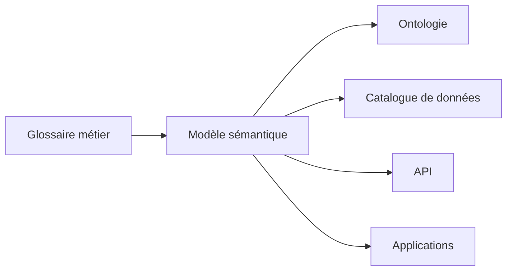

# DATA-118 — Enterprise Semantic Model

> Référentiel officiel du modèle sémantique d'entreprise pour **EduWeb Planner**.

## Sommaire

1. Vision
2. Objectifs
3. Définition
4. Principes
5. Architecture
6. Composants du modèle
7. Gouvernance
8. Cycle de vie
9. API conceptuelle
10. KPI
11. Bonnes pratiques
12. Anti-patterns
13. Règles d'architecture

---

## 1. Vision

Établir un langage commun pour l'ensemble des données de l'écosystème EduWeb afin que tous les acteurs — métiers, développeurs, analystes et systèmes — interprètent les informations de manière identique.

---

## 2. Objectifs

- Uniformiser la signification des données.
- Réduire les ambiguïtés terminologiques.
- Faciliter l'interopérabilité.
- Soutenir les analyses avancées et l'IA.
- Aligner les modèles métiers et techniques.

---

## 3. Définition

Le **modèle sémantique** décrit les concepts métier, leurs attributs, leurs relations et leurs règles d'interprétation indépendamment de leur implémentation technique.

---

## 4. Principes

- Une définition unique par concept.
- Vocabulaire métier partagé.
- Traçabilité des évolutions.
- Réutilisation des concepts.
- Alignement avec les référentiels de données.

---

## 5. Architecture



---

## 6. Composants du modèle

- Concepts métier
- Définitions
- Attributs
- Relations
- Contraintes
- Synonymes
- Taxonomies
- Métadonnées associées

---

## 7. Gouvernance

- Chief Data Officer
- Architecte Data
- Architecte Métier
- Data Owner
- Data Steward
- Comité de Gouvernance

---

## 8. Cycle de vie

1. Identification des concepts.
2. Validation métier.
3. Modélisation.
4. Publication.
5. Réutilisation.
6. Évolution.
7. Archivage.

---

## 9. API conceptuelle

```typescript
interface EnterpriseSemanticModel {
    defineConcept(): void;
    relateConcepts(): void;
    publishModel(): void;
    validateConsistency(): boolean;
    versionModel(): void;
}
```

---

## 10. KPI

| KPI | Objectif |
|------|----------|
| Concepts documentés | 100 % |
| Concepts réutilisés | ≥ 80 % |
| Incohérences sémantiques | 0 critique |
| Mises à jour validées | 100 % |

---

## 11. Bonnes pratiques

- Maintenir un glossaire métier unique.
- Réutiliser les concepts existants.
- Versionner les modèles.
- Valider les définitions avec les métiers.
- Synchroniser le modèle avec le Data Catalog.

---

## 12. Anti-patterns

- Définitions contradictoires.
- Concepts dupliqués.
- Modèle non documenté.
- Évolutions sans validation.
- Absence de gouvernance.

---

## 13. Règles d'architecture

- RA-DATA118-001 : Chaque concept possède une définition unique.
- RA-DATA118-002 : Les modèles sont versionnés.
- RA-DATA118-003 : Les relations entre concepts sont documentées.
- RA-DATA118-004 : Les évolutions sont validées par la gouvernance.
- RA-DATA118-005 : Le modèle sémantique alimente le catalogue de données et les ontologies.

---

# Fin du document
