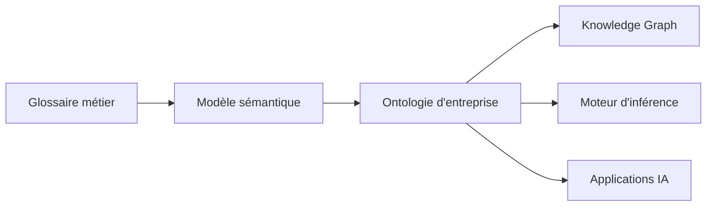

# DATA-119 — Enterprise Ontology Architecture

> Référentiel officiel de l'architecture des ontologies d'entreprise pour **EduWeb Planner**.

## Sommaire

1. Vision
2. Objectifs
3. Définition
4. Principes
5. Architecture de référence
6. Composants de l'ontologie
7. Gouvernance
8. Cycle de vie
9. API conceptuelle
10. KPI
11. Bonnes pratiques
12. Anti-patterns
13. Règles d'architecture

---

## 1. Vision

Mettre en place une architecture d'ontologies commune afin de représenter formellement les connaissances métier d'EduWeb, de favoriser l'interopérabilité sémantique et de soutenir les applications d'intelligence artificielle.

---

## 2. Objectifs

- Formaliser les connaissances métier.
- Garantir une compréhension commune des concepts.
- Faciliter les raisonnements automatiques.
- Soutenir le Knowledge Graph.
- Renforcer l'interopérabilité sémantique.

---

## 3. Définition

Une **ontologie d'entreprise** est un modèle formel décrivant les concepts, les relations, les propriétés et les règles qui structurent les connaissances d'un domaine métier.

---

## 4. Principes

- Concept défini une seule fois.
- Réutilisation des ontologies existantes.
- Versionnement obligatoire.
- Gouvernance métier et technique.
- Alignement avec le modèle sémantique.

---

## 5. Architecture de référence



---

## 6. Composants de l'ontologie

- Classes
- Individus
- Relations
- Propriétés
- Contraintes
- Règles métier
- Vocabulaires contrôlés
- Alignements avec des standards externes

---

## 7. Gouvernance

- Chief Data Officer
- Enterprise Architect
- Data Architect
- Domain Expert
- Data Steward
- Comité de Gouvernance des Données

---

## 8. Cycle de vie

1. Identification des concepts.
2. Modélisation.
3. Validation métier.
4. Publication.
5. Réutilisation.
6. Évolution.
7. Dépréciation.

---

## 9. API conceptuelle

```typescript
interface EnterpriseOntology {
    createClass(): void;
    defineRelation(): void;
    validateOntology(): boolean;
    publishOntology(): void;
    inferKnowledge(): void;
}
```

---

## 10. KPI

| KPI | Objectif |
|------|----------|
| Concepts couverts par l'ontologie | ≥ 95 % |
| Relations documentées | 100 % |
| Ontologies versionnées | 100 % |
| Réutilisation des concepts | ≥ 80 % |

---

## 11. Bonnes pratiques

- Utiliser des standards (OWL, RDF, SKOS).
- Réutiliser les vocabulaires existants.
- Versionner les ontologies.
- Documenter chaque concept.
- Tester les règles d'inférence.

---

## 12. Anti-patterns

- Ontologies redondantes.
- Concepts contradictoires.
- Évolutions non gouvernées.
- Documentation absente.
- Relations implicites.

---

## 13. Règles d'architecture

- RA-DATA119-001 : Toute ontologie est versionnée.
- RA-DATA119-002 : Les concepts sont alignés sur le modèle sémantique.
- RA-DATA119-003 : Les relations sont explicitement documentées.
- RA-DATA119-004 : Les ontologies sont validées avant publication.
- RA-DATA119-005 : Les ontologies alimentent le Knowledge Graph d'entreprise.

---

# Fin du document
