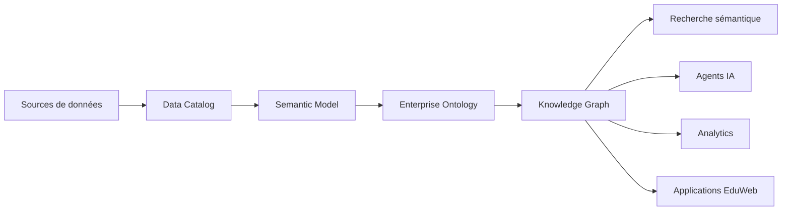

# DATA-120 — Enterprise Knowledge Graph

> Référentiel officiel de l'architecture du **Knowledge Graph** d'entreprise pour **EduWeb Planner**.

## Sommaire

1. Vision
2. Objectifs
3. Définition
4. Principes
5. Architecture de référence
6. Composants
7. Cas d'usage
8. Gouvernance
9. Cycle de vie
10. API conceptuelle
11. KPI
12. Bonnes pratiques
13. Anti-patterns
14. Règles d'architecture
15. Documents associés

---

# 1. Vision

Construire un graphe de connaissances unifié permettant de relier les personnes, établissements, formations, documents, applications, ressources pédagogiques et processus de l'écosystème EduWeb afin d'améliorer la recherche, l'aide à la décision, l'interopérabilité et les capacités d'intelligence artificielle.

---

# 2. Objectifs

- Centraliser les connaissances de l'entreprise.
- Relier les données issues de sources hétérogènes.
- Faciliter les raisonnements automatiques.
- Alimenter les assistants IA.
- Améliorer la recherche sémantique.
- Favoriser la découverte de connaissances.

---

# 3. Définition

Un **Knowledge Graph** est un graphe de connaissances représentant les entités, leurs attributs et leurs relations sous une forme exploitable par les humains comme par les systèmes intelligents.

---

# 4. Principes

- Source unique de vérité sémantique.
- Concepts gouvernés.
- Relations explicites.
- Évolutivité.
- Traçabilité.
- Réutilisation maximale.

---

# 5. Architecture de référence



---

# 6. Composants

- Entités
- Relations
- Classes
- Ontologies
- Métadonnées
- Taxonomies
- Raisonneur (Inference Engine)
- Triple Store
- API GraphQL/SPARQL
- Connecteurs

---

# 7. Cas d'usage

- Recherche intelligente d'établissements.
- Recommandation pédagogique.
- Détection de relations cachées.
- Cartographie des compétences.
- Assistance conversationnelle.
- Gouvernance documentaire.
- Aide à la décision.
- Génération de rapports.

---

# 8. Gouvernance

Principaux acteurs :

- Chief Data Officer
- Enterprise Architect
- Data Architect
- Knowledge Engineer
- Data Steward
- Domain Experts
- RSSI

---

# 9. Cycle de vie

1. Acquisition des connaissances.
2. Modélisation.
3. Validation.
4. Publication.
5. Enrichissement.
6. Exploitation.
7. Archivage.

---

# 10. API conceptuelle

```typescript
interface EnterpriseKnowledgeGraph {

    createEntity(): void;

    createRelation(): void;

    queryKnowledge(): void;

    inferKnowledge(): void;

    enrichGraph(): void;

    publishGraph(): void;

}
```

---

# 11. KPI

| KPI | Objectif |
|------|----------|
| Concepts représentés | ≥ 95 % |
| Relations documentées | ≥ 98 % |
| Temps moyen de requête | < 2 s |
| Disponibilité | ≥ 99,9 % |
| Réutilisation des connaissances | En progression continue |

---

# 12. Bonnes pratiques

- Réutiliser les ontologies standards.
- Documenter chaque relation.
- Automatiser l'enrichissement du graphe.
- Contrôler la qualité des connaissances.
- Versionner les modèles.
- Auditer régulièrement les inférences.

---

# 13. Anti-patterns

- Relations implicites non documentées.
- Concepts dupliqués.
- Ontologies divergentes.
- Données non gouvernées.
- Absence de validation métier.
- Graphes isolés.

---

# 14. Règles d'architecture

- RA-DATA120-001 : Toute entité appartient à une ontologie validée.
- RA-DATA120-002 : Les relations sont explicitement modélisées.
- RA-DATA120-003 : Les connaissances sont traçables jusqu'à leur source.
- RA-DATA120-004 : Les inférences sont vérifiables.
- RA-DATA120-005 : Le Knowledge Graph constitue la couche sémantique de référence de l'écosystème EduWeb.

---

# 15. Documents associés

- DATA-118 — Enterprise Semantic Model
- DATA-119 — Enterprise Ontology Architecture
- DATA-106 — Enterprise Data Catalog
- DATA-107 — Enterprise Data Lineage
- ARCH-148 — Enterprise Artificial Intelligence Architecture
- ARCH-149 — Enterprise Multi-Agent Systems Architecture

---

# Conclusion

Le **Knowledge Graph** constitue le socle de la connaissance de l'entreprise. En fédérant les modèles sémantiques, les ontologies et les référentiels de données, il offre à EduWeb Planner une plateforme robuste pour l'intelligence artificielle, la recherche sémantique, l'analyse avancée et la gouvernance des connaissances.

---

# Fin du document
