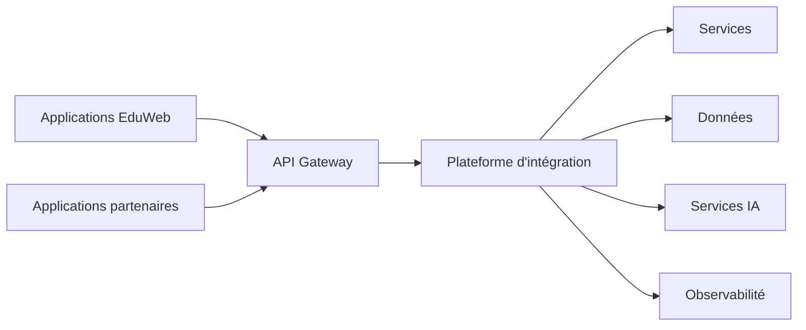

# INT-101 — Enterprise Integration Foundation

> Référentiel officiel des fondations de l'architecture d'intégration d'entreprise pour **EduWeb Planner**.

## Sommaire

1. Vision
2. Objectifs
3. Définition
4. Principes
5. Architecture de référence
6. Composants
7. Cycle de vie
8. Gouvernance
9. Cas d'usage EduWeb
10. API conceptuelle
11. KPI
12. Bonnes pratiques
13. Anti-patterns
14. Règles d'architecture
15. Documents associés

---

## 1. Vision

Mettre en place une architecture d'intégration unifiée permettant à toutes les plateformes EduWeb, aux applications partenaires et aux services d'intelligence artificielle d'échanger des données de manière fiable, sécurisée et interopérable.

## 2. Objectifs

- Standardiser les échanges entre systèmes.
- Réduire le couplage entre applications.
- Faciliter l'évolutivité.
- Garantir la sécurité des flux.
- Favoriser la réutilisation des services.

## 3. Définition

L'architecture d'intégration d'entreprise définit les principes, technologies et mécanismes assurant la communication entre les applications, données, services et plateformes internes ou externes.

## 4. Principes

- Integration by Design
- API First
- Event Driven
- Loose Coupling
- Sécurité par défaut
- Observabilité
- Gouvernance

## 5. Architecture de référence



## 6. Composants

- API Gateway
- Bus d'intégration
- Broker de messages
- Registre des services
- Connecteurs
- Gestion des identités
- Journalisation
- Supervision

## 7. Cycle de vie

1. Analyse du besoin.
2. Conception.
3. Développement.
4. Tests.
5. Déploiement.
6. Supervision.
7. Amélioration continue.

## 8. Gouvernance

- Enterprise Architect
- Integration Architect
- API Manager
- RSSI
- Data Steward
- Responsables métier

## 9. Cas d'usage EduWeb

- Synchronisation des établissements.
- Échanges entre Planner, Governance, Family et Booking.
- Connexion aux services ministériels.
- Intégration avec les services IA.

## 10. API conceptuelle

```typescript
interface EnterpriseIntegrationPlatform {
  registerService(): void;
  publishEvent(): void;
  consumeEvent(): void;
  routeRequest(): void;
  monitorFlow(): void;
}
```

## 11. KPI

| KPI | Objectif |
|------|----------|
| Disponibilité plateforme | ≥ 99,9 % |
| Temps moyen de routage | < 200 ms |
| Flux supervisés | 100 % |
| Interfaces documentées | 100 % |

## 12. Bonnes pratiques

- Concevoir des interfaces stables.
- Documenter les contrats.
- Automatiser les tests d'intégration.
- Surveiller les performances.

## 13. Anti-patterns

- Intégrations point à point non maîtrisées.
- Interfaces non versionnées.
- Couplage fort.
- Absence de supervision.

## 14. Règles d'architecture

- RA-INT101-001 : Toute intégration est documentée.
- RA-INT101-002 : Les interfaces sont versionnées.
- RA-INT101-003 : Les échanges sont sécurisés.
- RA-INT101-004 : Les flux sont observables.
- RA-INT101-005 : Les services sont enregistrés.

## 15. Documents associés

- INT-102 — Enterprise API Architecture
- AI-111 — Enterprise Model Context Protocol
- ARCH-150 — Enterprise Architecture
- DATA-120 — Enterprise Knowledge Graph

# Fin du document
