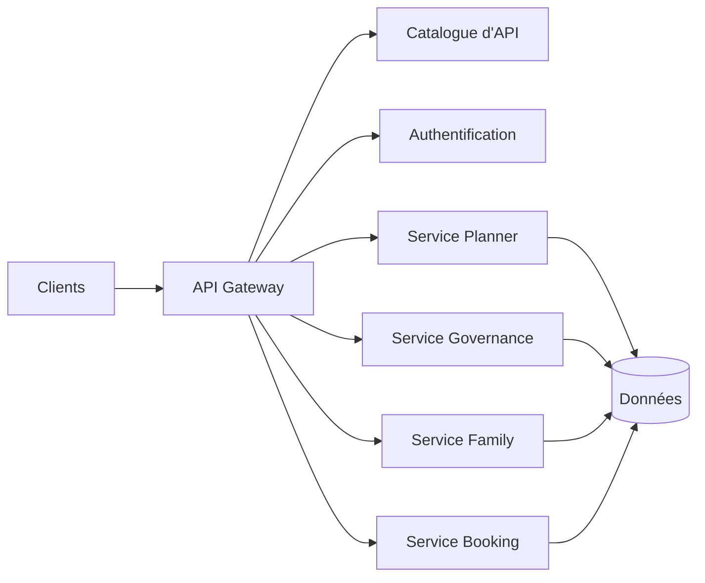

# INT-102 — Enterprise API Architecture

> Référentiel officiel de l'architecture **API First** pour **EduWeb Planner**.

## Sommaire

1. Vision
2. Objectifs
3. Définition
4. Principes
5. Architecture de référence
6. Composants
7. Cycle de vie des API
8. Gouvernance
9. Cas d'usage EduWeb
10. API conceptuelle
11. KPI
12. Bonnes pratiques
13. Anti-patterns
14. Règles d'architecture
15. Documents associés

---

## 1. Vision

Fournir un socle d'API cohérent, sécurisé, documenté et versionné permettant aux applications EduWeb, aux partenaires et aux services d'IA d'échanger des informations de manière standardisée.

## 2. Objectifs

- Adopter une approche API First.
- Standardiser les contrats d'échange.
- Faciliter la réutilisation des services.
- Garantir la sécurité et la traçabilité.
- Accélérer le développement des intégrations.

## 3. Définition

Une architecture API organise la conception, la publication, la sécurisation, la gestion du cycle de vie et la supervision des interfaces de programmation utilisées par les systèmes de l'entreprise.

## 4. Principes

- API First
- Contract First
- Versionnement
- Sécurité par défaut
- Interopérabilité
- Observabilité
- Réutilisation

## 5. Architecture de référence



## 6. Composants

- API Gateway
- Catalogue d'API
- Documentation OpenAPI
- Authentification OAuth2/OIDC
- Journalisation
- Limitation de débit
- Supervision
- Gestion des versions

## 7. Cycle de vie des API

1. Analyse.
2. Conception.
3. Documentation.
4. Développement.
5. Tests.
6. Publication.
7. Supervision.
8. Dépréciation.

## 8. Gouvernance

- Enterprise Architect
- API Architect
- API Product Owner
- RSSI
- Développeurs
- Responsables métier

## 9. Cas d'usage EduWeb

- Consultation des emplois du temps.
- Gestion des établissements.
- Synchronisation des comptes.
- Intégration des services IA.
- Échanges avec les partenaires institutionnels.

## 10. API conceptuelle

```typescript
interface EnterpriseAPI {
  authenticate(): Promise<boolean>;
  getResource(id: string): Promise<object>;
  createResource(payload: object): Promise<object>;
  updateResource(id: string, payload: object): Promise<object>;
  deleteResource(id: string): Promise<void>;
}
```

## 11. KPI

| KPI | Objectif |
|------|----------|
| API documentées | 100 % |
| Disponibilité | ≥ 99,9 % |
| Temps moyen de réponse | < 300 ms |
| API versionnées | 100 % |
| Couverture des tests | ≥ 90 % |

## 12. Bonnes pratiques

- Utiliser OpenAPI.
- Versionner chaque API.
- Normaliser les codes d'erreur.
- Sécuriser les accès.
- Tester automatiquement les contrats.

## 13. Anti-patterns

- API sans documentation.
- Rupture de compatibilité.
- Endpoints redondants.
- Authentification faible.
- Logs insuffisants.

## 14. Règles d'architecture

- RA-INT102-001 : Toute API possède un contrat OpenAPI.
- RA-INT102-002 : Les versions sont explicites.
- RA-INT102-003 : Les accès sont authentifiés.
- RA-INT102-004 : Les métriques sont collectées.
- RA-INT102-005 : Les API sont publiées dans le catalogue.

## 15. Documents associés

- INT-101 — Enterprise Integration Foundation
- INT-103 — Enterprise API Gateway Architecture
- AI-111 — Enterprise Model Context Protocol
- DATA-110 — Enterprise Data Integration

# Fin du document
