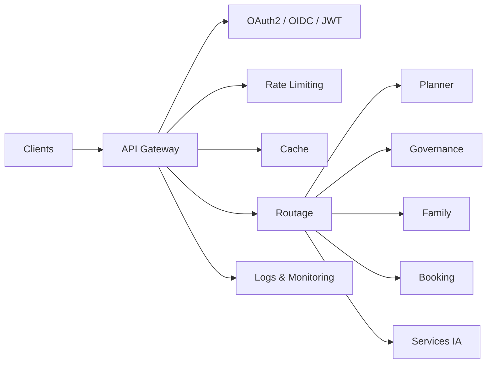

# INT-103 — Enterprise API Gateway Architecture

> Référentiel officiel de l'architecture **API Gateway** pour **EduWeb Planner**.

## Sommaire

1. Vision
2. Objectifs
3. Définition
4. Principes
5. Architecture de référence
6. Composants
7. Cycle de traitement d'une requête
8. Gouvernance
9. Cas d'usage EduWeb
10. API conceptuelle
11. KPI
12. Bonnes pratiques
13. Anti-patterns
14. Règles d'architecture
15. Documents associés

---

## 1. Vision

Mettre en œuvre une passerelle d'API centralisée assurant le routage, la sécurité, l'observabilité et la gouvernance des échanges entre les applications EduWeb, les partenaires et les services d'intelligence artificielle.

## 2. Objectifs

- Centraliser les points d'entrée.
- Sécuriser les API.
- Optimiser les performances.
- Simplifier le routage.
- Faciliter la supervision.

## 3. Définition

Une API Gateway est un composant d'infrastructure qui reçoit les requêtes des clients, applique les politiques de sécurité et de gouvernance, puis les distribue vers les services appropriés.

## 4. Principes

- Gateway by Design
- Zero Trust
- API First
- Observabilité
- Haute disponibilité
- Scalabilité
- Gouvernance centralisée

## 5. Architecture de référence



## 6. Composants

- API Gateway
- Authentification
- Autorisation
- Rate Limiting
- Quotas
- Cache
- Load Balancer
- Journalisation
- Monitoring
- Catalogue d'API

## 7. Cycle de traitement d'une requête

1. Réception.
2. Authentification.
3. Autorisation.
4. Contrôle de débit.
5. Routage.
6. Transformation éventuelle.
7. Réponse.
8. Journalisation.

## 8. Gouvernance

- API Manager
- Enterprise Architect
- RSSI
- SRE
- Développeurs
- Responsables métier

## 9. Cas d'usage EduWeb

- Accès sécurisé à Planner.
- Exposition des API Governance.
- Intégration avec les LLM via MCP.
- Accès aux données pédagogiques.
- Portail partenaires.

## 10. API conceptuelle

```typescript
interface ApiGateway {
  authenticate(token: string): Promise<boolean>;
  authorize(resource: string): boolean;
  route(path: string): Promise<object>;
  applyRateLimit(clientId: string): boolean;
  logRequest(): void;
}
```

## 11. KPI

| KPI | Objectif |
|------|----------|
| Disponibilité | ≥ 99,9 % |
| Temps de routage | < 100 ms |
| API protégées | 100 % |
| Journalisation | 100 % |
| Incidents critiques | 0 |

## 12. Bonnes pratiques

- Utiliser OAuth2/OpenID Connect.
- Centraliser les politiques de sécurité.
- Définir des quotas adaptés.
- Superviser les performances.
- Versionner les API.

## 13. Anti-patterns

- Passerelles multiples non coordonnées.
- API exposées sans authentification.
- Absence de monitoring.
- Règles de sécurité incohérentes.
- Cache mal configuré.

## 14. Règles d'architecture

- RA-INT103-001 : Toutes les API externes passent par la Gateway.
- RA-INT103-002 : Les accès sont authentifiés.
- RA-INT103-003 : Les quotas sont appliqués.
- RA-INT103-004 : Les métriques sont collectées.
- RA-INT103-005 : Les événements sont journalisés.

## 15. Documents associés

- INT-101 — Enterprise Integration Foundation
- INT-102 — Enterprise API Architecture
- INT-104 — Enterprise Service Bus
- AI-111 — Enterprise Model Context Protocol

# Fin du document
