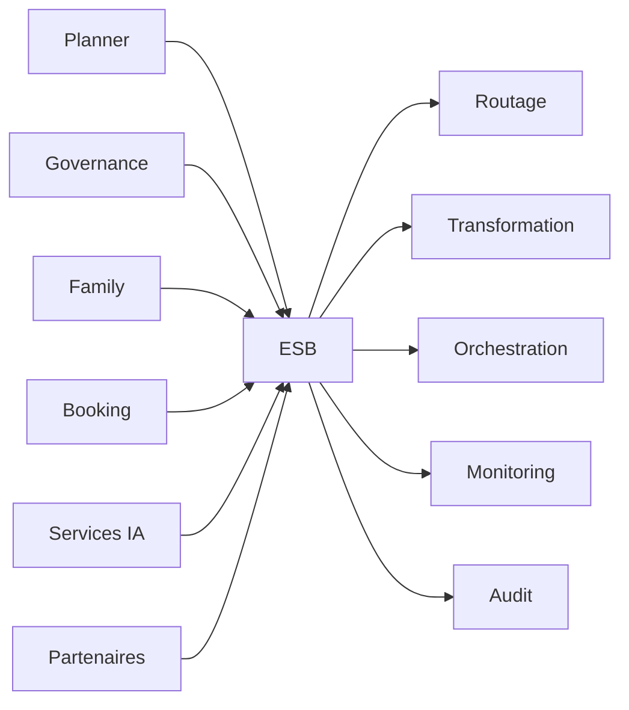

# INT-104 — Enterprise Service Bus (ESB)

> Référentiel officiel de l'architecture **Enterprise Service Bus (ESB)** pour **EduWeb Planner**.

## Sommaire

1. Vision
2. Objectifs
3. Définition
4. Principes
5. Architecture de référence
6. Composants
7. Cycle de traitement d'un message
8. Gouvernance
9. Cas d'usage EduWeb
10. API conceptuelle
11. KPI
12. Bonnes pratiques
13. Anti-patterns
14. Règles d'architecture
15. Documents associés

---

## 1. Vision

Mettre en place un bus de services d'entreprise assurant des échanges fiables, sécurisés et interopérables entre les applications, microservices, partenaires institutionnels et plateformes d'intelligence artificielle d'EduWeb Planner.

## 2. Objectifs

- Découpler les applications.
- Centraliser les échanges.
- Orchestrer les services.
- Transformer les messages.
- Améliorer la résilience et la supervision.

## 3. Définition

Un **Enterprise Service Bus (ESB)** est une infrastructure middleware qui facilite la communication entre plusieurs systèmes hétérogènes grâce au routage, à la transformation, à l'orchestration et à la sécurisation des messages.

## 4. Principes

- Loose Coupling
- Service Mediation
- Canonical Data Model
- Message Transformation
- Security by Design
- High Availability
- Observability

## 5. Architecture de référence



## 6. Composants

- Bus de services
- Moteur de routage
- Transformateur de messages
- Orchestrateur de services
- Connecteurs
- Gestionnaire d'erreurs
- Sécurité
- Journalisation
- Monitoring
- Registre des services

## 7. Cycle de traitement d'un message

1. Réception.
2. Validation.
3. Authentification.
4. Transformation.
5. Routage.
6. Orchestration.
7. Livraison.
8. Journalisation.

## 8. Gouvernance

- Enterprise Architect
- Integration Architect
- API Manager
- RSSI
- MLOps Engineer
- Responsables métier

## 9. Cas d'usage EduWeb

- Synchronisation des établissements scolaires.
- Échanges entre Planner et Governance.
- Intégration avec les plateformes ministérielles.
- Communication avec les services IA.
- Consolidation des données pédagogiques.

## 10. API conceptuelle

```typescript
interface EnterpriseServiceBus {
  receiveMessage(message: object): void;
  transformMessage(message: object): object;
  routeMessage(destination: string): void;
  orchestrateService(flow: string): void;
  monitorFlow(): void;
}
```

## 11. KPI

| KPI | Objectif |
|------|----------|
| Disponibilité du bus | ≥ 99,9 % |
| Messages livrés avec succès | ≥ 99,99 % |
| Temps moyen de routage | < 150 ms |
| Flux supervisés | 100 % |
| Incidents critiques | 0 |

## 12. Bonnes pratiques

- Utiliser un modèle canonique de données.
- Versionner les contrats d'échange.
- Prévoir des files d'attente pour les reprises.
- Journaliser tous les flux.
- Superviser les performances en continu.

## 13. Anti-patterns

- Intégrations point à point incontrôlées.
- Routage codé en dur.
- Transformations non documentées.
- Bus unique sans haute disponibilité.
- Absence de surveillance.

## 14. Règles d'architecture

- RA-INT104-001 : Tous les échanges inter-applications transitent par l'ESB lorsque requis.
- RA-INT104-002 : Les messages utilisent un format standardisé.
- RA-INT104-003 : Les transformations sont documentées.
- RA-INT104-004 : Les erreurs sont journalisées et supervisées.
- RA-INT104-005 : Les connecteurs sont versionnés.

## 15. Documents associés

- INT-101 — Enterprise Integration Foundation
- INT-102 — Enterprise API Architecture
- INT-103 — Enterprise API Gateway Architecture
- INT-105 — Enterprise Event-Driven Architecture
- AI-113 — Enterprise AI Orchestration

# Fin du document
