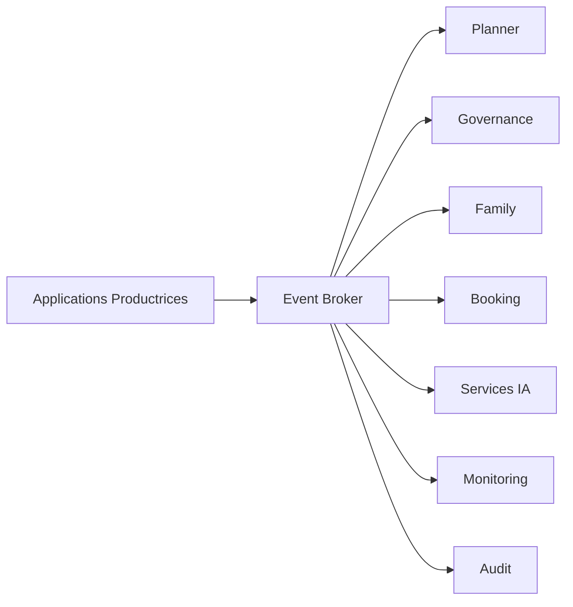

# INT-105 — Enterprise Event-Driven Architecture (EDA)

> Référentiel officiel de l'architecture orientée événements pour **EduWeb Planner**.

## Sommaire

1. Vision
2. Objectifs
3. Définition
4. Principes
5. Architecture de référence
6. Composants
7. Cycle de vie d'un événement
8. Gouvernance
9. Cas d'usage EduWeb
10. API conceptuelle
11. KPI
12. Bonnes pratiques
13. Anti-patterns
14. Règles d'architecture
15. Documents associés

---

## 1. Vision

Adopter une architecture orientée événements afin de favoriser des échanges asynchrones, évolutifs et résilients entre les applications, services et plateformes d'intelligence artificielle d'EduWeb Planner.

## 2. Objectifs

- Découpler les producteurs et consommateurs.
- Favoriser les traitements temps réel.
- Améliorer la résilience.
- Faciliter l'extensibilité.
- Accroître l'observabilité des flux.

## 3. Définition

L'Event-Driven Architecture (EDA) repose sur la production, la diffusion et la consommation d'événements métier ou techniques déclenchant automatiquement des traitements.

## 4. Principes

- Event First
- Loose Coupling
- Publication / Abonnement
- Asynchronisme
- Idempotence
- Cohérence éventuelle
- Traçabilité

## 5. Architecture de référence



## 6. Composants

- Producteurs d'événements
- Event Broker
- Topics
- Files d'attente
- Consommateurs
- Gestionnaire de schémas
- Observabilité
- Journalisation
- Dead Letter Queue
- Catalogue d'événements

## 7. Cycle de vie d'un événement

1. Création.
2. Validation.
3. Publication.
4. Distribution.
5. Consommation.
6. Traitement.
7. Journalisation.
8. Archivage.

## 8. Gouvernance

- Enterprise Architect
- Integration Architect
- Event Manager
- RSSI
- Data Steward
- Responsables métier

## 9. Cas d'usage EduWeb

- Création d'un établissement scolaire.
- Validation d'un abonnement.
- Publication d'un emploi du temps.
- Notification d'un parent.
- Synchronisation des données.
- Déclenchement de workflows IA.

## 10. API conceptuelle

```typescript
interface EnterpriseEventBus {
  publish(topic: string, event: object): Promise<void>;
  subscribe(topic: string): Promise<void>;
  acknowledge(eventId: string): void;
  retry(eventId: string): void;
  deadLetter(eventId: string): void;
}
```

## 11. KPI

| KPI | Objectif |
|------|----------|
| Événements délivrés | ≥ 99,99 % |
| Latence moyenne | < 100 ms |
| Événements tracés | 100 % |
| Reprises automatiques | ≥ 95 % |
| Disponibilité du broker | ≥ 99,9 % |

## 12. Bonnes pratiques

- Concevoir des événements métier explicites.
- Utiliser des schémas versionnés.
- Garantir l'idempotence.
- Prévoir des files de reprise.
- Superviser les flux en continu.

## 13. Anti-patterns

- Événements trop génériques.
- Dépendances synchrones inutiles.
- Absence de versionnement.
- Topics non gouvernés.
- Consommateurs sans reprise.

## 14. Règles d'architecture

- RA-INT105-001 : Les événements sont versionnés.
- RA-INT105-002 : Les schémas sont documentés.
- RA-INT105-003 : Les publications sont journalisées.
- RA-INT105-004 : Les consommateurs sont idempotents.
- RA-INT105-005 : Les erreurs sont redirigées vers une Dead Letter Queue.

## 15. Documents associés

- INT-104 — Enterprise Service Bus
- INT-106 — Enterprise Message Brokers & Queues
- INT-107 — Enterprise Microservices Integration
- AI-113 — Enterprise AI Orchestration

# Fin du document
