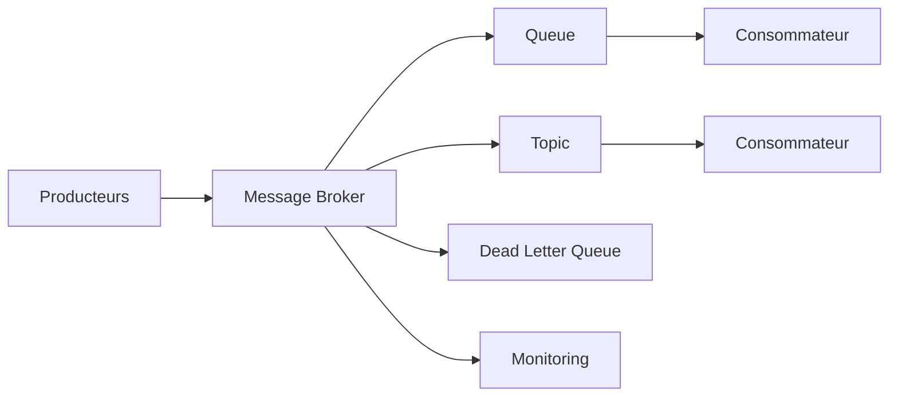

# INT-106 — Enterprise Message Brokers & Queues

> Référentiel officiel des **courtiers de messages et files d'attente** pour **EduWeb Planner**.

## Sommaire

1. Vision
2. Objectifs
3. Définition
4. Principes
5. Architecture de référence
6. Composants
7. Cycle de traitement d'un message
8. Gouvernance
9. Cas d'usage EduWeb
10. API conceptuelle
11. KPI
12. Bonnes pratiques
13. Anti-patterns
14. Règles d'architecture
15. Documents associés

---

## 1. Vision

Mettre en place une infrastructure de messagerie fiable, évolutive et résiliente permettant aux applications, microservices et plateformes d'IA d'échanger des messages de manière asynchrone.

## 2. Objectifs

- Garantir la livraison des messages.
- Découpler les producteurs et consommateurs.
- Améliorer la résilience.
- Optimiser les performances.
- Assurer la supervision des flux.

## 3. Définition

Les **Message Brokers & Queues** assurent le transport, le stockage temporaire, le routage et la distribution sécurisée des messages entre systèmes distribués.

## 4. Principes

- Asynchronous First
- Publish / Subscribe
- Queue-based Processing
- Idempotence
- Haute disponibilité
- Scalabilité
- Observabilité

## 5. Architecture de référence



## 6. Composants

- Message Broker
- Files d'attente
- Topics
- Producteurs
- Consommateurs
- Dead Letter Queue
- Gestionnaire de schémas
- Monitoring
- Journalisation
- Console d'administration

## 7. Cycle de traitement d'un message

1. Publication.
2. Validation.
3. Persistance.
4. Routage.
5. Consommation.
6. Accusé de réception.
7. Réessai si nécessaire.
8. Archivage ou DLQ.

## 8. Gouvernance

- Integration Architect
- Platform Engineer
- SRE
- RSSI
- Data Steward
- Responsables métier

## 9. Cas d'usage EduWeb

- Notifications aux établissements.
- Synchronisation des comptes utilisateurs.
- Génération des emplois du temps.
- Déclenchement de workflows IA.
- Échanges avec les partenaires institutionnels.

## 10. API conceptuelle

```typescript
interface EnterpriseMessageBroker {
  publish(topic: string, message: object): Promise<void>;
  consume(queue: string): Promise<object>;
  acknowledge(messageId: string): void;
  retry(messageId: string): void;
  sendToDeadLetter(messageId: string): void;
}
```

## 11. KPI

| KPI | Objectif |
|------|----------|
| Disponibilité du broker | ≥ 99,9 % |
| Messages délivrés | ≥ 99,99 % |
| Temps moyen de transit | < 100 ms |
| DLQ traitées | ≥ 95 % |
| Supervision des flux | 100 % |

## 12. Bonnes pratiques

- Configurer des politiques de réessai.
- Utiliser des DLQ.
- Garantir l'idempotence.
- Versionner les schémas.
- Surveiller les files d'attente.

## 13. Anti-patterns

- Files non supervisées.
- Messages non persistés.
- Réessais infinis.
- Schémas non versionnés.
- Consommateurs non idempotents.

## 14. Règles d'architecture

- RA-INT106-001 : Tous les messages critiques sont persistés.
- RA-INT106-002 : Les DLQ sont surveillées.
- RA-INT106-003 : Les producteurs et consommateurs utilisent des schémas versionnés.
- RA-INT106-004 : Les accusés de réception sont obligatoires.
- RA-INT106-005 : Les performances sont mesurées en continu.

## 15. Documents associés

- INT-104 — Enterprise Service Bus
- INT-105 — Enterprise Event-Driven Architecture
- INT-107 — Enterprise Microservices Integration
- AI-113 — Enterprise AI Orchestration

# Fin du document
