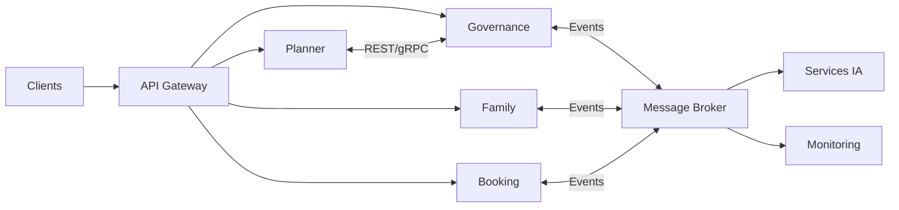

# INT-107 — Enterprise Microservices Integration

> Référentiel officiel de l'intégration des **microservices** pour **EduWeb Planner**.

## Sommaire

1. Vision
2. Objectifs
3. Définition
4. Principes
5. Architecture de référence
6. Composants
7. Modèles d'intégration
8. Gouvernance
9. Cas d'usage EduWeb
10. API conceptuelle
11. KPI
12. Bonnes pratiques
13. Anti-patterns
14. Règles d'architecture
15. Documents associés

---

## 1. Vision

Construire un écosystème de microservices autonomes, résilients et interopérables, capables d'évoluer indépendamment tout en assurant une intégration fluide des services métier et des composants d'intelligence artificielle.

## 2. Objectifs

- Découpler les domaines fonctionnels.
- Favoriser les déploiements indépendants.
- Standardiser les échanges.
- Améliorer la résilience.
- Garantir l'observabilité.

## 3. Définition

L'intégration des microservices consiste à organiser les communications entre services indépendants au moyen d'API, d'événements et de mécanismes de messagerie, tout en limitant les dépendances et en assurant la cohérence globale.

## 4. Principes

- Domain-Driven Design
- Single Responsibility
- API First
- Event-Driven
- Loose Coupling
- Resilience by Design
- Observability

## 5. Architecture de référence



## 6. Composants

- API Gateway
- Service Discovery
- Microservices métier
- Message Broker
- Event Bus
- Service Registry
- Observabilité
- Circuit Breaker
- Configuration centralisée
- Journalisation distribuée

## 7. Modèles d'intégration

1. REST API
2. gRPC
3. Publish/Subscribe
4. Saga Pattern
5. Outbox Pattern
6. CQRS
7. Event Sourcing
8. Async Messaging

## 8. Gouvernance

- Enterprise Architect
- Solution Architect
- Integration Architect
- Platform Engineer
- SRE
- RSSI

## 9. Cas d'usage EduWeb

- Gestion des établissements.
- Planification des emplois du temps.
- Gestion des abonnements.
- Notifications aux familles.
- Synchronisation avec les plateformes ministérielles.
- Déclenchement de workflows IA.

## 10. API conceptuelle

```typescript
interface EnterpriseMicroservice {
  register(): Promise<void>;
  discover(): Promise<void>;
  exposeAPI(): Promise<void>;
  publishEvent(event: object): Promise<void>;
  consumeEvent(topic: string): Promise<void>;
}
```

## 11. KPI

| KPI | Objectif |
|------|----------|
| Disponibilité des services | ≥ 99,9 % |
| Temps moyen de réponse | < 250 ms |
| Couverture des API | 100 % |
| Événements traités | ≥ 99,99 % |
| Déploiements sans interruption | ≥ 95 % |

## 12. Bonnes pratiques

- Déployer des services faiblement couplés.
- Utiliser Service Discovery.
- Documenter les contrats d'API.
- Mettre en œuvre Circuit Breaker et Retry.
- Superviser les échanges distribués.

## 13. Anti-patterns

- Microservices trop volumineux.
- Couplage fort entre services.
- Appels synchrones en cascade.
- Absence de traçabilité.
- Partage direct des bases de données.

## 14. Règles d'architecture

- RA-INT107-001 : Chaque microservice possède son propre contrat d'API.
- RA-INT107-002 : Les échanges interservices sont sécurisés.
- RA-INT107-003 : Les événements métier sont versionnés.
- RA-INT107-004 : Les transactions distribuées utilisent un modèle adapté (Saga, Outbox).
- RA-INT107-005 : Tous les services sont observables.

## 15. Documents associés

- INT-103 — Enterprise API Gateway Architecture
- INT-105 — Enterprise Event-Driven Architecture
- INT-106 — Enterprise Message Brokers & Queues
- INT-108 — Enterprise Service Mesh

# Fin du document
