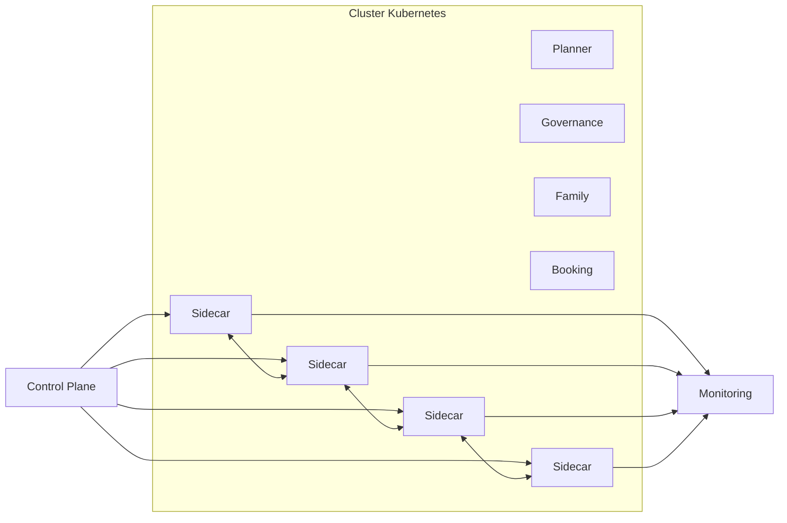

# INT-108 — Enterprise Service Mesh

> Référentiel officiel de l'architecture **Service Mesh** pour **EduWeb Planner**.

## Sommaire

1. Vision
2. Objectifs
3. Définition
4. Principes
5. Architecture de référence
6. Composants
7. Cycle de communication
8. Gouvernance
9. Cas d'usage EduWeb
10. API conceptuelle
11. KPI
12. Bonnes pratiques
13. Anti-patterns
14. Règles d'architecture
15. Documents associés

---

## 1. Vision

Mettre en œuvre un **Service Mesh** afin d'assurer une communication sécurisée, observable et résiliente entre les microservices d'EduWeb Planner, sans alourdir leur logique métier.

## 2. Objectifs

- Sécuriser les communications interservices.
- Uniformiser les politiques réseau.
- Renforcer la résilience.
- Centraliser l'observabilité.
- Simplifier la gouvernance.

## 3. Définition

Un **Service Mesh** est une couche d'infrastructure qui gère les communications entre microservices via des **proxies sidecar** pilotés par un **plan de contrôle**, offrant sécurité, routage intelligent, résilience et supervision.

## 4. Principes

- Zero Trust
- mTLS par défaut
- Sidecar Proxy
- Control Plane centralisé
- Observabilité distribuée
- Résilience native
- Séparation des responsabilités

## 5. Architecture de référence



## 6. Composants

- Control Plane
- Sidecar Proxy
- Service Discovery
- mTLS
- Traffic Management
- Policy Engine
- Tracing distribué
- Metrics
- Logs
- Tableau de bord

## 7. Cycle de communication

1. Découverte du service.
2. Authentification mTLS.
3. Application des politiques.
4. Routage intelligent.
5. Collecte des métriques.
6. Traces distribuées.
7. Journalisation.
8. Analyse.

## 8. Gouvernance

- Enterprise Architect
- Platform Engineer
- Kubernetes Administrator
- SRE
- RSSI
- DevOps Lead

## 9. Cas d'usage EduWeb

- Communications sécurisées entre Planner et Governance.
- Gestion des flux IA.
- Répartition intelligente du trafic.
- Déploiements Canary et Blue/Green.
- Analyse des performances des microservices.

## 10. API conceptuelle

```typescript
interface ServiceMeshController {
  applyPolicy(policy: object): Promise<void>;
  enableMTLS(): Promise<void>;
  configureRouting(rule: object): Promise<void>;
  collectTelemetry(): Promise<void>;
  injectSidecar(service: string): Promise<void>;
}
```

## 11. KPI

| KPI | Objectif |
|------|----------|
| Communications chiffrées | 100 % |
| Disponibilité | ≥ 99,9 % |
| Latence interservices | < 20 ms |
| Traces distribuées | 100 % |
| Politiques appliquées | 100 % |

## 12. Bonnes pratiques

- Activer le mTLS sur tous les services.
- Utiliser des politiques de routage déclaratives.
- Superviser les traces distribuées.
- Déployer progressivement les nouvelles versions.
- Automatiser les contrôles de conformité.

## 13. Anti-patterns

- Communications directes sans proxy.
- Certificats non renouvelés.
- Politiques réseau dispersées.
- Logs non centralisés.
- Dépendance au code applicatif pour la sécurité.

## 14. Règles d'architecture

- RA-INT108-001 : Toutes les communications interservices utilisent le Service Mesh.
- RA-INT108-002 : Le mTLS est obligatoire.
- RA-INT108-003 : Les politiques réseau sont centralisées.
- RA-INT108-004 : Les traces distribuées sont activées.
- RA-INT108-005 : Les sidecars sont supervisés.

## 15. Documents associés

- INT-107 — Enterprise Microservices Integration
- INT-109 — Enterprise Webhooks
- AI-115 — Enterprise AI Observability
- ARCH-130 — Cloud Native Architecture

# Fin du document
