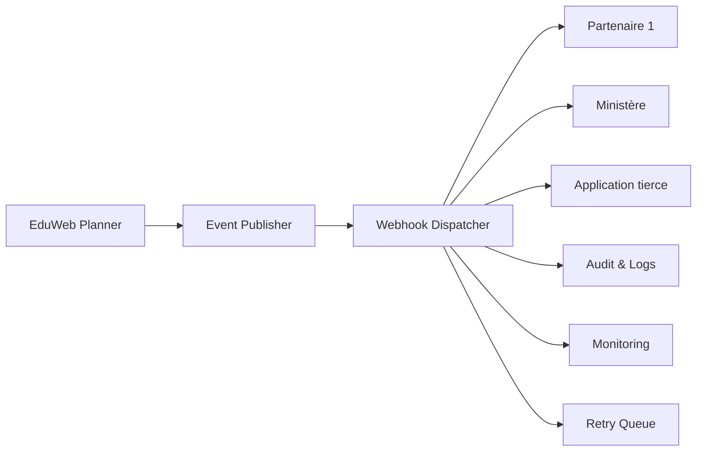

# INT-109 — Enterprise Webhooks

> Référentiel officiel de l'architecture **Webhooks** pour **EduWeb Planner**.

## Sommaire

1. Vision
2. Objectifs
3. Définition
4. Principes
5. Architecture de référence
6. Composants
7. Cycle de vie d'un webhook
8. Gouvernance
9. Cas d'usage EduWeb
10. API conceptuelle
11. KPI
12. Bonnes pratiques
13. Anti-patterns
14. Règles d'architecture
15. Documents associés

---

## 1. Vision

Permettre des notifications temps réel fiables, sécurisées et interopérables entre EduWeb Planner, les partenaires institutionnels et les applications tierces grâce aux Webhooks.

## 2. Objectifs

- Automatiser les échanges événementiels.
- Réduire les appels de polling.
- Garantir une livraison fiable.
- Sécuriser les notifications.
- Faciliter l'intégration des partenaires.

## 3. Définition

Un **Webhook** est un mécanisme permettant à une application d'envoyer automatiquement une notification HTTP à une autre application lorsqu'un événement prédéfini se produit.

## 4. Principes

- Event Driven
- HTTPS obligatoire
- Authentification forte
- Signature HMAC
- Idempotence
- Retry automatique
- Observabilité

## 5. Architecture de référence



## 6. Composants

- Event Publisher
- Webhook Dispatcher
- Gestionnaire des abonnements
- Signature HMAC
- File de réessai
- Dead Letter Queue
- Monitoring
- Audit
- Catalogue des événements

## 7. Cycle de vie d'un webhook

1. Déclenchement d'un événement.
2. Vérification des abonnements.
3. Construction du message.
4. Signature.
5. Envoi HTTPS.
6. Validation de la réponse.
7. Réessai si nécessaire.
8. Journalisation.

## 8. Gouvernance

- API Manager
- Integration Architect
- RSSI
- Platform Engineer
- Responsables métier

## 9. Cas d'usage EduWeb

- Notification d'un nouvel abonnement.
- Création d'un établissement scolaire.
- Validation d'un paiement.
- Synchronisation avec les plateformes ministérielles.
- Déclenchement d'un workflow IA.

## 10. API conceptuelle

```typescript
interface EnterpriseWebhookService {
  register(url: string): Promise<void>;
  publish(event: object): Promise<void>;
  sign(payload: object): string;
  retry(eventId: string): Promise<void>;
  unsubscribe(id: string): Promise<void>;
}
```

## 11. KPI

| KPI | Objectif |
|------|----------|
| Livraison réussie | ≥ 99,9 % |
| Temps moyen d'envoi | < 2 s |
| Notifications signées | 100 % |
| Réessais automatiques | ≥ 95 % |
| Disponibilité | ≥ 99,9 % |

## 12. Bonnes pratiques

- Utiliser HTTPS exclusivement.
- Signer tous les messages.
- Prévoir l'idempotence côté récepteur.
- Journaliser tous les envois.
- Définir une politique de réessai.

## 13. Anti-patterns

- Webhooks sans authentification.
- Polling inutile.
- Absence de réessai.
- Signature faible.
- Journalisation insuffisante.

## 14. Règles d'architecture

- RA-INT109-001 : Tous les Webhooks utilisent HTTPS.
- RA-INT109-002 : Les messages sont signés.
- RA-INT109-003 : Les événements sont versionnés.
- RA-INT109-004 : Les échecs déclenchent un réessai automatique.
- RA-INT109-005 : Les notifications sont tracées et auditées.

## 15. Documents associés

- INT-105 — Enterprise Event-Driven Architecture
- INT-106 — Enterprise Message Brokers & Queues
- INT-110 — Enterprise Data Integration
- AI-113 — Enterprise AI Orchestration

# Fin du document
