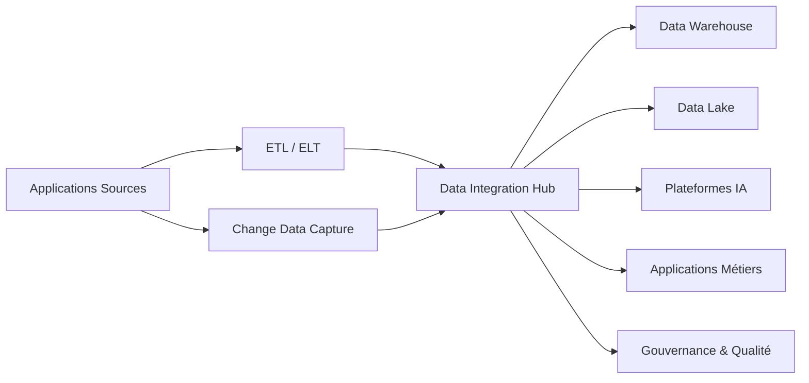

# INT-110 — Enterprise Data Integration

> Référentiel officiel de l'architecture d'**intégration des données** pour **EduWeb Planner**.

## Sommaire

1. Vision
2. Objectifs
3. Définition
4. Principes
5. Architecture de référence
6. Composants
7. Cycle de vie des données
8. Gouvernance
9. Cas d'usage EduWeb
10. API conceptuelle
11. KPI
12. Bonnes pratiques
13. Anti-patterns
14. Règles d'architecture
15. Documents associés

---

## 1. Vision

Mettre en œuvre une plateforme unifiée d'intégration des données permettant de connecter les applications opérationnelles, analytiques et les services d'intelligence artificielle d'EduWeb Planner.

## 2. Objectifs

- Assurer une circulation fiable des données.
- Garantir la qualité et la cohérence.
- Réduire les silos d'information.
- Faciliter les traitements temps réel et batch.
- Renforcer la gouvernance des données.

## 3. Définition

L'intégration des données regroupe les mécanismes permettant de collecter, transformer, synchroniser, enrichir et distribuer les données entre différents systèmes, en temps réel ou en mode différé.

## 4. Principes

- Single Source of Truth
- Data Quality by Design
- Metadata First
- Batch & Real-Time
- Data Lineage
- Security by Default
- Scalability

## 5. Architecture de référence



## 6. Composants

- Connecteurs de données
- ETL / ELT
- Change Data Capture (CDC)
- Data Integration Hub
- Data Warehouse
- Data Lake
- Référentiel de métadonnées
- MDM (Master Data Management)
- Qualité des données
- Monitoring

## 7. Cycle de vie des données

1. Collecte.
2. Validation.
3. Transformation.
4. Enrichissement.
5. Synchronisation.
6. Publication.
7. Archivage.
8. Audit.

## 8. Gouvernance

- Chief Data Officer
- Data Architect
- Data Steward
- Integration Architect
- RSSI
- Responsables métier

## 9. Cas d'usage EduWeb

- Synchronisation des établissements scolaires.
- Consolidation des inscriptions.
- Alimentation du Data Warehouse.
- Préparation des jeux de données IA.
- Reporting décisionnel.

## 10. API conceptuelle

```typescript
interface EnterpriseDataIntegration {
  extract(source: string): Promise<object>;
  transform(dataset: object): Promise<object>;
  load(target: string): Promise<void>;
  synchronize(domain: string): Promise<void>;
  validate(dataset: object): Promise<boolean>;
}
```

## 11. KPI

| KPI | Objectif |
|------|----------|
| Qualité des données | ≥ 98 % |
| Synchronisation réussie | ≥ 99,9 % |
| Traçabilité | 100 % |
| Temps de traitement | Conforme aux SLA |
| Jeux de données gouvernés | 100 % |

## 12. Bonnes pratiques

- Définir un modèle canonique.
- Utiliser le CDC pour les traitements temps réel.
- Versionner les schémas.
- Documenter les métadonnées.
- Contrôler la qualité avant publication.

## 13. Anti-patterns

- Duplication incontrôlée des données.
- Transformations non documentées.
- Référentiels multiples incohérents.
- Absence de traçabilité.
- Gouvernance insuffisante.

## 14. Règles d'architecture

- RA-INT110-001 : Les flux sont documentés.
- RA-INT110-002 : Les transformations sont traçables.
- RA-INT110-003 : Les métadonnées sont maintenues.
- RA-INT110-004 : Les données critiques sont validées.
- RA-INT110-005 : Les traitements respectent les politiques de sécurité.

## 15. Documents associés

- INT-105 — Enterprise Event-Driven Architecture
- INT-106 — Enterprise Message Brokers & Queues
- INT-111 — Enterprise ETL & ELT
- DATA-101 — Enterprise Data Architecture
- AI-119 — Enterprise AI Knowledge Systems

# Fin du document
