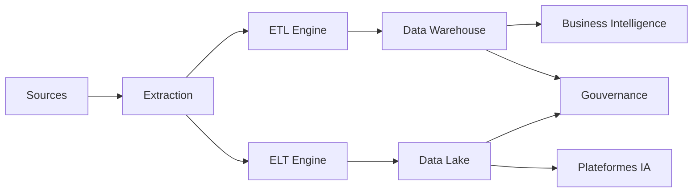

# INT-111 — Enterprise ETL & ELT

> Référentiel officiel des architectures **ETL (Extract, Transform, Load)** et **ELT (Extract, Load, Transform)** pour **EduWeb Planner**.

## Sommaire

1. Vision
2. Objectifs
3. Définition
4. Principes
5. Comparaison ETL / ELT
6. Architecture de référence
7. Composants
8. Cycle de traitement
9. Gouvernance
10. Cas d'usage EduWeb
11. API conceptuelle
12. KPI
13. Bonnes pratiques
14. Anti-patterns
15. Règles d'architecture
16. Documents associés

---

## 1. Vision

Mettre en place des pipelines de données robustes, automatisés et gouvernés afin d'alimenter les applications métiers, les plateformes analytiques et les systèmes d'intelligence artificielle d'EduWeb Planner.

## 2. Objectifs

- Automatiser les flux de données.
- Garantir la qualité et la cohérence.
- Optimiser les traitements batch et temps réel.
- Réduire les délais de disponibilité des données.
- Assurer la traçabilité complète.

## 3. Définition

L'**ETL** extrait les données, les transforme avant leur chargement dans la cible. L'**ELT** extrait puis charge les données dans la plateforme cible avant d'effectuer les transformations, généralement au sein d'un Data Warehouse ou d'un Data Lake.

## 4. Principes

- Pipeline as Code
- Data Quality by Design
- Automatisation
- Traçabilité
- Scalabilité
- Sécurité
- Réutilisabilité

## 5. Comparaison ETL / ELT

| Critère | ETL | ELT |
|---------|-----|-----|
| Transformation | Avant chargement | Après chargement |
| Performance | Adaptée aux volumes modérés | Optimisée pour les grands volumes |
| Cible | Bases décisionnelles | Data Lake / Data Warehouse cloud |
| Cas d'usage | Reporting classique | Big Data, IA, analytique avancée |

## 6. Architecture de référence



## 7. Composants

- Connecteurs
- Moteur ETL
- Moteur ELT
- Orchestrateur
- Contrôles qualité
- Gestion des métadonnées
- Data Warehouse
- Data Lake
- Monitoring
- Catalogue des données

## 8. Cycle de traitement

1. Extraction.
2. Validation.
3. Transformation (ETL) ou Chargement (ELT).
4. Contrôle qualité.
5. Publication.
6. Supervision.
7. Audit.
8. Archivage.

## 9. Gouvernance

- Chief Data Officer
- Data Architect
- Data Engineer
- Data Steward
- Integration Architect
- RSSI

## 10. Cas d'usage EduWeb

- Consolidation des inscriptions.
- Alimentation des tableaux de bord.
- Préparation des jeux de données IA.
- Historisation des activités pédagogiques.
- Reporting institutionnel.

## 11. API conceptuelle

```typescript
interface EnterpriseETLPipeline {
  extract(source: string): Promise<object>;
  transform(data: object): Promise<object>;
  load(target: string): Promise<void>;
  validate(data: object): Promise<boolean>;
  monitor(): Promise<void>;
}
```

## 12. KPI

| KPI | Objectif |
|------|----------|
| Succès des pipelines | ≥ 99,9 % |
| Qualité des données | ≥ 98 % |
| Traçabilité | 100 % |
| Temps de traitement | Conforme aux SLA |
| Pipelines supervisés | 100 % |

## 13. Bonnes pratiques

- Automatiser les pipelines.
- Versionner les transformations.
- Contrôler la qualité à chaque étape.
- Documenter les métadonnées.
- Superviser les traitements.

## 14. Anti-patterns

- Transformations manuelles.
- Pipelines non documentés.
- Absence de contrôle qualité.
- Dépendances implicites.
- Absence de reprise sur erreur.

## 15. Règles d'architecture

- RA-INT111-001 : Les pipelines sont versionnés.
- RA-INT111-002 : Les contrôles qualité sont obligatoires.
- RA-INT111-003 : Les traitements sont supervisés.
- RA-INT111-004 : Les métadonnées sont maintenues.
- RA-INT111-005 : Les erreurs sont journalisées.

## 16. Documents associés

- INT-110 — Enterprise Data Integration
- INT-112 — Enterprise Streaming Architecture
- DATA-103 — Enterprise Data Warehouse
- DATA-104 — Enterprise Data Lake
- AI-114 — Enterprise MLOps

# Fin du document
