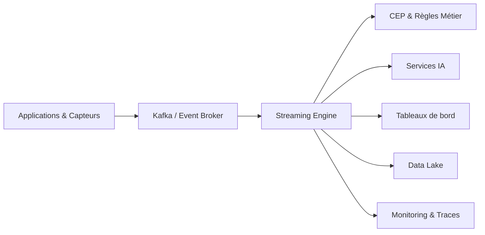

# INT-112 — Enterprise Streaming Architecture

> Référentiel officiel de l'architecture **Streaming** pour **EduWeb Planner**.

## Sommaire

1. Vision
2. Objectifs
3. Définition
4. Principes
5. Architecture de référence
6. Composants
7. Cycle de traitement d'un flux
8. Gouvernance
9. Cas d'usage EduWeb
10. API conceptuelle
11. KPI
12. Bonnes pratiques
13. Anti-patterns
14. Règles d'architecture
15. Documents associés

---

## 1. Vision

Mettre en œuvre une plateforme de traitement des flux de données en temps réel afin de fournir des informations immédiatement exploitables pour les applications métier, les tableaux de bord décisionnels et les services d'intelligence artificielle d'EduWeb Planner.

## 2. Objectifs

- Exploiter les données en temps réel.
- Réduire la latence décisionnelle.
- Faciliter les traitements continus.
- Garantir la scalabilité horizontale.
- Renforcer l'observabilité des pipelines.

## 3. Définition

Une architecture **Streaming** permet de collecter, transporter, traiter et diffuser des flux continus de données avec une faible latence grâce à des moteurs spécialisés tels qu'Apache Kafka, Apache Flink, Kafka Streams ou Spark Structured Streaming.

## 4. Principes

- Event Streaming
- Stream Processing
- Low Latency
- Exactly-Once lorsque nécessaire
- Scalabilité horizontale
- Tolérance aux pannes
- Observabilité native

## 5. Architecture de référence



## 6. Composants

- Producteurs d'événements
- Broker de streaming
- Moteur de traitement
- Fenêtres temporelles (Windowing)
- CEP (Complex Event Processing)
- Connecteurs
- Data Lake
- Observabilité
- Catalogue des schémas
- Supervision

## 7. Cycle de traitement d'un flux

1. Production.
2. Publication.
3. Persistance.
4. Traitement continu.
5. Agrégation.
6. Enrichissement.
7. Diffusion.
8. Archivage.

## 8. Gouvernance

- Enterprise Architect
- Data Architect
- Data Engineer
- Streaming Platform Engineer
- SRE
- RSSI

## 9. Cas d'usage EduWeb

- Suivi en temps réel des connexions.
- Analyse instantanée des usages.
- Détection d'anomalies.
- Tableaux de bord temps réel.
- Déclenchement de workflows IA.
- Surveillance des performances de la plateforme.

## 10. API conceptuelle

```typescript
interface EnterpriseStreamingPlatform {
  publish(stream: string, event: object): Promise<void>;
  consume(stream: string): Promise<object>;
  process(window: string): Promise<void>;
  checkpoint(): Promise<void>;
  monitor(): Promise<void>;
}
```

## 11. KPI

| KPI | Objectif |
|------|----------|
| Latence moyenne | < 1 seconde |
| Disponibilité | ≥ 99,9 % |
| Débit traité | Conforme aux SLA |
| Flux supervisés | 100 % |
| Reprises automatiques | ≥ 95 % |

## 12. Bonnes pratiques

- Utiliser des schémas versionnés.
- Configurer des checkpoints réguliers.
- Définir des fenêtres adaptées aux cas d'usage.
- Superviser les flux en continu.
- Tester les scénarios de reprise.

## 13. Anti-patterns

- Traitements bloquants.
- Absence de checkpoints.
- Topics non gouvernés.
- Schémas incompatibles.
- Absence d'observabilité.

## 14. Règles d'architecture

- RA-INT112-001 : Tous les flux critiques sont supervisés.
- RA-INT112-002 : Les schémas sont versionnés.
- RA-INT112-003 : Les traitements supportent la reprise.
- RA-INT112-004 : Les pipelines sont documentés.
- RA-INT112-005 : Les métriques sont collectées en continu.

## 15. Documents associés

- INT-105 — Enterprise Event-Driven Architecture
- INT-106 — Enterprise Message Brokers & Queues
- INT-111 — Enterprise ETL & ELT
- DATA-104 — Enterprise Data Lake
- AI-114 — Enterprise MLOps

# Fin du document
