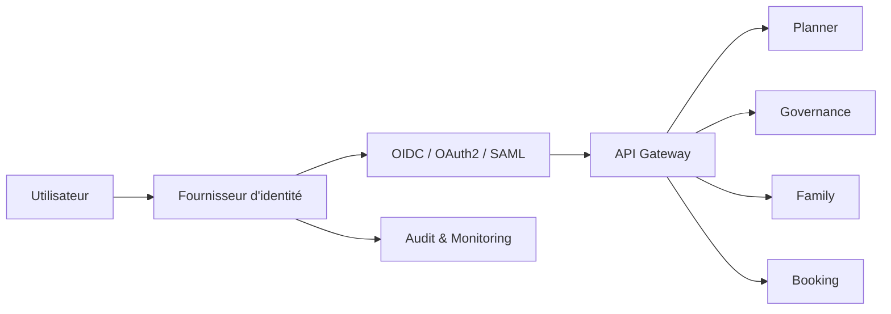

# INT-113 — Enterprise Identity Federation

> Référentiel officiel de la **Fédération d'Identité** pour **EduWeb Planner**.

## Sommaire

1. Vision
2. Objectifs
3. Définition
4. Principes
5. Architecture de référence
6. Composants
7. Cycle de vie d'une authentification fédérée
8. Gouvernance
9. Cas d'usage EduWeb
10. API conceptuelle
11. KPI
12. Bonnes pratiques
13. Anti-patterns
14. Règles d'architecture
15. Documents associés

---

## 1. Vision

Permettre un accès unifié, sécurisé et interopérable aux services EduWeb grâce à une fédération d'identité moderne reposant sur des standards ouverts.

## 2. Objectifs

- Mettre en œuvre le Single Sign-On (SSO).
- Réduire la multiplication des identifiants.
- Renforcer la sécurité des accès.
- Faciliter l'intégration avec les partenaires.
- Centraliser la gouvernance des identités.

## 3. Définition

La fédération d'identité permet à plusieurs organisations ou applications de partager un mécanisme d'authentification et d'autorisation fondé sur une relation de confiance entre fournisseurs d'identité (IdP) et fournisseurs de services (SP).

## 4. Principes

- Zero Trust
- Identity First
- Single Sign-On
- Least Privilege
- MFA by Default
- Standards ouverts
- Auditabilité

## 5. Architecture de référence



## 6. Composants

- Identity Provider (IdP)
- Service Provider (SP)
- OAuth 2.0
- OpenID Connect
- SAML 2.0
- SCIM
- MFA
- RBAC / ABAC
- Annuaire d'identités
- Journal d'audit

## 7. Cycle de vie d'une authentification fédérée

1. Demande d'accès.
2. Redirection vers l'IdP.
3. Authentification.
4. Vérification MFA.
5. Émission du jeton.
6. Validation par le service.
7. Attribution des droits.
8. Journalisation.

## 8. Gouvernance

- IAM Architect
- RSSI
- Enterprise Architect
- Identity Administrator
- Compliance Officer

## 9. Cas d'usage EduWeb

- Connexion unique des enseignants.
- Accès des établissements scolaires.
- Fédération avec les plateformes ministérielles.
- Authentification des partenaires.
- Accès sécurisé aux services IA.

## 10. API conceptuelle

```typescript
interface EnterpriseIdentityFederation {
  authenticate(): Promise<string>;
  validateToken(token: string): Promise<boolean>;
  refreshToken(): Promise<string>;
  revokeToken(token: string): Promise<void>;
  synchronizeIdentity(userId: string): Promise<void>;
}
```

## 11. KPI

| KPI | Objectif |
|------|----------|
| Disponibilité IAM | ≥ 99,9 % |
| MFA activé | 100 % des comptes sensibles |
| Temps moyen d'authentification | < 2 s |
| Comptes synchronisés | 100 % |
| Journalisation | 100 % |

## 12. Bonnes pratiques

- Activer le MFA.
- Utiliser OIDC pour les nouvelles applications.
- Synchroniser automatiquement les identités.
- Auditer régulièrement les privilèges.
- Centraliser les politiques IAM.

## 13. Anti-patterns

- Comptes locaux multiples.
- Authentification sans MFA.
- Tokens non expirés.
- Autorisations excessives.
- Journaux incomplets.

## 14. Règles d'architecture

- RA-INT113-001 : Toute application utilise une authentification fédérée.
- RA-INT113-002 : Les accès sensibles imposent le MFA.
- RA-INT113-003 : Les jetons sont signés et expirent automatiquement.
- RA-INT113-004 : Les rôles sont gouvernés.
- RA-INT113-005 : Les événements IAM sont audités.

## 15. Documents associés

- INT-102 — Enterprise API Architecture
- INT-103 — Enterprise API Gateway Architecture
- INT-114 — Enterprise B2B Integration
- SEC-101 — Enterprise Identity & Access Management

# Fin du document
