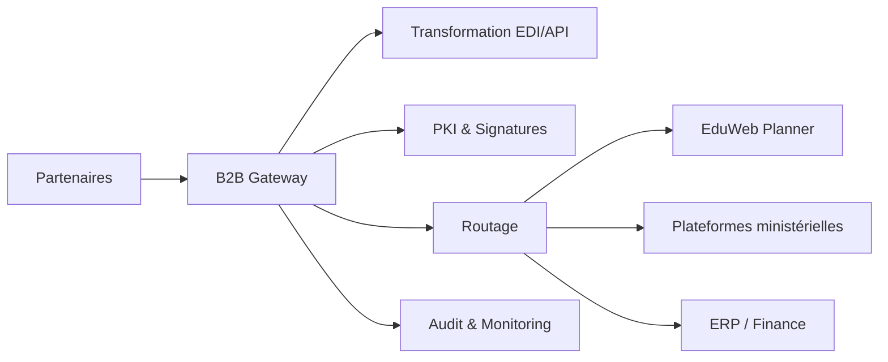

# INT-114 — Enterprise B2B Integration

> Référentiel officiel de l'intégration **Business-to-Business (B2B)** pour **EduWeb Planner**.

## Sommaire

1. Vision
2. Objectifs
3. Définition
4. Principes
5. Architecture de référence
6. Composants
7. Cycle d'un échange B2B
8. Gouvernance
9. Cas d'usage EduWeb
10. API conceptuelle
11. KPI
12. Bonnes pratiques
13. Anti-patterns
14. Règles d'architecture
15. Documents associés

---

## 1. Vision

Déployer une plateforme d'intégration B2B sécurisée permettant des échanges fiables entre EduWeb Planner, les ministères, établissements scolaires, banques, fournisseurs et autres partenaires.

## 2. Objectifs

- Standardiser les échanges interorganisationnels.
- Garantir la sécurité et la conformité.
- Faciliter l'onboarding des partenaires.
- Assurer la traçabilité des transactions.
- Automatiser les processus métier.

## 3. Définition

L'intégration B2B regroupe les architectures, protocoles et processus permettant l'échange automatisé de données entre organisations au moyen d'interfaces normalisées et sécurisées.

## 4. Principes

- Standards ouverts
- Interopérabilité
- Sécurité by Design
- Non-répudiation
- Traçabilité
- Haute disponibilité
- Gouvernance contractuelle

## 5. Architecture de référence



## 6. Composants

- B2B Gateway
- Connecteurs AS2/AS4
- REST / SOAP
- SFTP
- Moteur de transformation
- PKI
- Gestion des partenaires
- Monitoring
- Journal d'audit
- Catalogue de contrats

## 7. Cycle d'un échange B2B

1. Identification du partenaire.
2. Authentification.
3. Validation du contrat.
4. Transformation.
5. Transmission.
6. Accusé de réception.
7. Archivage.
8. Audit.

## 8. Gouvernance

- Enterprise Architect
- Integration Architect
- RSSI
- Partner Manager
- Compliance Officer

## 9. Cas d'usage EduWeb

- Échanges avec les ministères.
- Paiements et banques.
- Synchronisation avec des ERP.
- Partage de référentiels scolaires.
- Intégration avec des plateformes partenaires.

## 10. API conceptuelle

```typescript
interface EnterpriseB2BPlatform {
  onboardPartner(id: string): Promise<void>;
  send(document: object): Promise<void>;
  receive(): Promise<object>;
  validateContract(id: string): Promise<boolean>;
  audit(transactionId: string): Promise<void>;
}
```

## 11. KPI

| KPI | Objectif |
|------|----------|
| Disponibilité | ≥ 99,9 % |
| Transactions réussies | ≥ 99,5 % |
| Échanges tracés | 100 % |
| Temps moyen de traitement | Conforme aux SLA |
| Partenaires conformes | 100 % |

## 12. Bonnes pratiques

- Utiliser des standards reconnus.
- Chiffrer les échanges.
- Signer les documents critiques.
- Superviser les transactions.
- Tester régulièrement les partenaires.

## 13. Anti-patterns

- Protocoles propriétaires non documentés.
- Absence de certificats.
- Contrats non versionnés.
- Échanges non journalisés.
- Validation manuelle systématique.

## 14. Règles d'architecture

- RA-INT114-001 : Tous les échanges B2B sont authentifiés.
- RA-INT114-002 : Les documents critiques sont signés.
- RA-INT114-003 : Les contrats d'échange sont versionnés.
- RA-INT114-004 : Les transactions sont auditables.
- RA-INT114-005 : Les SLA sont surveillés.

## 15. Documents associés

- INT-113 — Enterprise Identity Federation
- INT-115 — Enterprise SaaS Integration
- INT-109 — Enterprise Webhooks
- SEC-103 — Enterprise PKI

# Fin du document
